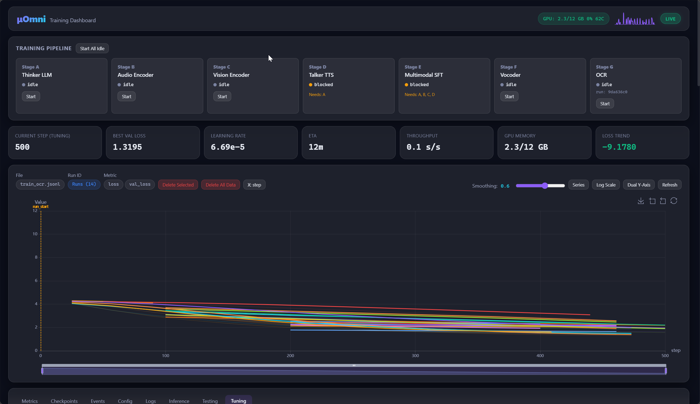
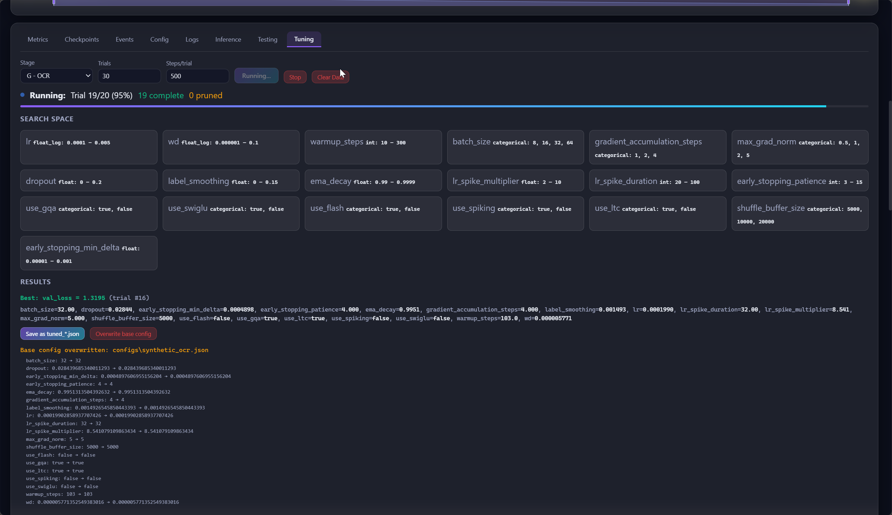
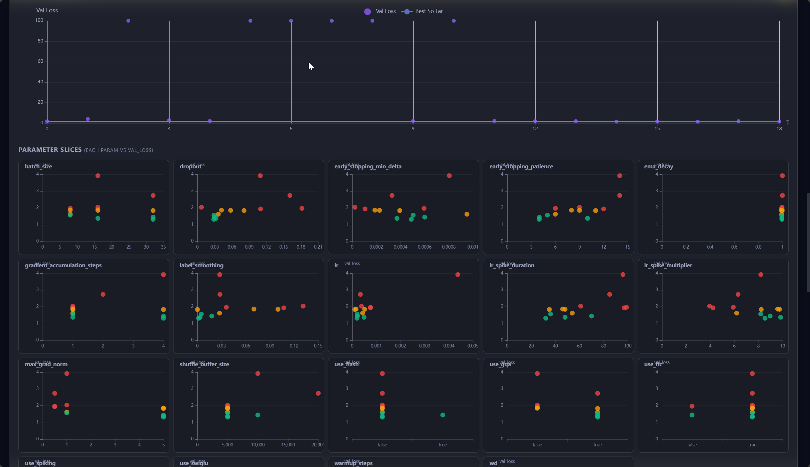

# μOmni — Tiny Multimodal AI (fits 16GB VRAM)

A from-scratch **multimodal AI** stack (text + image + speech in/out) trainable on a single GPU. Uses a Thinker-Talker architecture inspired by recent multimodal LLMs.

```
Image ──→ ViT Encoder ──→ Projector ──┐
Audio ──→ Audio Encoder ─→ Projector ──┤
Text  ──→ Token Embeddings ───────────┤
                                       ├──→ Thinker (LLM) ──→ Text Output
                                       └──→ Talker ──→ RVQ ──→ Vocoder ──→ Speech
```

> **~13.9M parameters** (synthetic config) | **16GB VRAM** (RTX 5070 Ti) | Reference learning repo — compact and readable

<p align="center">
  
</p>
<p align="center"><em>Training Dashboard — live metrics, pipeline management, and GPU monitoring</em></p>

<p align="center">
  
  
</p>
<p align="center"><em>Hyperparameter Tuning — search space configuration (left) and parameter slice analysis (right)</em></p>

---

## Benchmark Results (Synthetic Data, 2000 samples)

| Component | Metric | Score | Rating |
|-----------|--------|-------|--------|
| **Thinker** (GQA+MTP) | Top-1 Accuracy | 65.09% | EXCELLENT |
| | Top-5 Accuracy | 92.92% | EXCELLENT |
| | Top-10 Accuracy | 97.80% | EXCELLENT |
| | Perplexity | 2.71 | EXCELLENT |
| **Audio Encoder** (8x, 12.5Hz) | Val Loss | **0.0000688** | NEAR-ZERO |
| | Beam CER | 7.05% | GOOD |
| **Vision Encoder** (CLIP) | Embedding Diversity | **0.93** | EXCELLENT |
| **Talker** (FFN 8/3) | Top-5 Base | **92.33%** | EXCELLENT |
| | Top-5 Residual | **93.00%** | EXCELLENT |
| **SFT** (Multimodal) | Val Loss | 1.078 | GOOD |

**Architecture** (synthetic config):
| Feature | Setting |
|---------|---------|
| GQA | Enabled (kv_groups=2, 2:1 Q:KV ratio) |
| FFN Ratio | 8/3 × d_model (344 for d=128) — standard SwiGLU convention |
| Audio Downsample | 8x (12.5Hz) |
| Multi-Token Prediction | 2 heads (predict t+2, t+3) |
| Sliding Window Attention | Infrastructure ready (window_size=0 default) |
| YaRN RoPE | Infrastructure ready (scaling_factor=1.0 default) |
| Label Smoothing | 0.1 (all stages including SFT) |
| Training Monitor | TrainingMonitor (LR spike + early stopping + best weights) |
| Fused AdamW | `fused=True` on all CUDA optimizers |

**Training time** (RTX 5070 Ti Laptop GPU, synthetic 2000 samples):
| Stage | Clean Run | Epochs |
|-------|-----------|--------|
| A: Thinker | ~15 min | 500 |
| B: Audio Encoder | ~5 min | 50 |
| C: Vision Encoder | ~12 min | 50 |
| D: Talker | ~8 min | 50 |
| E: SFT | ~25 min | 50 |
| F: Vocoder (optional) | ~15 min | 50 |
| G: OCR (optional) | ~10 min | 50 |
| **Total (A-E required)** | **~65 min** | |
| **Total (all stages)** | **~90 min** | |

*Note: B+C can run in parallel. First-time setup with config tuning may take 2+ hours.*

---

## Quick Start

```bash
# 1. Install
pip install -r requirements.txt

# 2. Generate synthetic data (for testing)
python -m scripts.generate_synthetic_data

# 3. Train (any order for A/B/C, then D needs A, E needs all)
python -m train.train_thinker --config configs/synthetic_thinker.json    # Stage A: Thinker LLM
python -m train.train_audio_enc --config configs/synthetic_audio_enc.json # Stage B: Audio Encoder
python -m train.train_vision --config configs/synthetic_vision.json       # Stage C: Vision Encoder
python -m train.train_talker --config configs/synthetic_talker.json       # Stage D: Talker + RVQ
python -m train.sft_omni --config configs/synthetic_omni_sft.json         # Stage E: Multimodal SFT

# 4. Inference
python -m test.infer_chat --ckpt_dir checkpoints/thinker_tiny                                    # Text chat
python -m test.infer_chat --ckpt_dir checkpoints/omni_sft_tiny --image photo.jpg "describe this"  # Image QA
python -m test.infer_chat --ckpt_dir checkpoints/omni_sft_tiny --audio_in speech.wav              # Audio transcription
python -m test.infer_chat --ckpt_dir checkpoints/omni_sft_tiny --image doc.jpg --ocr              # OCR
```

---

## File Map

### Core Models (`omni/`)

| File | Component | Params | Purpose |
|------|-----------|--------|---------|
| `thinker.py` | ThinkerLM | ~13.9M | Decoder-only LLM — processes all modalities, generates text. Includes Block, Attention (RoPE, GQA, Sliding Window), MLP (SwiGLU), MoE, MTP, YaRN RoPE, Arthemis extensions |
| `audio_encoder.py` | AudioEncoderTiny | ~2.0M | Mel spectrogram → transformer encoder. CTC mode (ASR) or contrastive mode (CLAP) |
| `vision_encoder.py` | ViTTiny | ~914K | Image patches → transformer encoder → CLS token. Also contains TransformerTextEncoder for CLIP training |
| `talker.py` | TalkerTiny | ~2.2M | Autoregressive speech code predictor — predicts RVQ codebook indices frame by frame |
| `codec.py` | RVQ + Vocoders | ~49K | RVQ (2 codebooks, 128 codes), HiFi-GAN neural vocoder (generator + MPD + MSD discriminators), Griffin-Lim fallback |
| `ocr_model.py` | OCRModel | ~2.1M | ViT encoder + cross-attention decoder for extracting text from images |
| `tokenizer.py` | BPETokenizer | — | SentencePiece BPE wrapper (encode/decode text to token IDs) |
| `nn_utils.py` | NN Utilities | — | RoPE (cached), RMSNorm, projection/temperature helpers |
| `data_utils.py` | Data Utilities | — | Streaming IterableDatasets, collate functions, dataset analysis helpers |
| `training_utils.py` | Training Utilities | — | EMA, LR scheduler, gradient utilities, TrainingMonitor, logger, JSONL metrics upsert |
| `checkpoint_utils.py` | Checkpoint Utilities | — | Checkpoint discovery/load/save and state-dict normalization |
| `io_utils.py` | I/O Utilities | — | Log tee helpers and robust audio loading |
| `resume_utils.py` | Resume Utilities | — | Resume position math and iterable-dataset resume setup |

### Training Scripts

| File | Stage | What It Trains | Loss Function |
|------|-------|----------------|---------------|
| `train/train_thinker.py` | A | Thinker LLM on text corpus | Cross-entropy (next-token prediction) |
| `train/train_audio_enc.py` | B | Audio encoder for ASR | CTC loss (sequence alignment) |
| `train/train_vision.py` | C | Vision encoder + text encoder | InfoNCE contrastive loss (CLIP-style) |
| `train/train_talker.py` | D | Talker + RVQ codec for TTS | Cross-entropy on RVQ codes |
| `train/train_vocoder.py` | F | HiFi-GAN vocoder (optional) | Adversarial + feature matching + mel L1 |
| `train/train_ocr.py` | G | OCR model (optional) | Cross-entropy on characters |
| `train/sft_omni.py` | E | All components jointly on mixed data | Cross-entropy on text tokens |

### Inference & Export

| File | Purpose |
|------|---------|
| `test/infer_chat.py` | Interactive multimodal inference — text chat, image QA, audio transcription, TTS, OCR, video |
| `scripts/export.py` | Merge all component checkpoints into HuggingFace-compatible safetensors |
| `export/modeling_muomni.py` | HuggingFace `PreTrainedModel` (`MuOmniForCausalLM` + `MuOmniMultimodalModel`) |
| `export/infer_standalone.py` | Inference from merged safetensors (no separate checkpoints needed) |
| `export/test_safetensor.py` | Validate exported safetensors file |
| `export/test_hf_text.py` | Scored test for HF text model |
| `export/test_hf_multimodal.py` | Scored test for HF multimodal model |

### Test Scripts

| File | Tests | Key Metrics |
|------|-------|-------------|
| `test/test_thinker.py` | Thinker LLM | Perplexity, generation quality |
| `test/test_audio_enc.py` | Audio encoder | WER/CER (word/character error rate) |
| `test/test_vision.py` | Vision encoder | R@1/R@5/R@10 retrieval, embedding diversity |
| `test/test_talker.py` | Talker + RVQ | Reconstruction quality |
| `test/test_vocoder.py` | HiFi-GAN vocoder | Mel loss, audio quality |
| `test/test_ocr.py` | OCR model | Character accuracy, edit distance |
| `test/test_sft.py` | Multimodal SFT | Val loss, generation quality |

### Utility Scripts (`scripts/`)

| File | Purpose |
|------|---------|
| `generate_synthetic_data.py` | Generate synthetic data for all modalities (quick testing) |
| `metrics_viewer.html` | Static JSONL metrics viewer (open in browser) |
| `download_production_text.py` | Download real text corpus |
| `download_production_audio.py` | Download real audio dataset (ASR + TTS) |
| `download_production_image.py` | Download real image dataset + captions |
| `download_production_ocr.py` | Download real OCR dataset |
| `calculate_model_size.py` | Print parameter counts for all components |

### Other

| File | Purpose |
|------|---------|
| `CLAUDE.md` | Project instructions for Claude Code AI assistant |

---

## Configuration

## Structured Metrics Logging

Train/test scripts (except `test/infer_chat.py`) now emit structured records to `logs/metrics/*.jsonl`.

- Required fields: `timestamp`, `script`, `phase`, `run_id`, `epoch`, `batch`, `step`, `split`, `metric_name`, `metric_value`
- Optional fields: `lr`, `loss`, `checkpoint`, `device`, `extra`
- Resume safety: duplicate keys are upserted by `(run_id, phase, epoch, batch, step, split, metric_name)`

Use the viewer:

```bash
start scripts/metrics_viewer.html
```

Then choose one or more files from `logs/metrics/` and filter by script/run/phase/metric.

Configs in `configs/` — one per training stage (`synthetic_*.json`). These use smaller vocab/steps for quick iteration.

Key settings across all configs:

| Setting | Default | Effect |
|---------|---------|--------|
| `use_amp` | `true` | Mixed precision — halves VRAM, 2x throughput |
| `use_compile` | `false` | torch.compile — 20-50% speedup (not on RTX 50-series) |
| `use_gqa` | `true` | Grouped Query Attention — faster KV cache |
| `use_swiglu` | `true` | SwiGLU activation — better quality than GELU |
| `use_moe` | `false` | Mixture of Experts — more capacity, same compute |
| `use_mtp` | `false` | Multi-Token Prediction — predict t+2, t+3 during training |
| `window_size` | `128` | Sliding Window Attention — O(n*w) for alternating layers |
| `rope_scaling_factor` | `1.0` | YaRN RoPE — context extension beyond training length |
| `label_smoothing` | `0.1` | Label smoothing (all stages including SFT) |
| `use_early_stopping` | `false` | Early stopping on val plateau (true for SFT) |
| `use_lr_spike` | `true` | LR spike to escape loss plateaus |
| `use_spiking` | `false` | Arthemis spiking attention (experimental) |
| `use_ltc` | `false` | Arthemis liquid time constants (experimental) |

---

## Datasets

### Option A: Synthetic (recommended for quick start)
```bash
python -m scripts.generate_synthetic_data
```

### Option B: Real datasets (each < 5GB)
```bash
python -m scripts.download_production_text --combine
python -m scripts.download_production_audio --combine
python -m scripts.download_production_image --combine
python -m scripts.download_production_ocr --combine
```

Data formats:
- **Text**: Plain `.txt`, one sample per line
- **ASR Audio**: CSV with `wav,text` columns
- **TTS Audio**: CSV with `text,wav` columns (reversed!)
- **Images**: JSON manifest with `image` + `caption` fields
- **OCR**: CSV with `image,text` columns

---

## Performance Optimizations

### Model-Level
- **Multi-Token Prediction (MTP)** — predict t+2, t+3 during training for richer gradients
- **Sliding Window Attention** — O(n*w) complexity for alternating layers, enabling longer sequences
- **YaRN RoPE** — context extension beyond training length via rope_scaling_factor
- Cached RoPE cos/sin tables (not recomputed every forward pass)
- Pre-allocated causal masks (sliced, not recreated)
- Zero-copy GQA expansion (expand+reshape instead of repeat_interleave)
- Sorted MoE dispatch (batched, not nested Python loops)
- Efficient RVQ encoding (torch.cdist)
- No forward-pass NaN checks (removed GPU-syncing isnan/isinf)

### Training-Level
- Mixed precision (AMP float16/bfloat16)
- Label smoothing (0.1) for better calibration and reduced overconfidence
- `zero_grad(set_to_none=True)` (frees gradient memory)
- `pin_memory=True` on DataLoaders
- `cudnn.benchmark=True` (auto-tuned convolutions)
- Flash Attention (PyTorch 2.0+ scaled_dot_product_attention)
- TF32 matmul enabled globally
- Single gradient norm check (clip + threshold in one pass)
- Streaming IterableDataset (90%+ RAM reduction)

### Generation-Level
- **ThinkerLM.generate()** with temperature, top-k, top-p (nucleus), and repetition penalty
- Repetition penalty for preventing degenerate loops and improving output quality
- Top-k / top-p (nucleus) sampling for controlled diversity during text generation

---

## Export & HuggingFace

### Export to safetensors
```bash
# Merge all trained components into HuggingFace-compatible format
python -m scripts.export \
  --thinker_ckpt checkpoints/thinker_tiny \
  --audio_ckpt checkpoints/audio_enc_tiny \
  --vision_ckpt checkpoints/vision_tiny \
  --talker_ckpt checkpoints/talker_tiny \
  --ocr_ckpt checkpoints/ocr_tiny \
  --output_dir export
```

This creates:
- `export/model.safetensors` — HF-compatible (flat thinker keys, works with `from_pretrained`)
- `export/model_full.safetensors` — Full multimodal model (all components with prefixed keys)
- `export/config.json` — HuggingFace config with `auto_map` for custom model discovery
- `export/modeling_muomni.py` — Self-contained model class (no `omni/` dependency)

### Use with HuggingFace Transformers
```python
import sys; sys.path.insert(0, "export")
from modeling_muomni import MuOmniForCausalLM
from omni.tokenizer import BPETokenizer
import torch

# Load model (works exactly like any HF model)
model = MuOmniForCausalLM.from_pretrained("./export", trust_remote_code=True)
model = model.cuda().eval()

# Tokenize and generate
tok = BPETokenizer("export/tokenizer.model")
ids = [1] + tok.encode("The red cat")
x = torch.tensor([ids], device="cuda")
out = model.generate(x, max_new_tokens=20, temperature=0.7, top_k=40)
print(tok.decode(out[0].tolist()))
# Output: "The red cat sits in the park."
```

### Full multimodal inference
```python
from modeling_muomni import MuOmniMultimodalModel
model = MuOmniMultimodalModel.from_pretrained_safetensors("./export")
out = model(input_ids=text_ids, pixel_values=image, mel_spectrogram=audio)
```

### Upload to HuggingFace Hub (optional)
```bash
huggingface-cli login
huggingface-cli upload prskid1000/micro-Omni export/
```

---

## Testing

```bash
# Single component
python -m test.test_thinker --checkpoint checkpoints/thinker_tiny

# Multimodal SFT test
python -m test.test_sft --checkpoint checkpoints/omni_sft_tiny --config configs/synthetic_omni_sft.json

# All tests (PowerShell)
Get-ChildItem -Filter 'test_*.py' -Recurse | ForEach-Object { python $_.FullName }

# Export validation
python -m export.test_safetensor

# HF model tests
python -m export.test_hf_text           # HF text model scored test
python -m export.test_hf_multimodal     # HF multimodal scored test
```

Flags: `--device cpu` (no GPU), `--num_samples N` (limit test size), `--config path/to/config.json`

---

## Learning Guide

See [`study/`](study/) for a complete zero-to-master tutorial (25 chapters + 5 appendices). Covers everything from "What is AI?" to deployment, with real-life analogies and ASCII diagrams.

## License

MIT. Replace datasets with those compatible with your needs.
