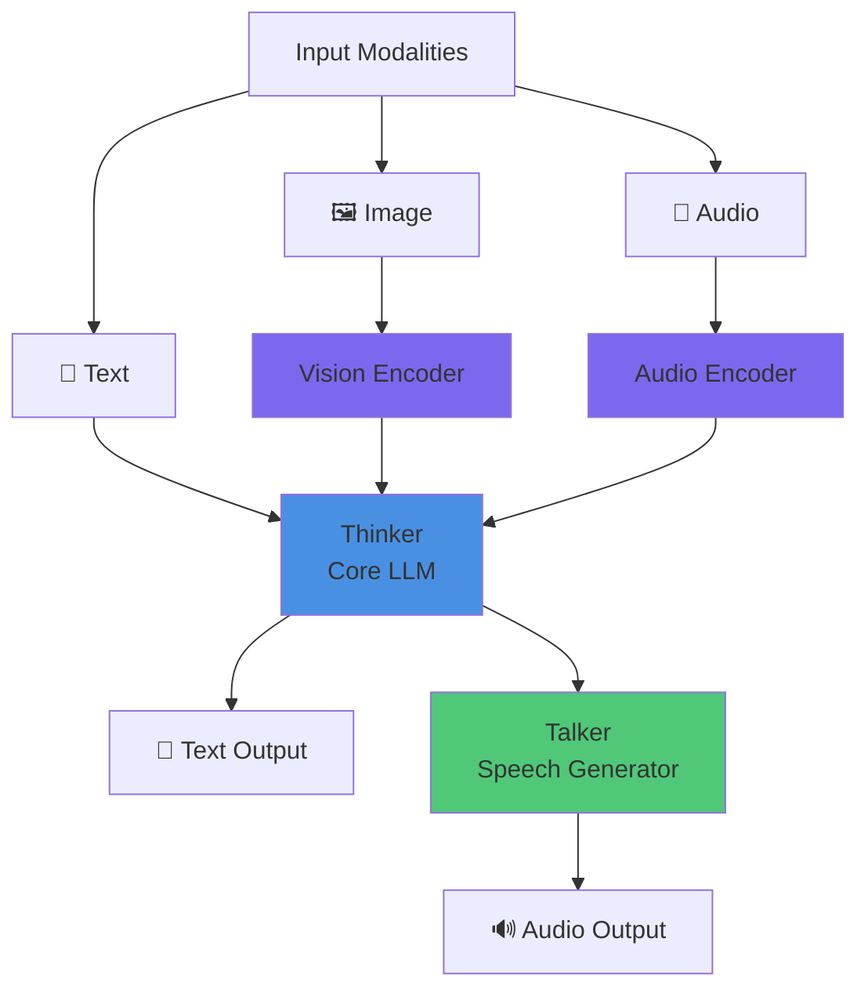
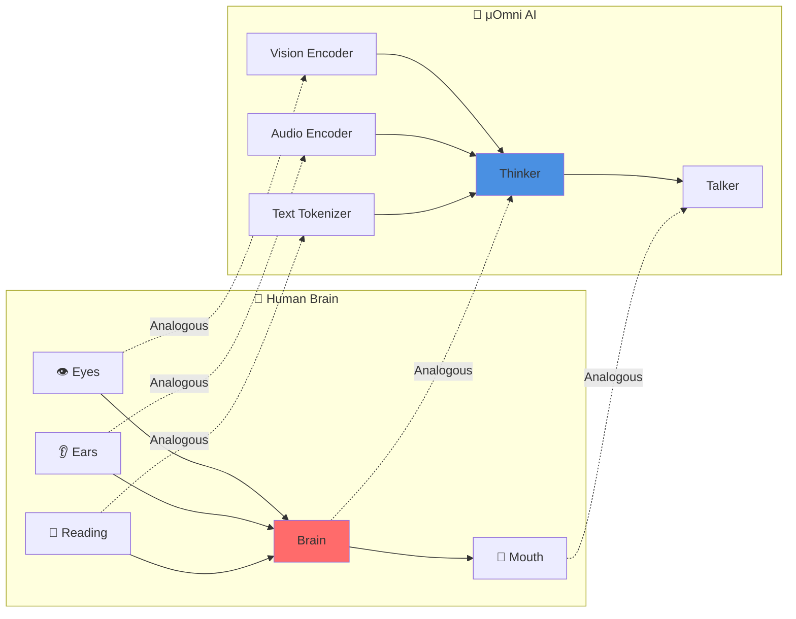
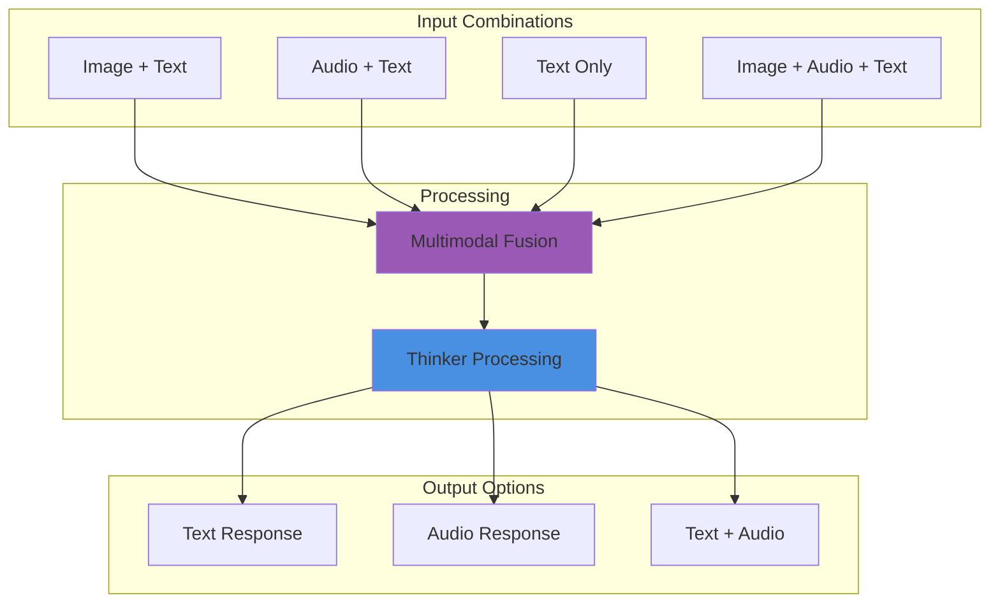

# Introduction to μOmni

## 🎯 Key Takeaways (TL;DR)

- **What**: μOmni is a multimodal AI that understands text, images, and audio
- **Why**: Learn AI with a complete, runnable system that fits on consumer GPUs
- **How**: Thinker-Talker architecture with separate encoders for each modality
- **Key Insight**: All modalities unified into 256-dim space for Thinker to process
- **Common Mistake**: Trying to train everything at once (use staged training!)
- **Time to First Model**: ~4 hours for basic training

**📖 Reading Guide**:
- **Quick Read**: 5 minutes (overview only)
- **Standard Read**: 10 minutes (full document)
- **Deep Dive**: 20 minutes (read + try examples)

## What is μOmni?

μOmni (pronounced "micro-omni") is a **multimodal AI model** that can understand and generate:
- **Text** - Read and write sentences
- **Images** - See and describe pictures
- **Audio** - Hear speech and generate speech

Think of it like a human brain that can process multiple types of information at once!

### Diagram 1: μOmni Capabilities Overview



**Explanation**: This diagram shows how μOmni accepts multiple input types (text, image, audio), processes them through specialized encoders, combines them in the Thinker, and produces both text and speech outputs.

## Why "Tiny"?

The "tiny" in μOmni means it's designed to:
- Fit on a single 12GB GPU (most AI models need much more)
- Train quickly with small datasets (< 5GB each)
- Be easy to understand and modify

This makes it perfect for learning!

## Real-World Analogy

Imagine you're learning a new language:

1. **Thinker** = Your brain that understands and generates language
2. **Audio Encoder** = Your ears that convert sound to meaning
3. **Vision Encoder** = Your eyes that convert images to meaning
4. **Talker** = Your mouth that converts thoughts to speech

μOmni works similarly - it has separate "senses" that feed into a central "brain."

### Diagram 2: Human Brain Analogy



**Explanation**: This diagram illustrates how μOmni's architecture mirrors human sensory processing - separate input channels (eyes/ears) feed into a central processor (brain), which then generates output (speech).

## What Can μOmni Do?

### Input Modes:
- 📝 **Text**: "What is the weather?"
- 🖼️ **Image**: A photo of a cat
- 🎤 **Audio**: A spoken question
- 🎬 **Video**: A short clip

### Output Modes:
- 📝 **Text**: Written responses
- 🔊 **Audio**: Spoken responses (text-to-speech)

### Combined:
- See an image + hear audio → Generate text response
- Read text → Generate spoken audio
- And more combinations!

### Diagram 3: Input-Output Combinations



**Explanation**: μOmni supports flexible input combinations (any mix of text, image, audio) and can produce text responses, audio responses, or both simultaneously.

## Key Concepts You'll Learn

1. **Neural Networks** - How computers "learn" (see [Glossary](GLOSSARY.md) for detailed explanations)
2. **Transformers** - The architecture powering modern AI (uses attention mechanisms to process sequences)
3. **Multimodal Fusion** - Combining different data types (text, images, audio) into a unified representation
4. **Training** - Teaching the model with examples (adjusting weights to minimize errors)
5. **Inference** - Using the trained model to make predictions on new data

> **💡 New to AI?** Don't worry about technical terms! Check the [Glossary](GLOSSARY.md) for simple explanations of terms like "embedding", "attention", "tokenization", and more.

## Project Structure

```
μOmni/
├── omni/              # Core model code
│   ├── thinker.py     # Language model
│   ├── audio_encoder.py
│   ├── vision_encoder.py
│   └── talker.py
├── train_*.py         # Training scripts
├── infer_chat.py      # Inference interface
├── configs/           # Configuration files
└── study/             # This guide!
```

### Diagram 4: Project File Organization

```mermaid
graph TD
    Root[μOmni/] --> Omni[omni/]
    Root --> Train[train_*.py]
    Root --> Infer[infer_chat.py]
    Root --> Configs[configs/]
    Root --> Study[study/]
    
    Omni --> ThinkerPy[thinker.py]
    Omni --> AudioPy[audio_encoder.py]
    Omni --> VisionPy[vision_encoder.py]
    Omni --> TalkerPy[talker.py]
    Omni --> CodecPy[codec.py]
    
    Train --> TrainText[train_text.py]
    Train --> TrainAudio[train_audio_enc.py]
    Train --> TrainVision[train_vision.py]
    Train --> TrainTalker[train_talker.py]
    Train --> SFT[sft_omni.py]
    
    Configs --> ThinkerCfg[thinker_tiny.json]
    Configs --> AudioCfg[audio_enc_tiny.json]
    Configs --> VisionCfg[vision_tiny.json]
    Configs --> TalkerCfg[talker_tiny.json]
    Configs --> OmniCfg[omni_sft_tiny.json]
    
    Study --> Intro[00_Introduction.md]
    Study --> Basics[01_Neural_Networks_Basics.md]
    Study --> Arch[02_Architecture_Overview.md]
    Study --> More[More study files...]
    
    style Root fill:#2c3e50
    style Omni fill:#3498db
    style Train fill:#e74c3c
    style Study fill:#27ae60
```



**Explanation**: This diagram shows the complete file structure of the μOmni project, organized into core model code (`omni/`), training scripts, inference interface, configuration files, and study materials.

## What Makes This Special?

Most AI models are:
- ❌ Only text OR images OR audio
- ❌ Require huge datasets (terabytes)
- ❌ Need expensive hardware
- ❌ Hard to understand

μOmni is:
- ✅ All modalities in one model
- ✅ Works with small datasets
- ✅ Runs on consumer GPUs
- ✅ Code is readable and educational

## Learning Goals

By the end of this guide, you'll understand:
- How neural networks process information
- How μOmni's architecture works
- How to train your own model
- How to use trained models for inference
- How to modify and experiment

## Prerequisites Check

Before continuing, make sure you can:
- ✅ Write a Python function
- ✅ Understand classes and objects
- ✅ Read and write files
- ✅ Use imports

If you're comfortable with these, you're ready!

---

**Next:** [01_Neural_Networks_Basics.md](01_Neural_Networks_Basics.md) - Learn the fundamentals

**See Also:**
- [Glossary](GLOSSARY.md) - Simple explanations of technical terms
- [Architecture Overview](02_Architecture_Overview.md)
- [Main README](../README.md)

