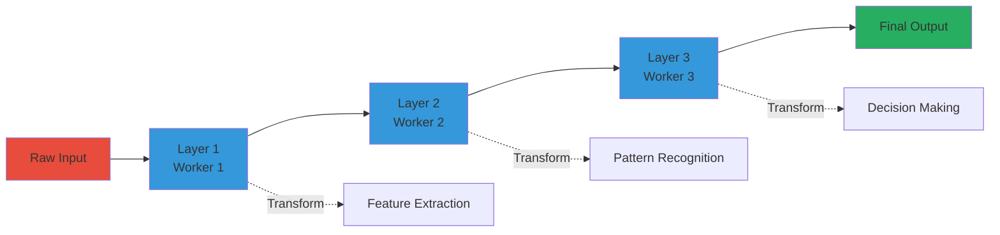
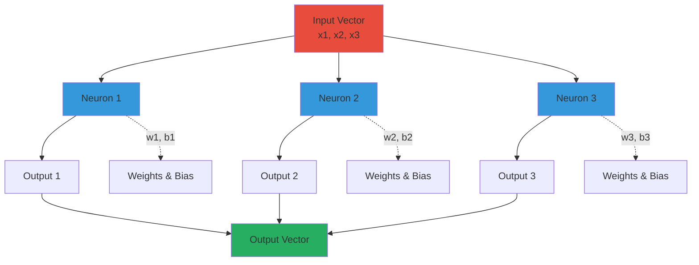
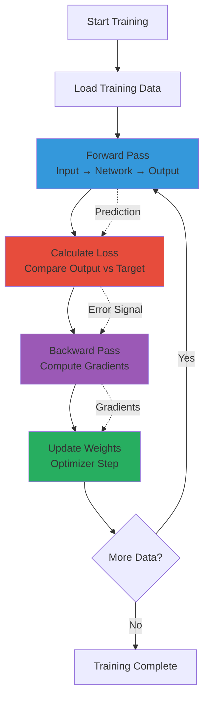
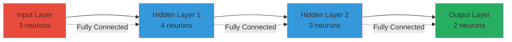
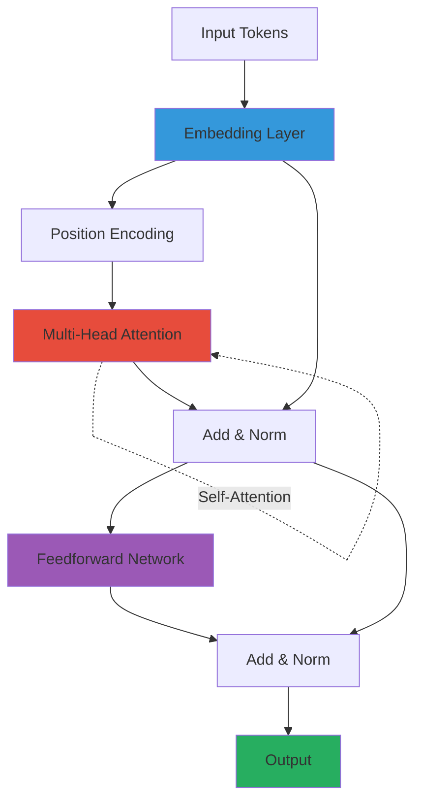
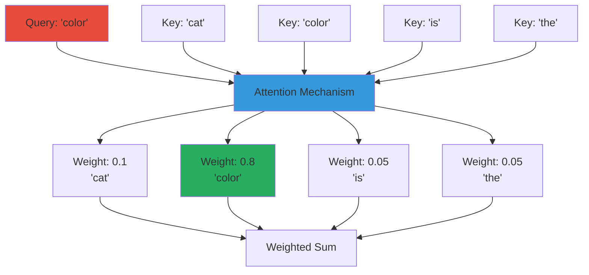

# Neural Networks Basics

## What is a Neural Network?

A **neural network** is a computer program that learns patterns from data, inspired by how our brains work.

### Simple Analogy

Think of a neural network like a factory assembly line:

```
Input → Worker 1 → Worker 2 → Worker 3 → Output
```

Each "worker" (called a **layer**) does a small transformation, and together they produce the final result.

### Diagram 1: Neural Network as Assembly Line



**Explanation**: Each layer transforms the data slightly, building up from raw input to meaningful output. Like an assembly line where each worker adds value.

## Basic Building Blocks

### 1. Neurons (Nodes)

A **neuron** is the smallest unit - it takes inputs, does a calculation, and produces an output.

```python
# Simplified neuron
def neuron(inputs, weights, bias):
    # Multiply inputs by weights
    result = sum(x * w for x, w in zip(inputs, weights))
    # Add bias
    result += bias
    # Apply activation function
    return max(0, result)  # ReLU activation
```

### 2. Layers

A **layer** is a group of neurons that process data together.

```python
# Example: A layer with 3 neurons
layer = [
    neuron(inputs, weights1, bias1),
    neuron(inputs, weights2, bias2),
    neuron(inputs, weights3, bias3)
]
```

### Diagram 2: Layer Structure



**Explanation**: A layer contains multiple neurons, each processing the same input with different weights. All neurons work in parallel to produce the layer's output.

### 3. Activation Functions

These add non-linearity (curves) to make the network learn complex patterns.

Common ones:
- **ReLU**: `max(0, x)` - Simple and fast
- **Sigmoid**: `1 / (1 + e^(-x))` - Squashes to 0-1
- **GELU**: `x * Φ(x)` - Smooth version of ReLU

## How Neural Networks Learn

### The Training Process

1. **Forward Pass**: Data flows through the network
2. **Calculate Loss**: Compare output to correct answer
3. **Backward Pass**: Adjust weights to reduce error
4. **Repeat**: Do this many times with many examples

### Diagram 3: Training Loop Flow



**Explanation**: The training loop continuously processes data, measures error, and adjusts weights to improve predictions. This cycle repeats until the model learns the patterns.

```python
# Simplified training loop
for example in training_data:
    # Forward pass
    prediction = network(example.input)
    
    # Calculate error
    error = loss_function(prediction, example.answer)
    
    # Backward pass (update weights)
    network.update_weights(error)
```

### Loss Function

Measures how wrong the network is. Common types:
- **Cross-Entropy**: For classification (is this a cat or dog?)
- **Mean Squared Error**: For regression (predicting numbers)

## Types of Neural Networks

### 1. Feedforward Networks

Simplest type - data flows in one direction:
```
Input → Hidden Layer → Output
```

### Diagram 4: Feedforward Network Architecture



**Explanation**: Feedforward networks process information in one direction only - from input through hidden layers to output. No loops or feedback.

### 2. Convolutional Neural Networks (CNNs)

Good for images - uses "filters" to detect patterns:
```python
# Example: Detecting edges in an image
filter = [[-1, -1, -1],
          [ 0,  0,  0],
          [ 1,  1,  1]]
```

### 3. Recurrent Neural Networks (RNNs)

Good for sequences (text, audio) - has "memory":
```
Input → [Memory] → Output
         ↑   ↓
         └───┘
```

### 4. Transformers (What μOmni Uses!)

Most powerful - uses "attention" to focus on important parts:
```
Input → Attention → Feedforward → Output
```

### Diagram 6: Transformer Architecture



**Explanation**: Transformers use attention to process all tokens simultaneously, allowing direct relationships between any positions. The feedforward network processes each position independently.

## Key Concepts in μOmni

### Embeddings

Convert discrete things (words, images) into numbers:

```python
# Word embedding example
"cat" → [0.2, -0.5, 0.8, ...]  # Vector of numbers
"dog" → [0.3, -0.4, 0.7, ...]
```

Similar words have similar embeddings!

### Attention Mechanism

Allows the model to "focus" on relevant parts:

```
Question: "What color is the cat?"
          ↓
Model focuses on: "cat" and "color"
```

### Diagram 7: Attention Visualization



**Explanation**: Attention computes weights for each word based on relevance to the query. "color" gets high weight (0.8) because it directly matches the query, while other words get lower weights.

### Self-Attention

A layer looks at all parts of input and decides what's important:

```python
# Simplified self-attention
def self_attention(inputs):
    # For each position, look at all other positions
    for i in range(len(inputs)):
        # Calculate importance of each position
        importance = calculate_attention(inputs[i], inputs)
        # Weighted sum
        output[i] = sum(importance[j] * inputs[j] for j in range(len(inputs)))
    return output
```

## PyTorch Basics

μOmni uses **PyTorch**, a Python library for neural networks.

### Tensors

Like NumPy arrays, but can run on GPU:

```python
import torch

# Create a tensor
x = torch.tensor([1, 2, 3])

# Operations
y = x * 2  # [2, 4, 6]
z = x + y  # [3, 6, 9]
```

### Neural Network Module

```python
import torch.nn as nn

class SimpleNet(nn.Module):
    def __init__(self):
        super().__init__()
        self.layer1 = nn.Linear(10, 5)  # 10 inputs → 5 outputs
        self.layer2 = nn.Linear(5, 1)   # 5 inputs → 1 output
    
    def forward(self, x):
        x = torch.relu(self.layer1(x))
        x = self.layer2(x)
        return x
```

### Training in PyTorch

```python
model = SimpleNet()
optimizer = torch.optim.Adam(model.parameters(), lr=0.001)
loss_fn = nn.MSELoss()

for input, target in dataloader:
    # Forward
    output = model(input)
    loss = loss_fn(output, target)
    
    # Backward
    optimizer.zero_grad()
    loss.backward()
    optimizer.step()
```

## Common Terms

- **Batch**: Processing multiple examples at once (faster)
- **Epoch**: One full pass through all training data
- **Learning Rate**: How big steps to take when learning
- **Gradient**: Direction to adjust weights
- **Backpropagation**: Calculating gradients backwards through network

## Visual Learning

```
Input Data
    ↓
[Embedding Layer]  ← Converts to numbers
    ↓
[Attention Layer]  ← Focuses on important parts
    ↓
[Feedforward]      ← Processes information
    ↓
[Output Layer]     ← Produces result
    ↓
Output
```

## Practice Exercise

Try this in Python:

```python
import torch
import torch.nn as nn

# Create simple network
net = nn.Sequential(
    nn.Linear(2, 4),  # 2 inputs, 4 hidden
    nn.ReLU(),
    nn.Linear(4, 1)   # 4 hidden, 1 output
)

# Test it
x = torch.tensor([[1.0, 2.0]])
output = net(x)
print(f"Input: {x}, Output: {output}")
```

---

**Next:** [02_Architecture_Overview.md](02_Architecture_Overview.md) - See how μOmni is built

**See Also:**
- [Thinker Deep Dive](03_Thinker_Deep_Dive.md) - Transformer details
- PyTorch Tutorial: https://pytorch.org/tutorials/

