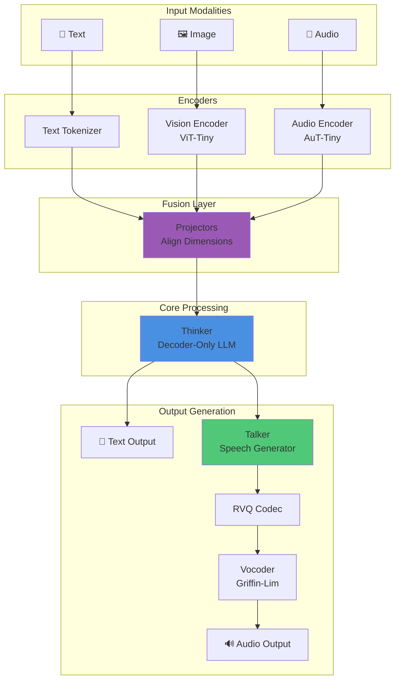
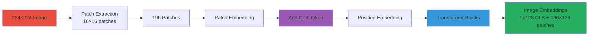
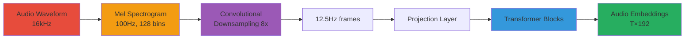
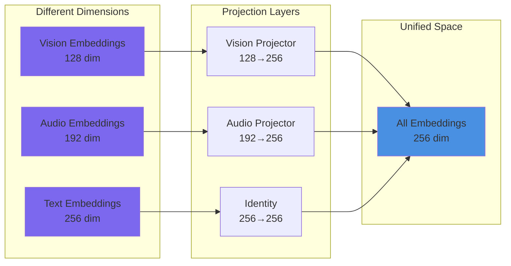
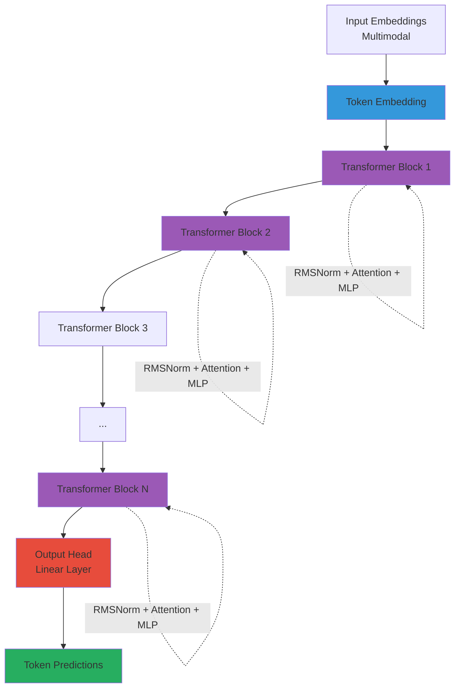
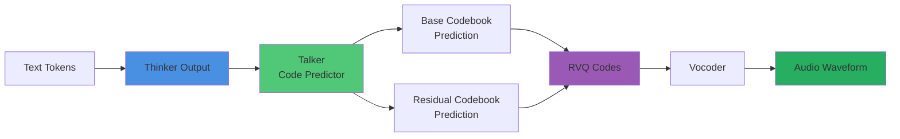

# μOmni Architecture Overview

## High-Level View

μOmni follows a **Thinker-Talker** architecture, inspired by Qwen3 Omni:

```
┌─────────────┐
│   Input     │  (Text, Image, Audio)
└──────┬──────┘
       │
       ├───→ [Vision Encoder] ───┐
       ├───→ [Audio Encoder] ────┤
       └───→ [Text Tokenizer] ───┤
                                 │
                          ┌──────▼──────┐
                          │  Projectors │  (Align dimensions)
                          └──────┬──────┘
                                 │
                          ┌──────▼──────┐
                          │   Thinker   │  (Core LLM)
                          └──────┬──────┘
                                 │
                          ┌──────▼──────┐
                          │   Output    │  (Text tokens)
                          └──────┬──────┘
                                 │
                          ┌──────▼──────┐
                          │   Talker    │  (Speech generator)
                          └──────┬──────┘
                                 │
                          ┌──────▼──────┐
                          │   RVQ Codec │  (Audio codes)
                          └──────┬──────┘
                                 │
                          ┌──────▼──────┐
                          │   Vocoder   │  (Waveform)
                          └─────────────┘
```

### Diagram 1: Complete System Architecture



**Explanation**: This diagram shows the complete data flow from multiple input modalities through specialized encoders, fusion via projectors, processing in Thinker, and generation of both text and audio outputs.

## Component Breakdown

### 1. Input Encoders

**Purpose**: Convert raw data into embeddings

#### Vision Encoder (ViT-Tiny)
- **Input**: Image (224×224 pixels)
- **Process**: 
  - Split into patches (16×16)
  - Convert patches to embeddings
  - Add CLS token (summary token)
- **Output**: Image embeddings

```python
# Simplified vision encoding
image → patches → embeddings → CLS token
(224×224) → (196 patches) → (196×128) → (1×128)
```

### Diagram 2: Vision Encoder Processing



**Explanation**: The vision encoder splits images into patches, converts them to embeddings, adds a CLS token for global representation, and processes through transformer blocks to produce image embeddings.

#### Audio Encoder (AuT-Tiny)
- **Input**: Audio waveform
- **Process**:
  - Convert to mel spectrogram
  - Downsample (8x reduction)
  - Process with transformer
- **Output**: Audio frame embeddings (12.5 Hz rate)

```python
# Simplified audio encoding
audio → mel → downsample → embeddings
(16kHz) → (100Hz) → (12.5Hz) → (T×192)
```

### Diagram 3: Audio Encoder Processing



**Explanation**: Audio is converted to mel spectrogram, downsampled 8x to reduce temporal resolution, then processed through transformer blocks to produce frame-level embeddings at 12.5 Hz.

#### Text Tokenizer
- **Input**: Text string
- **Process**: BPE (Byte Pair Encoding)
- **Output**: Token IDs

```python
# Simplified tokenization
"Hello world" → [1234, 5678] → embeddings
```

### 2. Projectors

**Purpose**: Align different modalities to same dimension

```python
# Vision projector
vision_emb (128 dim) → projector → thinker_emb (256 dim)

# Audio projector  
audio_emb (192 dim) → projector → thinker_emb (256 dim)
```

All modalities end up in the same "language" (256 dimensions).

### Diagram 4: Modality Projection



**Explanation**: Projectors align all modalities to the same 256-dimensional space, allowing Thinker to process them uniformly regardless of their original representation.

### 3. Thinker (Core LLM)

**Purpose**: Process unified multimodal sequence

**Architecture**:
```
Input Embeddings
    ↓
[Transformer Block 1]
    ↓
[Transformer Block 2]
    ↓
...
    ↓
[Transformer Block N]
    ↓
Output Head
    ↓
Token Predictions
```

### Diagram 5: Thinker Architecture



**Explanation**: Thinker processes unified embeddings through a stack of transformer blocks, each containing normalization, attention, and feedforward layers, finally producing token predictions via the output head.

**Key Features**:
- **RoPE**: Rotary Position Embedding (handles positions)
- **GQA**: Grouped Query Attention (optional, saves memory)
- **SwiGLU**: Activation function
- **MoE**: Mixture of Experts (optional)

### 4. Talker (Speech Generator)

**Purpose**: Generate speech codes from text

**Process**:
```
Text tokens → Thinker output → Talker → RVQ codes
```

**Architecture**: Similar to Thinker but predicts audio codes instead of text tokens.

### Diagram 6: Talker Generation Pipeline



**Explanation**: Talker takes Thinker's text output and generates RVQ codes (base + residual) autoregressively, which are then decoded by the vocoder into audio waveforms.

### 5. RVQ Codec

**Purpose**: Convert between mel spectrograms and discrete codes

**Process**:
```
Mel → [Codebook 0] → Residual → [Codebook 1] → Codes
(128) → (code) → (residual) → (code) → (2 codes)
```

### Diagram 7: RVQ Codec Process

```mermaid
graph LR
    Mel[Mel Spectrogram<br/>128 dim] --> Proj[Project to 64 dim]
    Proj --> CB0[Codebook 0<br/>128 codes]
    CB0 --> Code0[Code 0]
    CB0 --> Residual[Residual<br/>Error]
    Residual --> CB1[Codebook 1<br/>128 codes]
    CB1 --> Code1[Code 1]
    Code0 --> Codes[Output Codes<br/>(code0, code1)]
    Code1 --> Codes
    
    Codes -.->|Decode| Decode[Decode]
    Decode --> Reconstruct[Reconstructed Mel]
    
    style Mel fill:#e74c3c
    style CB0 fill:#3498db
    style CB1 fill:#3498db
    style Codes fill:#27ae60
```

**Explanation**: RVQ quantizes mel spectrograms in two stages - first codebook quantizes the input, second codebook quantizes the residual error, producing two discrete codes per frame.

### 6. Vocoder (Griffin-Lim)

**Purpose**: Convert mel spectrogram to audio waveform

**Process**: Iterative phase reconstruction (no neural network needed!)

## Data Flow Example

### Example: Image + Text Question

```
1. Image Input:
   image.png (224×224)
   ↓
   Vision Encoder
   ↓
   [CLS token] (1×128)
   ↓
   Vision Projector
   ↓
   Image embedding (1×256)

2. Text Input:
   "What do you see?"
   ↓
   Tokenizer
   ↓
   [1234, 5678, 9012, ...]
   ↓
   Text embeddings (5×256)

3. Fusion:
   [Image emb] + [Text embs] = (6×256)
   ↓
   Thinker
   ↓
   "I see a blue background."

4. Optional TTS:
   "I see a blue background."
   ↓
   Talker → RVQ → Vocoder
   ↓
   output.wav
```

## Key Design Decisions

### Why Separate Encoders?

- **Specialization**: Each encoder optimized for its modality
- **Modularity**: Can train/improve independently
- **Efficiency**: Process in parallel

### Why Projectors?

- **Unified Space**: Thinker only needs to understand one format
- **Flexibility**: Easy to add new modalities
- **Simplicity**: Thinker doesn't need to handle raw images/audio

### Why Thinker-Talker Split?

- **Separation of Concerns**: 
  - Thinker = Understanding and reasoning
  - Talker = Speech generation
- **Training Efficiency**: Can train separately
- **Flexibility**: Can use Thinker without Talker

## Model Sizes

All "tiny" models are designed to fit in 12GB VRAM:

| Component | Parameters | Purpose |
|-----------|-----------|---------|
| Thinker | ~50M | Core language model |
| Audio Encoder | ~20M | Speech understanding |
| Vision Encoder | ~10M | Image understanding |
| Talker | ~30M | Speech generation |
| RVQ Codec | ~5M | Audio quantization |
| Projectors | ~1M | Modality alignment |
| **Total** | **~120M** | Full system |

## Training Stages

1. **Stage A**: Thinker (text-only)
2. **Stage B**: Audio Encoder (ASR)
3. **Stage C**: Vision Encoder
4. **Stage D**: Talker + RVQ
5. **Stage E**: Multimodal SFT (all together)

See [Training Workflow](07_Training_Workflow.md) for details.

## Code Structure

```
omni/
├── thinker.py         # Core LLM
├── audio_encoder.py   # Speech input
├── vision_encoder.py  # Image input
├── talker.py          # Speech output
├── codec.py           # RVQ quantization
├── tokenizer.py       # Text processing
└── utils.py           # Helper functions
```

## Visual Architecture

```
                    ┌─────────────┐
                    │   Inputs    │
                    └──────┬──────┘
                           │
        ┌──────────────────┼──────────────────┐
        │                  │                  │
   ┌────▼────┐       ┌────▼────┐       ┌────▼────┐
   │ Vision  │       │ Audio   │       │  Text   │
   │ Encoder │       │ Encoder │       │Tokenizer│
   └────┬────┘       └────┬────┘       └────┬────┘
        │                │                  │
        └────────────────┼──────────────────┘
                        │
                  ┌─────▼─────┐
                  │ Projectors│
                  └─────┬─────┘
                        │
                  ┌─────▼─────┐
                  │  Thinker   │
                  └─────┬─────┘
                        │
        ┌───────────────┼───────────────┐
        │               │               │
   ┌────▼────┐    ┌────▼────┐    ┌────▼────┐
   │  Text   │    │  Talker │    │   RVQ   │
   │ Output  │    │         │    │  Codec  │
   └─────────┘    └────┬────┘    └────┬────┘
                       │               │
                  ┌────▼─────┐
                  │ Vocoder  │
                  └──────────┘
```

---

**Next:** 
- [03_Thinker_Deep_Dive.md](03_Thinker_Deep_Dive.md) - Understand the core LLM
- [04_Audio_Encoder.md](04_Audio_Encoder.md) - Learn about audio processing
- [05_Vision_Encoder.md](05_Vision_Encoder.md) - Learn about image processing

**See Also:**
- [Training Workflow](07_Training_Workflow.md)
- [Inference Guide](08_Inference_Guide.md)

