# μOmni Architecture Overview

> **💡 New to AI terminology?** This document uses technical terms like "embedding", "projector", "token", etc. If you encounter unfamiliar terms, check the [Glossary](GLOSSARY.md) for simple explanations!

## 🎯 Key Takeaways (TL;DR)

- **What**: μOmni is a multimodal AI with Thinker-Talker architecture
- **Why**: Enables understanding and generating text, images, and audio in one model
- **How**: Separate encoders → projectors → Thinker → Talker → Codec → Vocoder
- **Key Insight**: Projectors align different modalities to unified 256-dim space
- **Common Mistake**: Forgetting to project modalities before feeding to Thinker
- **Shape Flow**: Vision `(B,197,128)` → `(B,197,256)`, Audio `(B,T,192)` → `(B,T,256)`

**📖 Reading Guide**:
- **Quick Read**: 10 minutes (overview + diagrams)
- **Standard Read**: 30 minutes (full document)
- **Deep Dive**: 90 minutes (read + code + experiments)

## High-Level View

μOmni follows a **Thinker-Talker** architecture, inspired by Qwen3 Omni:

```
┌─────────────┐
│   Input     │  (Text, Image, Audio)
└──────┬──────┘
       │
       ├───→ [Vision Encoder] ───┐
       ├───→ [Audio Encoder] ────┤
       └───→ [Text Tokenizer] ───┤
                                 │
                          ┌──────▼──────┐
                          │  Projectors │  (Align dimensions)
                          └──────┬──────┘
                                 │
                          ┌──────▼──────┐
                          │   Thinker   │  (Core LLM)
                          └──────┬──────┘
                                 │
                          ┌──────▼──────┐
                          │   Output    │  (Text tokens)
                          └──────┬──────┘
                                 │
                          ┌──────▼──────┐
                          │   Talker    │  (Speech generator)
                          └──────┬──────┘
                                 │
                          ┌──────▼──────┐
                          │   RVQ Codec │  (Audio codes)
                          └──────┬──────┘
                                 │
                          ┌──────▼──────┐
                          │   Vocoder   │  (Waveform)
                          └─────────────┘
```

### Diagram 1: Complete System Architecture

```mermaid
graph TB
    subgraph Inputs["Input Modalities"]
        TextIn[📝 Text]
        ImageIn[🖼️ Image]
        AudioIn[🎤 Audio]
    end
    
    subgraph Encoders["Encoders"]
        TextTok[Text Tokenizer]
        VisionEnc[Vision Encoder<br/>ViT-Tiny]
        AudioEnc[Audio Encoder<br/>AuT-Tiny]
    end
    
    subgraph Fusion["Fusion Layer"]
        Proj[Projectors<br/>Align Dimensions]
    end
    
    subgraph Core["Core Processing"]
        Thinker[Thinker<br/>Decoder-Only LLM]
    end
    
    subgraph Output["Output Generation"]
        TextOut[📝 Text Output]
        Talker[Talker<br/>Speech Generator]
        RVQ[RVQ Codec]
        Vocoder[Vocoder<br/>Griffin-Lim]
        AudioOut[🔊 Audio Output]
    end
    
    TextIn --> TextTok
    ImageIn --> VisionEnc
    AudioIn --> AudioEnc
    
    TextTok --> Proj
    VisionEnc --> Proj
    AudioEnc --> Proj
    
    Proj --> Thinker
    Thinker --> TextOut
    Thinker --> Talker
    Talker --> RVQ
    RVQ --> Vocoder
    Vocoder --> AudioOut
    
    style Thinker fill:#4a90e2
    style Proj fill:#9b59b6
    style Talker fill:#50c878
```



**Explanation**: This diagram shows the complete data flow from multiple input modalities through specialized encoders, fusion via projectors, processing in Thinker, and generation of both text and audio outputs.

## Component Breakdown

### 1. Input Encoders

**Purpose**: Convert raw data into embeddings (vectors of numbers that represent the data)

> **What is an embedding?** An embedding converts discrete items (like words or image patches) into continuous vectors (lists of numbers). Think of it like translating words into a universal language of numbers. See [Glossary: Embedding](GLOSSARY.md#e) for more details.

#### Vision Encoder (ViT-Tiny)
- **Input**: Image (224×224 pixels)
- **Process**: 
  - Split into patches (16×16)
  - Convert patches to embeddings
  - Add CLS token (summary token)
  - Process through transformer blocks
- **Output**: Image embeddings (CLS token)
- **Training**: Contrastive learning (CLIP-style) with InfoNCE loss for proper image-caption alignment

```python
# Simplified vision encoding
image → patches → embeddings → CLS token
(224×224) → (196 patches) → (196×128) → (1×128)
```

### Diagram 2: Vision Encoder Processing

```mermaid
graph LR
    Image[224×224 Image] --> Patch[Patch Extraction<br/>16×16 patches]
    Patch --> Patches[196 Patches]
    Patches --> Embed[Patch Embedding]
    Embed --> CLS[Add CLS Token]
    CLS --> PosEnc[Position Embedding]
    PosEnc --> Trans[Transformer Blocks]
    Trans --> Output[Image Embeddings<br/>1×128 CLS + 196×128 patches]
    
    style Image fill:#e74c3c
    style CLS fill:#9b59b6
    style Trans fill:#3498db
    style Output fill:#27ae60
```



**Explanation**: The vision encoder splits images into patches, converts them to embeddings, adds a CLS token for global representation, and processes through transformer blocks to produce image embeddings.

#### Audio Encoder (AuT-Tiny)
- **Input**: Audio waveform
- **Process**:
  - Convert to mel spectrogram
  - Downsample (8x reduction)
  - Process with transformer
- **Output**: Audio frame embeddings (12.5 Hz rate)
- **Training**: CTC loss with full character vocabulary (98 tokens: printable ASCII + special tokens)

```python
# Simplified audio encoding
audio → mel → downsample → embeddings
(16kHz) → (100Hz) → (12.5Hz) → (T×192)
```

### Diagram 3: Audio Encoder Processing


**Explanation**: Audio is converted to mel spectrogram, downsampled 8x to reduce temporal resolution, then processed through transformer blocks to produce frame-level embeddings at 12.5 Hz.

#### Text Tokenizer
- **Input**: Text string
- **Process**: BPE (Byte Pair Encoding)
- **Output**: Token IDs

```python
# Simplified tokenization
"Hello world" → [1234, 5678] → embeddings
```

### 2. Projectors

**Purpose**: Align different modalities to same dimension

```python
# Vision projector
vision_emb (128 dim) → projector → thinker_emb (256 dim)

# Audio projector  
audio_emb (192 dim) → projector → thinker_emb (256 dim)
```

All modalities end up in the same "language" (256 dimensions).

### Diagram 4: Modality Projection


**Explanation**: Projectors align all modalities to the same 256-dimensional space, allowing Thinker to process them uniformly regardless of their original representation.

### 3. Thinker (Core LLM)

**Purpose**: Process unified multimodal sequence

**Architecture**:
```
Input Embeddings
    ↓
[Transformer Block 1]
    ↓
[Transformer Block 2]
    ↓
...
    ↓
[Transformer Block N]
    ↓
Output Head
    ↓
Token Predictions
```

### Diagram 5: Thinker Architecture


**Explanation**: Thinker processes unified embeddings through a stack of transformer blocks, each containing normalization, attention, and feedforward layers, finally producing token predictions via the output head.

**Key Features**:
- **RoPE**: Rotary Position Embedding (handles positions)
- **GQA**: Grouped Query Attention (optional, saves memory)
- **SwiGLU**: Activation function
- **MoE**: Mixture of Experts (optional)

### 4. Talker (Speech Generator)

**Purpose**: Generate speech codes from text

**Process**:
```
Text tokens → Thinker output → Talker → RVQ codes
```

**Architecture**: Similar to Thinker but predicts audio codes instead of text tokens.

### Diagram 6: Talker Generation Pipeline


**Explanation**: Talker takes Thinker's text output and generates RVQ codes (base + residual) autoregressively, which are then decoded by the vocoder into audio waveforms.

### 5. RVQ Codec

**Purpose**: Convert between mel spectrograms and discrete codes

**Process**:
```
Mel → [Codebook 0] → Residual → [Codebook 1] → Codes
(128) → (code) → (residual) → (code) → (2 codes)
```

### Diagram 7: RVQ Codec Process


**Explanation**: RVQ quantizes mel spectrograms in two stages - first codebook quantizes the input, second codebook quantizes the residual error, producing two discrete codes per frame.

### 6. Vocoder (Griffin-Lim)

**Purpose**: Convert mel spectrogram to audio waveform

**Process**: Improved Griffin-Lim with proper mel filterbank inversion (pseudo-inverse approach), automatic domain detection (log vs magnitude), momentum for better convergence, and proper normalization to prevent clipping.

**Improvements**: Uses proper mel filterbank inversion instead of simple upsampling, handles both log and magnitude domains automatically, includes momentum (0.99) for better convergence, and proper amplitude normalization.

## Data Flow Example

### Example: Image + Text Question

```
1. Image Input:
   image.png (224×224)
   ↓
   Vision Encoder
   ↓
   [CLS token] (1×128)
   ↓
   Vision Projector
   ↓
   Image embedding (1×256)

2. Text Input:
   "What do you see?"
   ↓
   Tokenizer
   ↓
   [1234, 5678, 9012, ...]
   ↓
   Text embeddings (5×256)

3. Fusion:
   [Image emb] + [Text embs] = (6×256)
   ↓
   Thinker
   ↓
   "I see a blue background."

4. Optional TTS:
   "I see a blue background."
   ↓
   Talker → RVQ → Vocoder
   ↓
   output.wav
```

## Key Design Decisions

### Why Separate Encoders?

- **Specialization**: Each encoder optimized for its modality
- **Modularity**: Can train/improve independently
- **Efficiency**: Process in parallel

### Why Projectors?

- **Unified Space**: Thinker only needs to understand one format
- **Flexibility**: Easy to add new modalities
- **Simplicity**: Thinker doesn't need to handle raw images/audio

### Why Thinker-Talker Split?

- **Separation of Concerns**: 
  - Thinker = Understanding and reasoning
  - Talker = Speech generation
- **Training Efficiency**: Can train separately
- **Flexibility**: Can use Thinker without Talker

## 📊 Component Comparison

All "tiny" models are designed to fit in 12GB VRAM:

| Component | Input Shape | Output Shape | Parameters | Purpose |
|-----------|-------------|--------------|------------|---------|
| Vision Encoder | (B, 3, 224, 224) | (B, 197, 128) | ~10M | Image → Embeddings |
| Audio Encoder | (B, T, 1) | (B, T/8, 192) | ~20M | Audio → Embeddings |
| Text Tokenizer | Text string | (B, T) | 0 | Text → Token IDs |
| Vision Projector | (B, 197, 128) | (B, 197, 256) | ~0.3M | Align to Thinker |
| Audio Projector | (B, T/8, 192) | (B, T/8, 256) | ~0.3M | Align to Thinker |
| Thinker | (B, T, 256) | (B, T, 5000) | ~50M | Core LLM |
| Talker | (B, T, 256) | (B, T, 2) | ~30M | Tokens → Audio Codes |
| RVQ Codec | (B, T, 128) | (B, T, 2) | ~5M | Mel → Codes |
| Vocoder | (B, T, 128) | (B, T, 16000) | 0 | Mel → Waveform |
| **Total** | **Various** | **Various** | **~120M** | **Full System** |

## Model Sizes

All "tiny" models are designed to fit in 12GB VRAM:

| Component | Parameters | Purpose |
|-----------|-----------|---------|
| Thinker | ~50M | Core language model |
| Audio Encoder | ~20M | Speech understanding |
| Vision Encoder | ~10M | Image understanding |
| Talker | ~30M | Speech generation |
| RVQ Codec | ~5M | Audio quantization |
| Projectors | ~1M | Modality alignment |
| **Total** | **~120M** | Full system |

## Training Stages

1. **Stage A**: Thinker (text-only) - Next-token prediction with gradient accumulation
2. **Stage B**: Audio Encoder (ASR) - CTC loss with full character vocabulary (98 tokens)
3. **Stage C**: Vision Encoder - Contrastive learning (CLIP-style) for image-caption alignment
4. **Stage D**: Talker + RVQ - Autoregressive code prediction
5. **Stage E**: Multimodal SFT (all together) - Fine-tuning with all modalities

**Training Features**:
- **Gradient accumulation**: All scripts support accumulating gradients for larger effective batch sizes
- **Automatic resume**: Training automatically detects and resumes from latest checkpoint
- **Mixed precision (AMP)**: Enabled by default for 1.5-2x speedup
- **Evaluation metrics**: Perplexity for text, proper character-level tokenization for audio

See [Training Workflow](07_Training_Workflow.md) for details.

## Code Structure

```
omni/
├── thinker.py         # Core LLM
├── audio_encoder.py   # Speech input
├── vision_encoder.py  # Image input
├── talker.py          # Speech output
├── codec.py           # RVQ quantization
├── tokenizer.py       # Text processing
└── utils.py           # Helper functions
```

## Visual Architecture

```
                    ┌─────────────┐
                    │   Inputs    │
                    └──────┬──────┘
                           │
        ┌──────────────────┼──────────────────┐
        │                  │                  │
   ┌────▼────┐       ┌────▼────┐       ┌────▼────┐
   │ Vision  │       │ Audio   │       │  Text   │
   │ Encoder │       │ Encoder │       │Tokenizer│
   └────┬────┘       └────┬────┘       └────┬────┘
        │                │                  │
        └────────────────┼──────────────────┘
                        │
                  ┌─────▼─────┐
                  │ Projectors│
                  └─────┬─────┘
                        │
                  ┌─────▼─────┐
                  │  Thinker   │
                  └─────┬─────┘
                        │
        ┌───────────────┼───────────────┐
        │               │               │
   ┌────▼────┐    ┌────▼────┐    ┌────▼────┐
   │  Text   │    │  Talker │    │   RVQ   │
   │ Output  │    │         │    │  Codec  │
   └─────────┘    └────┬────┘    └────┬────┘
                       │               │
                  ┌────▼─────┐
                  │ Vocoder  │
                  └──────────┘
```

## ⚠️ Common Pitfalls

1. **Forgetting Projectors**: Always project modalities before Thinker
   ```python
   # WRONG: Direct to Thinker
   thinker(vision_emb)  # Shape mismatch!
   
   # CORRECT: Project first
   vision_proj = vision_projector(vision_emb)  # (B, 197, 128) → (B, 197, 256)
   thinker(vision_proj)  # Now works!
   ```

2. **Shape Mismatches**: Check dimensions match after projection
   ```python
   assert vision_proj.shape[-1] == 256  # Must match Thinker's d_model
   assert audio_proj.shape[-1] == 256
   ```

3. **Modality Order**: Ensure consistent ordering when combining modalities
   ```python
   # Decide: [image, text] or [text, image]?
   # Keep consistent across training and inference
   ```

## ✅ Understanding Checkpoint

Before moving on, can you answer:

1. **Why separate encoders instead of one unified encoder?**
   - Answer: Each modality needs specialized processing (patches for images, mel for audio)

2. **Why do we need projectors?**
   - Answer: To align different embedding dimensions to Thinker's unified space (256 dims)

3. **What's the difference between Thinker and Talker?**
   - Answer: Thinker = understanding/reasoning (text output), Talker = speech generation (audio codes)

4. **Why staged training instead of end-to-end?**
   - Answer: Fits in 12GB VRAM, easier to debug, components can be pretrained separately

5. **What training improvements have been made?**
   - Answer: Vision uses contrastive learning (CLIP-style), audio uses full character vocabulary (98 tokens), gradient accumulation support, improved Griffin-Lim vocoder, automatic checkpoint resume

## 🚀 Extension Ideas

1. **Add Video Support**: Extend vision encoder to process video frames
2. **Custom Modalities**: Add new encoders (e.g., depth maps, point clouds)
3. **Unified Encoder**: Experiment with single encoder for all modalities
4. **Better Codec**: Try different audio codecs (e.g., EnCodec, SoundStream)
5. **Neural Vocoder**: Replace Griffin-Lim with neural vocoder (e.g., HiFi-GAN)

## ❓ Frequently Asked Questions

**Q: Why is the model called "tiny"?**
A: It's designed to fit in 12GB VRAM, making it accessible for learning and experimentation.

**Q: Can I use this for production?**
A: It's designed for education. For production, consider larger models or fine-tune on your data.

**Q: How do I add a new modality?**
A: Add encoder → add projector → update Thinker input handling → retrain

**Q: Why separate Thinker and Talker?**
A: Separation of concerns - Thinker handles understanding, Talker handles speech generation. Can use Thinker without Talker.

**Q: What's the difference between RVQ and other codecs?**
A: RVQ uses residual quantization (multiple codebooks), simpler than neural codecs but effective.

---

**Next:** 
- [03_Thinker_Deep_Dive.md](03_Thinker_Deep_Dive.md) - Understand the core LLM
- [04_Audio_Encoder.md](04_Audio_Encoder.md) - Learn about audio processing
- [05_Vision_Encoder.md](05_Vision_Encoder.md) - Learn about image processing

**See Also:**
- [Training Workflow](07_Training_Workflow.md)
- [Inference Guide](08_Inference_Guide.md)

