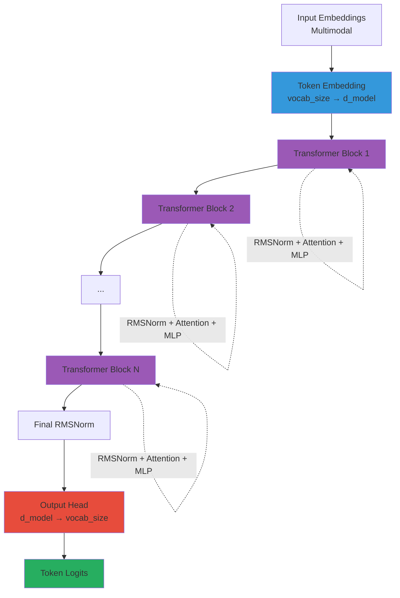
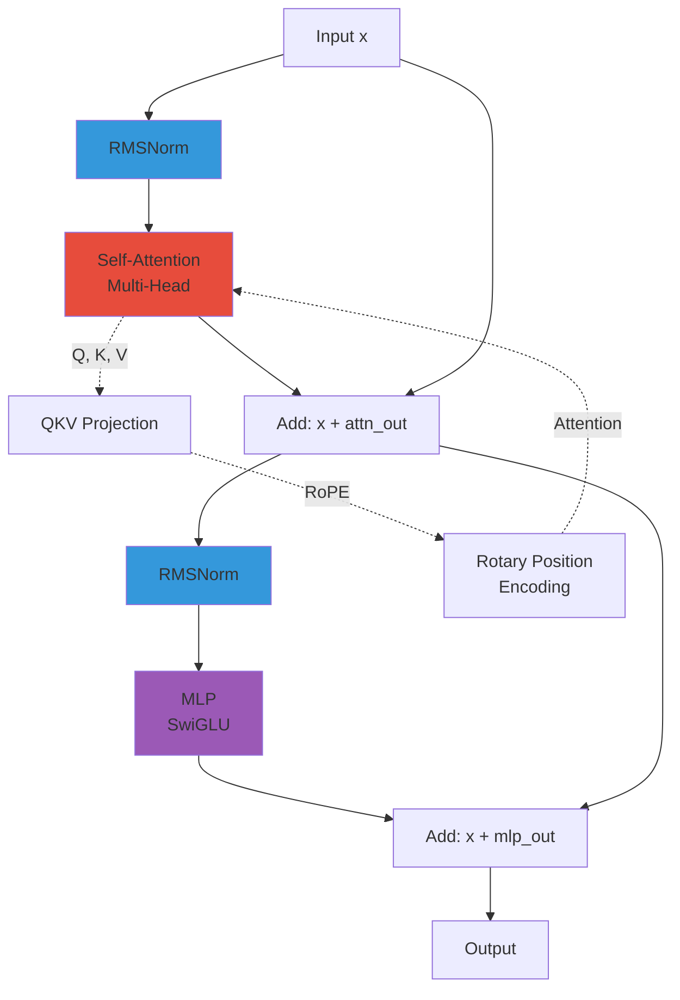
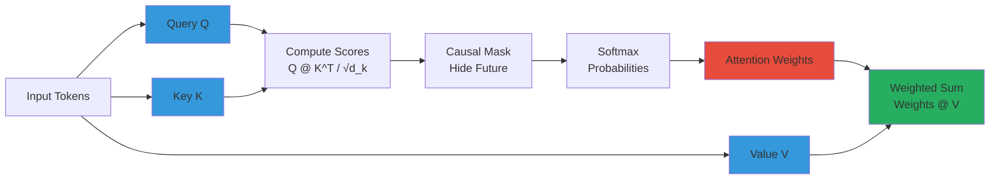
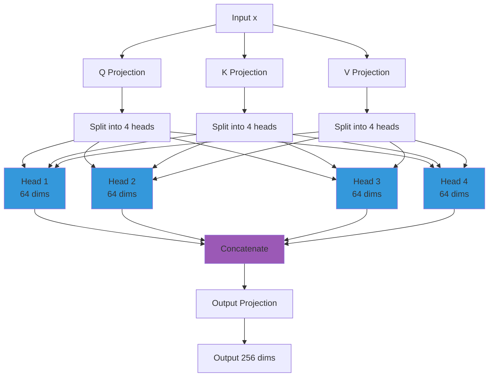
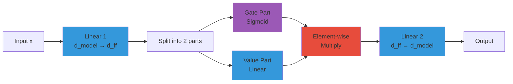
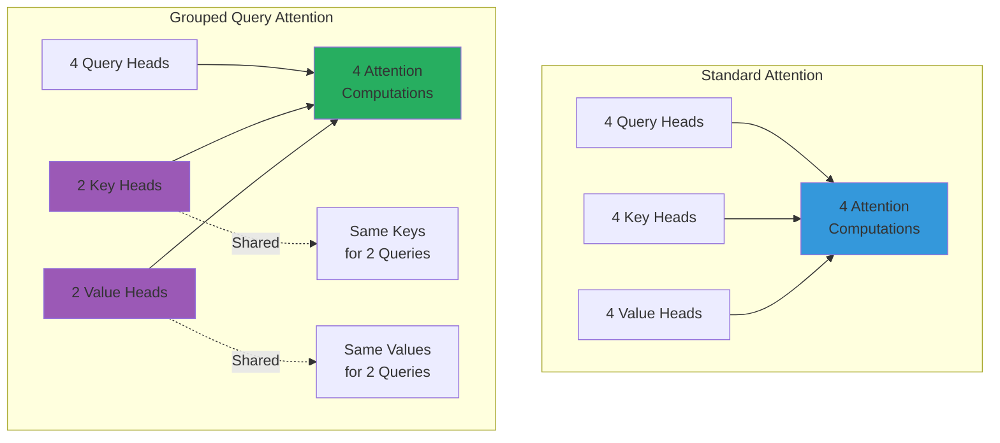
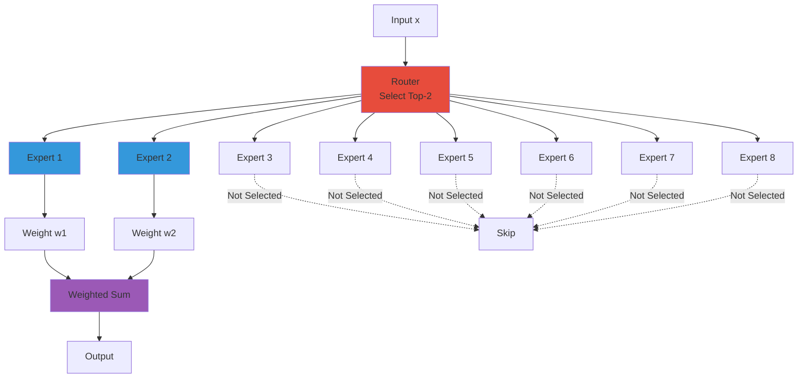
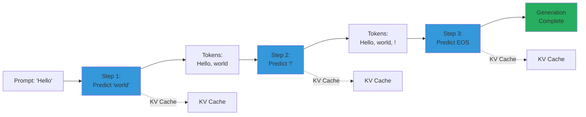

# Thinker: The Core Language Model

## What is Thinker?

**Thinker** is μOmni's core language model - a decoder-only transformer that processes unified multimodal embeddings.

Think of it as the "brain" that:
- Understands text, images, and audio (after encoding)
- Generates text responses
- Maintains context across the conversation

## Architecture

```
Input (Text/Image/Audio embeddings)
    ↓
Token/Embedding Layer
    ↓
┌─────────────────────┐
│  Transformer Block  │
│  ┌───────────────┐  │
│  │ RMSNorm       │  │
│  └───────┬───────┘  │
│          │          │
│  ┌───────▼───────┐  │
│  │ Self-Attention│  │
│  └───────┬───────┘  │
│          │          │
│  ┌───────▼───────┐  │
│  │ RMSNorm       │  │
│  └───────┬───────┘  │
│          │          │
│  ┌───────▼───────┐  │
│  │    MLP        │  │
│  │  (SwiGLU)     │  │
│  └───────────────┘  │
└─────────────────────┘
    ↓ (repeat N times)
Output Head
    ↓
Token Predictions
```

### Diagram 1: Thinker Complete Architecture



**Explanation**: Thinker processes unified embeddings through N transformer blocks, each containing normalization, attention, and feedforward layers, producing token predictions via the output head.

## Key Components

### 1. Embedding Layer

Converts token IDs to dense vectors:

```python
# From omni/thinker.py
self.tok_emb = nn.Embedding(vocab_size, d_model)
# vocab_size = 5000 (number of unique tokens)
# d_model = 256 (embedding dimension)
```

**Example**:
```python
token_id = 1234
embedding = tok_emb(token_id)  # Shape: (256,)
```

### 2. Transformer Blocks

Each block contains:
- **RMSNorm**: Normalization layer
- **Self-Attention**: Looks at all positions
- **MLP**: Feedforward network

### Diagram 2: Transformer Block Structure



**Explanation**: Each transformer block uses pre-norm architecture with residual connections. Self-attention processes all positions, MLP processes each position independently.

#### RMSNorm (Root Mean Square Normalization)

Simpler than LayerNorm, normalizes by RMS:

```python
def rms_norm(x, eps=1e-6):
    rms = torch.sqrt(torch.mean(x**2) + eps)
    return x / rms
```

#### Self-Attention

The heart of transformers - allows model to focus on relevant parts:

```python
# Simplified attention
def attention(query, key, value):
    # Compute similarity scores
    scores = query @ key.T / sqrt(d_k)
    # Apply softmax (probabilities)
    weights = softmax(scores)
    # Weighted sum
    output = weights @ value
    return output
```

### Diagram 3: Self-Attention Mechanism



**Explanation**: Self-attention computes similarity scores between queries and keys, applies causal masking (for decoder), converts to probabilities, then uses these weights to combine value vectors.

**Multi-Head Attention**: Run attention multiple times in parallel:

```python
# 4 heads, each with 64 dimensions (256 total)
head1 = attention(q1, k1, v1)  # 64 dims
head2 = attention(q2, k2, v2)  # 64 dims
head3 = attention(q3, k3, v3)  # 64 dims
head4 = attention(q4, k4, v4)  # 64 dims
# Concatenate: 256 dims
```

### Diagram 4: Multi-Head Attention



**Explanation**: Multi-head attention splits Q, K, V into multiple heads, processes each independently, then concatenates and projects back to the original dimension. Each head learns different attention patterns.

#### MLP (Multi-Layer Perceptron)

Feedforward network with SwiGLU activation:

```python
# SwiGLU: Swish-gated linear unit
def swiglu(x):
    gate = sigmoid(x)  # Gate
    return x * gate    # Gated output

# MLP structure
x → Linear → SwiGLU → Linear → output
```

### Diagram 6: MLP with SwiGLU



**Explanation**: SwiGLU splits the linear output into gate and value parts. The gate (sigmoid) controls how much of the value passes through, enabling more expressive transformations than standard ReLU.

### 3. RoPE (Rotary Position Embedding)

Handles sequence positions without adding separate position embeddings:

```python
# Rotates query/key vectors based on position
def apply_rope(x, position):
    # Rotate by angle based on position
    angle = position / (10000 ** (2 * i / d))
    rotated = rotate(x, angle)
    return rotated
```

### Diagram 5: RoPE Rotation

```mermaid
graph LR
    Q[Query Vector] --> RotQ[Rotate by θ_pos]
    K[Key Vector] --> RotK[Rotate by θ_pos]
    
    RotQ --> QRot[Rotated Q]
    RotK --> KRot[Rotated K]
    
    QRot --> Attn[Attention<br/>Q_rot @ K_rot^T]
    KRot --> Attn
    
    Pos[Position] --> Theta[Compute θ<br/>θ = pos / 10000^(2i/d)]
    Theta --> RotQ
    Theta --> RotK
    
    style Q fill:#3498db
    style K fill:#3498db
    style QRot fill:#9b59b6
    style KRot fill:#9b59b6
    style Attn fill:#e74c3c
```

**Explanation**: RoPE rotates query and key vectors by an angle that depends on their position. This encodes relative positions in the attention scores, allowing the model to understand token order without explicit position embeddings.

**Why RoPE?**
- Better generalization to longer sequences
- Relative position encoding
- More efficient than absolute positions

### 4. Output Head

Converts hidden states to token predictions:

```python
self.head = nn.Linear(d_model, vocab_size)
# (256) → (5000) logits
```

## Advanced Features

### GQA (Grouped Query Attention)

Optional feature that shares key/value heads:

```
Standard: 4 query heads, 4 key heads, 4 value heads
GQA:      4 query heads, 2 key heads, 2 value heads (shared)
```

### Diagram 7: GQA vs Standard Attention



**Explanation**: GQA reduces KV cache size by sharing key/value heads across multiple query heads. This halves memory usage during inference while maintaining similar quality.

**Benefit**: Reduces memory usage while maintaining quality.

### MoE (Mixture of Experts)

Optional feature - replaces MLP with multiple "expert" networks:

```python
# Router selects top-2 experts per token
experts = [Expert1(), Expert2(), ..., Expert8()]
selected = router(x)  # Top 2 experts
output = selected[0](x) + selected[1](x)
```

### Diagram 8: Mixture of Experts



**Explanation**: MoE uses a router to select the top-2 experts for each token. Only selected experts are activated, allowing larger model capacity (8 experts) while using compute for only 2 experts per token.

**Benefit**: Larger model capacity without proportional compute.

## Forward Pass

```python
def forward(self, x, embeddings=None):
    # Option 1: Token IDs
    if embeddings is None:
        x = self.tok_emb(x)  # (B, T, d_model)
    
    # Option 2: Raw embeddings (for multimodal)
    else:
        x = embeddings  # Already embeddings
    
    # Process through transformer blocks
    for block in self.blocks:
        x = block(x)  # (B, T, d_model)
    
    # Final normalization
    x = self.norm(x)
    
    # Predict next tokens
    logits = self.head(x)  # (B, T, vocab_size)
    return logits
```

## Training

### Objective: Next-Token Prediction

Given: `[BOS] "The cat sat"`
Predict: `"on"` (next token)

### Diagram 9: Training Flow

```mermaid
graph TD
    Text[Training Text] --> Tokenize[Tokenize]
    Tokenize --> Input[Input Tokens<br/>[BOS, The, cat, sat]]
    Input --> Thinker[Thinker Forward]
    Thinker --> Logits[Logits<br/>vocab_size]
    Logits --> Loss[Cross-Entropy Loss]
    Target[Target Tokens<br/>[The, cat, sat, on]] --> Loss
    Loss --> Backward[Backward Pass]
    Backward --> Update[Update Weights]
    Update --> Next[Next Batch]
    Next --> Input
    
    style Thinker fill:#4a90e2
    style Loss fill:#e74c3c
    style Update fill:#27ae60
```

**Explanation**: Training uses next-token prediction - given a sequence, predict the next token. Cross-entropy loss measures prediction quality, and gradients update model weights.

```python
# Training example
input_ids = [1, 1234, 5678, 9012]  # [BOS, The, cat, sat]
target_ids = [1234, 5678, 9012, 3456]  # [The, cat, sat, on]

# Forward pass
logits = model(input_ids)  # (B, T, vocab_size)

# Calculate loss
loss = cross_entropy(logits, target_ids)
```

### Loss Function

Cross-entropy loss - measures how well predictions match targets:

```python
loss = -log(probability_of_correct_token)
```

## Inference (Generation)

### Autoregressive Generation

Generate one token at a time:

```python
def generate(prompt, max_length=64):
    tokens = tokenize(prompt)
    
    for _ in range(max_length):
        # Get predictions
        logits = model(tokens)
        # Get next token (greedy: highest probability)
        next_token = argmax(logits[:, -1, :])
```

### Diagram 10: Autoregressive Generation



**Explanation**: Autoregressive generation produces one token at a time. Each step uses previously generated tokens (with KV caching for efficiency) to predict the next token until an end token is generated.
        # Append to sequence
        tokens.append(next_token)
        
        if next_token == EOS:
            break
    
    return detokenize(tokens)
```

### KV Caching

Speed up generation by caching previous computations:

```python
# First token: process full sequence
logits, kv_cache = model(prompt, use_cache=True)

# Subsequent tokens: only process new token
logits, kv_cache = model(new_token, kv_cache=kv_cache, use_cache=True)
```

**Benefit**: Much faster for long sequences!

## Configuration

From `configs/thinker_tiny.json`:

```json
{
  "vocab_size": 5000,      // Number of unique tokens
  "n_layers": 4,           // Number of transformer blocks
  "d_model": 256,          // Embedding dimension
  "n_heads": 4,            // Attention heads
  "d_ff": 1024,            // MLP hidden size
  "dropout": 0.1,          // Regularization
  "rope_theta": 10000,     // RoPE base frequency
  "ctx_len": 512,          // Maximum sequence length
  "use_swiglu": true,      // Use SwiGLU activation
  "use_gqa": false,        // Use grouped query attention
  "use_moe": false         // Use mixture of experts
}
```

## Code Walkthrough

Let's look at the actual implementation:

```python
# From omni/thinker.py

class ThinkerLM(nn.Module):
    def __init__(self, vocab_size, n_layers, d_model, ...):
        # Embedding layer
        self.tok_emb = nn.Embedding(vocab_size, d_model)
        
        # Transformer blocks
        self.blocks = nn.ModuleList([
            Block(d_model, n_heads, d_ff, ...)
            for _ in range(n_layers)
        ])
        
        # Output head
        self.head = nn.Linear(d_model, vocab_size)
    
    def forward(self, x, embeddings=None):
        # Handle both token IDs and embeddings
        if embeddings is None:
            x = self.tok_emb(x)
        else:
            x = embeddings
        
        # Process through blocks
        for block in self.blocks:
            x = block(x)
        
        # Predict tokens
        return self.head(x)
```

## Common Patterns

### 1. Pre-Normalization

Normalize BEFORE attention/MLP (not after):

```python
# Pre-norm (used in μOmni)
x = norm(x)
x = x + attention(x)

# Post-norm (older style)
x = x + attention(norm(x))
```

**Benefit**: More stable training.

### 2. Residual Connections

Add input to output (helps gradients flow):

```python
x = x + attention(x)  # Residual connection
```

### 3. Layer Scaling

Sometimes scale residual connections:

```python
x = x + alpha * attention(x)  # alpha < 1.0
```

## Performance Tips

1. **Batch Processing**: Process multiple sequences together
2. **KV Caching**: Cache attention states during generation
3. **Mixed Precision**: Use float16 for faster training
4. **Gradient Accumulation**: Simulate larger batches

## Debugging

Common issues:

1. **NaN values**: Check learning rate, gradient clipping
2. **Slow training**: Check batch size, use GPU
3. **Poor quality**: More training steps, better data
4. **OOM errors**: Reduce batch size, use gradient checkpointing

---

## Complete Layer-by-Layer Breakdown

> This section provides a detailed breakdown of every single layer in Thinker, combining **deep theoretical understanding** with **practical implementation details**. All explanations are **strictly based on our actual code** in `omni/thinker.py` and `omni/utils.py`.

### Theoretical Foundation: Why This Architecture?

#### The Decoder-Only Design

Thinker uses a **decoder-only** architecture (like GPT), not encoder-decoder (like BERT):

**Decoder-only advantages**:
- **Autoregressive generation**: Can generate text token by token
- **Unified architecture**: Same model for understanding and generation
- **Causal attention**: Only sees previous tokens (realistic for generation)
- **Simplicity**: Single stack of layers, easier to train

**Why not encoder-decoder?**
- More complex (two stacks)
- Encoder sees all tokens (not realistic for generation)
- Requires separate training for understanding vs generation

#### Pre-Normalization Architecture

Thinker uses **pre-norm** (normalize before transformation), not post-norm:

**Pre-norm benefits**:
- **Stable gradients**: Normalized inputs prevent gradient explosion
- **Deep networks**: Enables training very deep models (100+ layers)
- **Modern standard**: Used in LLaMA, PaLM, GPT-3

**Post-norm issues**:
- Can have gradient problems in deep networks
- Less stable training
- Older architecture (original Transformer)

#### Why These Specific Dimensions?

**d_model = 256**:
- Balance between capacity and efficiency
- Large enough for rich representations
- Small enough for 12GB GPU constraint

**n_heads = 4**:
- Each head gets 64 dimensions (256/4)
- Enough heads for specialization
- Not too many (diminishing returns)

**d_ff = 1024**:
- 4× expansion (standard ratio)
- Provides processing capacity
- Not excessive (efficiency)

### Complete Architecture Flow

```
Input: Token IDs [1, 1234, 5678]
    ↓
[Token Embedding] → (B, T, 256)
    ↓
┌─────────────────────────────────────┐
│  Transformer Block 1               │
│  ┌───────────────────────────────┐ │
│  │ RMSNorm                      │ │
│  └───────────┬───────────────────┘ │
│              ↓                      │
│  ┌───────────────────────────────┐ │
│  │ Multi-Head Attention          │ │
│  │  - Q/K/V Projections          │ │
│  │  - RoPE (Rotary Position)     │ │
│  │  - Attention Computation      │ │
│  │  - Output Projection           │ │
│  └───────────┬───────────────────┘ │
│              ↓                      │
│  [Residual: x = x + attn]           │
│              ↓                      │
│  ┌───────────────────────────────┐ │
│  │ RMSNorm                      │ │
│  └───────────┬───────────────────┘ │
│              ↓                      │
│  ┌───────────────────────────────┐ │
│  │ MLP (SwiGLU)                  │ │
│  │  - Gate Projection            │ │
│  │  - Up Projection              │ │
│  │  - Swish Activation           │ │
│  │  - Down Projection             │ │
│  └───────────┬───────────────────┘ │
│              ↓                      │
│  [Residual: x = x + mlp]            │
└───────────────┬──────────────────────┘
                ↓
    [Repeat for N blocks (default: 4)]
                ↓
[Final RMSNorm] → (B, T, 256)
    ↓
[Output Head] → (B, T, 5000)
    ↓
Token Logits
```

### Layer 1: Token Embedding

#### Code Location
`omni/thinker.py` - `ThinkerLM.__init__` and `forward`

#### Implementation

```python
class ThinkerLM(nn.Module):
    def __init__(self, vocab_size, ...):
        # Token embedding layer
        self.tok_emb = nn.Embedding(vocab_size, d_model)
        # vocab_size = 5000 (number of unique tokens)
        # d_model = 256 (embedding dimension)
```

#### Forward Pass

```python
def forward(self, x, embeddings=None):
    if embeddings is None:
        # Convert token IDs to embeddings
        x = self.tok_emb(x)  # (B, T) → (B, T, d_model)
    else:
        # Use provided embeddings (for multimodal)
        x = embeddings
```

#### Deep Theoretical Analysis

**Why Embedding Dimension Matters**

**256 dimensions** is a carefully chosen balance:

**Too small (64-128)**:
- Insufficient capacity for rich representations
- May lose semantic nuances
- Faster but less capable

**Too large (512-1024)**:
- More parameters (memory intensive)
- Risk of overfitting
- Diminishing returns

**256 dimensions**:
- Sweet spot for small models
- Enough capacity for good representations
- Efficient for 12GB GPU constraint

**What Gets Learned**

During training, embeddings learn:
1. **Frequency patterns**: Common words get stable embeddings
2. **Syntactic patterns**: Similar grammatical roles cluster
3. **Semantic patterns**: Similar meanings cluster
4. **Context patterns**: Words used in similar contexts cluster

**What Value Do We Get?**

1. **Semantic Understanding**: Model understands word meanings
2. **Efficient Storage**: Dense vectors vs sparse one-hot
3. **Transfer Learning**: Embeddings work across tasks
4. **Generalization**: Captures patterns beyond training
5. **Interpretability**: Can visualize and analyze embedding space

### Layer 2: Transformer Blocks

#### Block Structure

Each block contains:
1. Pre-norm RMSNorm
2. Multi-Head Attention
3. Residual connection
4. Pre-norm RMSNorm
5. MLP (SwiGLU)
6. Residual connection

#### Block 1: RMSNorm (Pre-Attention)

```python
# From omni/utils.py
class RMSNorm(nn.Module):
    def __init__(self, d):
        super().__init__()
        self.scale = nn.Parameter(torch.ones(d))
        self.eps = 1e-6
    
    def forward(self, x):
        # x shape: (B, T, d_model)
        # Compute RMS: sqrt(mean(x²))
        rms = torch.sqrt(torch.mean(x ** 2, dim=-1, keepdim=True) + self.eps)
        # Normalize: x / rms
        normalized = x / rms
        # Scale: normalized * scale
        return normalized * self.scale
```

**Why Pre-Norm Before Attention?**

**Pre-norm** (used in Thinker): `x = x + attention(norm(x))`
- Normalizes **before** attention
- Attention receives normalized inputs
- More stable gradients

**Post-norm** (original): `x = norm(x + attention(x))`
- Normalizes **after** attention
- Attention receives unnormalized inputs
- Can have gradient issues

**What Value Do We Get from RMSNorm?**

1. **Stable Training**: Prevents activation explosion
2. **Faster Convergence**: Enables larger learning rates
3. **Deep Networks**: Enables training 100+ layer models
4. **Efficiency**: Simpler than LayerNorm (no mean)
5. **Flexibility**: Learnable scale provides expressiveness

#### Block 2: Multi-Head Attention

**Q/K/V Projections**

```python
# From omni/thinker.py - Attention class
class Attention(nn.Module):
    def __init__(self, d, heads, ...):
        if use_gqa:
            # GQA: separate Q, K, V projections
            self.q = nn.Linear(d, heads * dk, bias=False)
            self.k = nn.Linear(d, kv_groups * dk, bias=False)
            self.v = nn.Linear(d, kv_groups * dk, bias=False)
        else:
            # Standard: combined QKV projection
            self.qkv = nn.Linear(d, 3*d, bias=False)
```

**Apply RoPE (Rotary Position Embedding)**

```python
# From omni/utils.py
class RoPE:
    def forward(self, q, k, pos):
        # Rotate query/key vectors based on position
        # q,k: (B, H, T, D), pos: (T,)
        # ... rotation computation ...
        return q_rotated, k_rotated
```

**Why RoPE in Attention?**

**RoPE is applied to Q and K** (not V):
- **Query and Key**: Used for computing similarity (need position info)
- **Value**: Contains actual information (position less critical)

**Why rotate instead of add?**
- **Additive** (learned embeddings): Fixed absolute positions
- **Rotative** (RoPE): Relative positions encoded in angles
- **Benefit**: Generalizes to longer sequences

**Attention Computation**

```python
# Compute attention scores
scores = torch.matmul(Q, K.transpose(-2, -1)) / math.sqrt(self.dk)

# Apply causal mask (for decoder)
if causal:
    mask = torch.triu(torch.ones(T, T, device=x.device), diagonal=1)
    scores = scores.masked_fill(mask.bool(), float('-inf'))

# Softmax to get attention weights
attn_weights = torch.softmax(scores, dim=-1)  # (B, heads, T, T)

# Weighted sum of values
attn_output = torch.matmul(attn_weights, V)
```

**Why Scale by √dk?**

**The problem**: Dot products grow with dimension
- High dimensions → large dot products
- Large values → extreme softmax (nearly one-hot)
- Extreme softmax → vanishing gradients

**The solution**: Scale by `√dk`
- Normalizes variance of dot products
- Keeps softmax in "soft" region
- Maintains gradient flow

**What Value Do We Get from Attention?**

1. **Contextual Understanding**: Each token sees full previous context
2. **Flexible Relationships**: Learns any relationship type
3. **Parallel Processing**: All positions processed simultaneously
4. **Interpretability**: Attention weights show focus
5. **Efficiency**: Single matrix operation for all relationships

#### Block 3: MLP (SwiGLU)

**Gate and Up Projections**

```python
# From omni/thinker.py - MLP class
class MLP(nn.Module):
    def __init__(self, d, ff, use_swiglu=True):
        if use_swiglu:
            self.gate_proj = nn.Linear(d, ff, bias=False)  # Gate projection
            self.up_proj = nn.Linear(d, ff, bias=False)    # Up projection
            self.down_proj = nn.Linear(ff, d, bias=False) # Down projection
```

**Forward Pass**

```python
def forward(self, x):
    # x shape: (B, T, d_model)
    
    # Project to gate and up
    gate = self.gate_proj(x)  # (B, T, d_model) → (B, T, ff)
    up = self.up_proj(x)      # (B, T, d_model) → (B, T, ff)
    
    # Swish activation: x * sigmoid(x)
    swish = gate * torch.sigmoid(gate)  # (B, T, ff)
    
    # Element-wise multiplication
    x = swish * up  # (B, T, ff)
    
    # Project back to model dimension
    x = self.down_proj(x)  # (B, T, ff) → (B, T, d_model)
    
    return x
```

**Why SwiGLU?**

**Traditional MLP** (GELU):
- Single projection path
- All information processed equally
- Less expressive

**SwiGLU** (Swish-Gated Linear Unit):
- Two projections (gate + up)
- Gate learns "what to process"
- Up learns "how to process"
- Multiplication creates interaction

**Why this is better**:
- **Selective processing**: Gate filters information
- **More parameters**: Two projections vs one
- **Interaction**: Gate and up interact multiplicatively
- **Proven**: Used in PaLM, LLaMA (state-of-the-art)

**What Value Do We Get from SwiGLU?**

1. **Selective Processing**: Learns what information to use
2. **Smooth Gradients**: No dead neurons, better training
3. **Expressiveness**: More powerful than GELU/ReLU
4. **Efficiency**: Self-gating is parameter-efficient
5. **Proven**: Used in state-of-the-art models

### Layer 3: Final Normalization

```python
# After all blocks
x = self.norm(x)  # Final RMSNorm
# Shape: (B, T, d_model)
```

### Layer 4: Output Head

```python
# Convert hidden states to token predictions
self.head = nn.Linear(d_model, vocab_size)

# Forward
logits = self.head(x)  # (B, T, d_model) → (B, T, vocab_size)
# logits[0, 0, :] = scores for all 5000 tokens at position 0
```

**What are Logits?**

```python
# Logits are raw scores (before softmax)
logits = head(hidden_states)  # (1, 3, 5000)

# Convert to probabilities
probs = torch.softmax(logits, dim=-1)  # (1, 3, 5000)
# probs[0, 0, token_id] = probability of that token

# Get most likely token
next_token = torch.argmax(logits[0, -1, :])  # Token ID
```

**Why Linear Head?**

**Why not more layers?**
- **Single linear**: Sufficient for token prediction
- **More layers**: Overkill, risk of overfitting
- **Efficiency**: Faster computation

**Why not non-linearity?**
- **Softmax provides non-linearity**: Converts scores to probabilities
- **Additional non-linearity**: Redundant, may hurt
- **Standard practice**: Linear head + softmax is standard

**What Value Do We Get from Output Head?**

1. **Token Prediction**: Converts hidden states to token scores
2. **Efficiency**: Simple linear layer (fast)
3. **Flexibility**: Can predict any vocabulary token
4. **Interpretability**: Logits show model confidence
5. **Standard**: Matches standard transformer architecture

### Complete Forward Pass with Shapes

```python
# Input
token_ids = torch.tensor([[1, 1234, 5678]])  # (1, 3)

# Step 1: Embedding
x = tok_emb(token_ids)  # (1, 3, 256)

# Step 2: Block 1
x = norm1(x)           # (1, 3, 256)
x = attention(x)       # (1, 3, 256)
x = x + residual       # (1, 3, 256)
x = norm2(x)           # (1, 3, 256)
x = mlp(x)             # (1, 3, 256)
x = x + residual       # (1, 3, 256)

# Step 3-5: Blocks 2-4 (same process)
x = block2(x)  # (1, 3, 256)
x = block3(x)  # (1, 3, 256)
x = block4(x)  # (1, 3, 256)

# Step 6: Final norm
x = final_norm(x)  # (1, 3, 256)

# Step 7: Output head
logits = head(x)  # (1, 3, 5000)
```

### Memory and Computation

**Per Block**:
- **Parameters**: ~1M (d_model=256, n_heads=4, d_ff=1024)
- **Memory**: O(B * T * d_model) for activations
- **Computation**: O(B * T² * d_model) for attention

**Total Model**:
- **Parameters**: ~4M (4 blocks) + embeddings + head
- **Total**: ~50M parameters

---

**Next:**
- [04_Audio_Encoder.md](04_Audio_Encoder.md) - How audio is processed
- [05_Vision_Encoder.md](05_Vision_Encoder.md) - How images are processed
- [07_Training_Workflow.md](07_Training_Workflow.md) - How to train Thinker

**See Also:**
- [Architecture Overview](02_Architecture_Overview.md)
- [Inference Guide](08_Inference_Guide.md)
- [Transformer Deep Dive](10_Transformer_Deep_Dive.md) - General transformer theory

