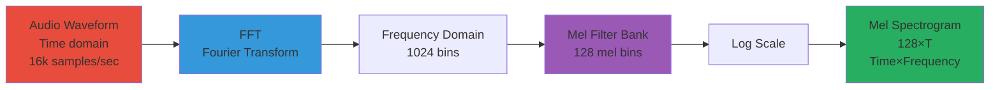
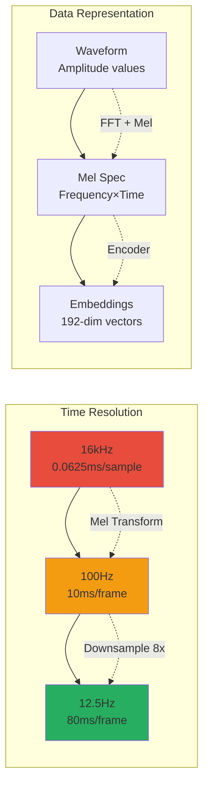
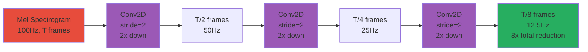
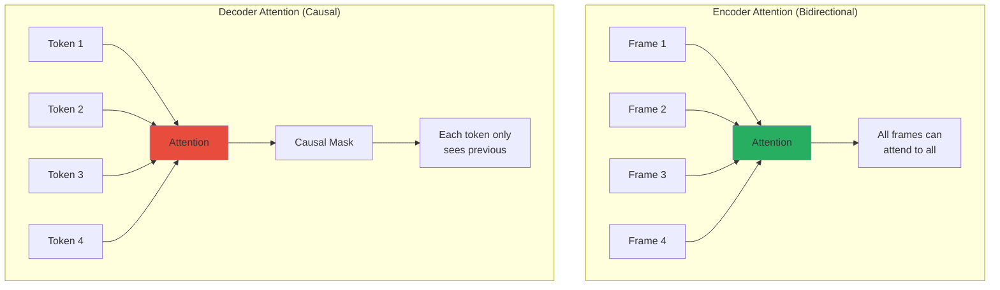
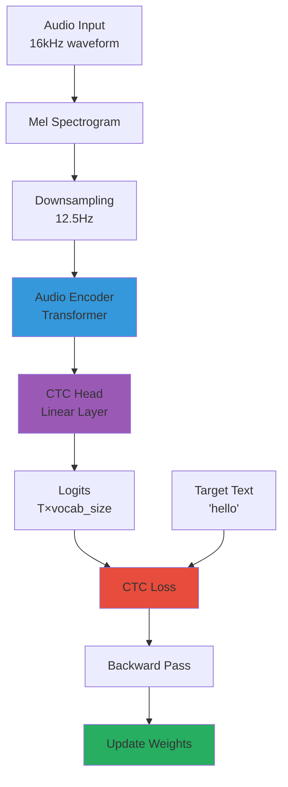
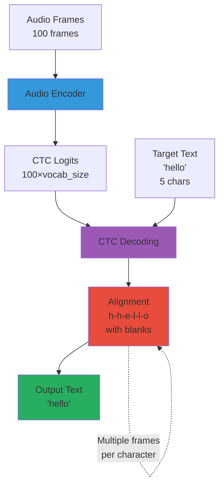

# Audio Encoder: Understanding Speech

## What is the Audio Encoder?

The **Audio Encoder** converts raw audio waveforms into embeddings that Thinker can understand.

Think of it as "ears" for the AI - it processes sound and extracts meaningful features.

## Audio Basics

### Waveform

Audio is a sequence of amplitude values over time:

```
Time: 0ms    10ms   20ms   30ms
      |       |      |      |
      ▼       ▼      ▼      ▼
Amplitude: [0.1, 0.5, -0.3, 0.8, ...]
```

### Sample Rate

Number of samples per second:
- **16 kHz**: 16,000 samples/second (μOmni uses this)
- **44.1 kHz**: CD quality
- **48 kHz**: Professional audio

### Mel Spectrogram

A visual representation of audio showing frequency content over time:

```
Frequency
    ↑
    |  ████
    |  ████  ████
    |  ████  ████  ████
    |  ████  ████  ████
    └──────────────────→ Time
```

**Why Mel?**: Human ears perceive frequencies logarithmically - mel scale matches this.

### Diagram 2: Mel Spectrogram Conversion



**Explanation**: Audio waveform is converted to frequency domain via FFT, then passed through mel filter banks (matching human perception) and log-scaled to produce the mel spectrogram representation.

## Architecture

```
Audio Waveform (16kHz)
    ↓
Mel Spectrogram (100Hz, 128 bins)
    ↓
Convolutional Downsampling (8x)
    ↓
Frame Rate: 12.5 Hz
    ↓
Transformer Encoder
    ↓
Frame Embeddings (T×192)
```

### Diagram 1: Audio Encoder Complete Pipeline

```mermaid
graph LR
    Audio[Audio Waveform<br/>16kHz, 1s = 16k samples] --> Mel[Mel Spectrogram<br/>100Hz, 128 bins<br/>1s = 100 frames]
    Mel --> Conv1[Conv Down 2x<br/>50Hz]
    Conv1 --> Conv2[Conv Down 2x<br/>25Hz]
    Conv2 --> Conv3[Conv Down 2x<br/>12.5Hz]
    Conv3 --> Proj[Projection<br/>Flatten + Linear]
    Proj --> Trans[Transformer Encoder<br/>N blocks]
    Trans --> Norm[RMSNorm]
    Norm --> Output[Frame Embeddings<br/>T×192, 12.5Hz]
    
    style Audio fill:#e74c3c
    style Mel fill:#f39c12
    style Conv1 fill:#9b59b6
    style Conv2 fill:#9b59b6
    style Conv3 fill:#9b59b6
    style Trans fill:#3498db
    style Output fill:#27ae60
```



**Explanation**: Audio is converted to mel spectrogram, downsampled 8x through three convolutional layers, projected to model dimension, processed through transformer blocks, and normalized to produce frame embeddings at 12.5 Hz.

## Step-by-Step Processing

### 1. Mel Spectrogram Conversion

```python
# From train_audio_enc.py
mel_spec = torchaudio.transforms.MelSpectrogram(
    sample_rate=16000,
    n_fft=1024,        # FFT window size
    hop_length=160,    # Step size (10ms)
    win_length=400,    # Window size (25ms)
    n_mels=128         # Frequency bins
)

# Convert audio to mel
mel = mel_spec(audio)  # Shape: (128, T)
mel = mel.T            # Shape: (T, 128) - time first
```

**Result**: 
- Input: 1 second audio = 16,000 samples
- Output: 100 frames × 128 mel bins

### Diagram 7: Audio Processing Timeline



**Explanation**: Audio processing reduces temporal resolution from 16kHz (0.0625ms per sample) to 12.5Hz (80ms per frame), while transforming from raw waveform to meaningful embeddings suitable for language model processing.

### 2. Convolutional Downsampling

Reduces temporal resolution from 100 Hz to 12.5 Hz (8x reduction):

```python
# Simplified downsampling
def downsample_8x(mel):
    # First 2x: (T, 128) → (T/2, 128)
    x = conv2d(mel, stride=2)
    # Second 2x: (T/2, 128) → (T/4, 128)
    x = conv2d(x, stride=2)
    # Third 2x: (T/4, 128) → (T/8, 128)
    x = conv2d(x, stride=2)
    return x  # 8x reduction total
```

### Diagram 3: Convolutional Downsampling



**Explanation**: Three convolutional layers with stride=2 each reduce temporal resolution by 2x, achieving 8x total reduction (100Hz → 12.5Hz). This reduces computational cost while maintaining sufficient detail for speech recognition.

**Why 12.5 Hz?**
- Matches Qwen3 Omni's frame rate
- Good balance: enough detail, not too slow
- ~80ms per frame (human speech is ~100-200ms per phoneme)

### 3. Projection to Model Dimension

```python
# Flatten and project
x = x.flatten()  # (T/8, H*W)
x = linear(x, d_model)  # (T/8, 192)
```

### 4. Transformer Encoder

Processes sequence of frames:

```python
# Encoder blocks (similar to Thinker but no masking)
for block in encoder_blocks:
    x = block(x)  # Self-attention + MLP
```

**Key Difference from Thinker**:
- **Encoder**: Can see all positions (bidirectional)
- **Decoder**: Only sees previous positions (causal)

### Diagram 4: Encoder vs Decoder Attention



**Explanation**: Encoder attention is bidirectional - all frames can attend to all other frames. Decoder attention is causal - each token can only attend to previous tokens (for autoregressive generation).

### 5. Final Normalization

```python
x = rms_norm(x)  # Final normalization
```

## Training: ASR (Automatic Speech Recognition)

The audio encoder is trained to transcribe speech:

```
Audio → Encoder → CTC Head → Text
```

### Diagram 6: ASR Training Flow



**Explanation**: Audio is processed through the encoder to produce frame embeddings, which are converted to character logits via CTC head. CTC loss handles alignment automatically during training.

### CTC (Connectionist Temporal Classification)

Handles alignment between audio frames and text:

**Problem**: Audio has many frames, text has few tokens
- Audio: 100 frames
- Text: "hello" (5 characters)

**Solution**: CTC allows multiple frames per character and handles alignment automatically.

### Diagram 5: CTC Alignment



**Explanation**: CTC automatically aligns many audio frames (100) to fewer text tokens (5). It allows multiple frames per character and handles blanks/repetitions, making training possible without manual alignment.

```python
# Simplified CTC
frames = encoder(audio)  # (100, 192)
logits = ctc_head(frames)  # (100, vocab_size)

# CTC loss handles alignment
loss = ctc_loss(logits, "hello")
```

### Training Data

From `data/audio/asr.csv`:
```csv
wav,text
data/audio/wav/000000.wav,"hello world"
data/audio/wav/000001.wav,"how are you"
```

## Code Structure

```python
# From omni/audio_encoder.py

class AudioEncoderTiny(nn.Module):
    def __init__(self, d_model, n_heads, ...):
        # Convolutional downsampling
        self.conv_down = ConvDown(downsample_factor)
        
        # Projection
        self.proj = nn.Linear(flattened_size, d_model)
        
        # Transformer encoder blocks
        self.blocks = nn.ModuleList([
            EncoderBlock(d_model, n_heads, ...)
            for _ in range(n_layers)
        ])
        
        # Final norm
        self.norm = RMSNorm(d_model)
    
    def forward(self, mel):
        # Downsample
        x = self.conv_down(mel)
        
        # Project
        x = self.proj(x.flatten(...))
        
        # Encode
        for block in self.blocks:
            x = block(x)
        
        # Normalize
        x = self.norm(x)
        return x
```

## Configuration

From `configs/audio_enc_tiny.json`:

```json
{
  "sample_rate": 16000,
  "mel_bins": 128,
  "downsample_time": 8,
  "target_hz": 12.5,
  "d_model": 192,
  "n_layers": 4,
  "n_heads": 3,
  "d_ff": 768
}
```

## Frame Rate Calculation

```
Input: 16,000 samples/second
Mel: 100 frames/second (hop_length=160)
After 8x downsample: 12.5 frames/second
```

**Why this matters**: 
- Lower frame rate = fewer tokens for Thinker
- Saves context length
- Still captures speech content

## Multimodal Integration

After encoding, audio embeddings are projected to Thinker's dimension:

```python
# Audio encoder output
audio_emb = audio_encoder(mel)  # (T, 192)

# Project to Thinker dimension
audio_emb = audio_projector(audio_emb)  # (T, 256)

# Now Thinker can process it!
thinker_input = torch.cat([image_emb, audio_emb, text_emb], dim=1)
output = thinker(thinker_input)
```

## Common Issues

### 1. Audio Too Long

**Problem**: Audio exceeds context length

**Solution**: Truncate or chunk
```python
max_audio_tokens = ctx_len // 4
audio_emb = audio_emb[:max_audio_tokens]
```

### 2. Sample Rate Mismatch

**Problem**: Audio not 16kHz

**Solution**: Resample
```python
if sr != 16000:
    audio = torchaudio.functional.resample(audio, sr, 16000)
```

### 3. Silent Audio

**Problem**: No speech detected

**Solution**: Check amplitude
```python
if audio.abs().max() < 0.01:
    print("Warning: Audio too quiet")
```

## Visual Guide

```
Audio File (WAV)
    ↓
[Load] → Waveform (16,000 samples/sec)
    ↓
[Mel Spectrogram] → (100 frames/sec, 128 bins)
    ↓
[Conv Downsample 8x] → (12.5 frames/sec, 128 bins)
    ↓
[Flatten & Project] → (T frames, 192 dims)
    ↓
[Transformer Encoder] → (T frames, 192 dims)
    ↓
[RMSNorm] → Final embeddings
    ↓
[Projector] → (T frames, 256 dims) → Thinker
```

## Training Example

```python
# Load audio and text
audio, sr = torchaudio.load("example.wav")
text = "hello world"

# Convert to mel
mel = mel_spec(audio)

# Encode
embeddings = audio_encoder(mel)

# For ASR training: predict text
logits = ctc_head(embeddings)
loss = ctc_loss(logits, text)
```

## Performance Tips

1. **Batch Processing**: Process multiple audio files together
2. **Padding**: Pad to same length in batch
3. **Normalization**: Normalize audio amplitude
4. **Augmentation**: Add noise, speed changes for robustness

---

## Complete Layer-by-Layer Breakdown

> This section provides a detailed breakdown of every single layer in the Audio Encoder, combining **deep theoretical understanding** with **practical implementation**. All explanations are **strictly based on our actual code** in `omni/audio_encoder.py` and `train_audio_enc.py`.

### Theoretical Foundation: Why This Architecture?

#### The Audio Understanding Problem

Audio is fundamentally different from text:
- **Continuous**: Waveform has infinite possible values
- **Temporal**: Time dimension is critical
- **High-dimensional**: Raw audio is very high-dimensional (16,000 samples/second)
- **Variable length**: Different audio clips have different durations

#### Why Mel Spectrograms?

**Raw waveform problems**:
- Too high-dimensional (16,000 values per second)
- Phase information is complex
- Hard for neural networks to process directly

**Mel spectrogram benefits**:
- **Lower dimensionality**: 128 frequency bins vs 16,000 samples
- **Phase removed**: Only magnitude (easier to learn)
- **Human-aligned**: Mel scale matches human perception
- **Time-frequency representation**: Captures both temporal and spectral patterns

#### Why Downsampling?

**The frame rate problem**:
- Mel spectrogram: 100 frames/second (from 16kHz audio, 160 sample hop)
- Too many frames for transformer (would consume all context)
- Need to reduce temporal resolution

**The solution**: Convolutional downsampling
- Reduces frames from 100 Hz → 12.5 Hz (8× reduction)
- Maintains frequency information
- Aligns with Qwen3 Omni's frame rate

#### Why Transformer Encoder?

**Encoder vs Decoder**:
- **Encoder**: Bidirectional (can see all frames)
- **Decoder**: Causal (only previous frames)
- For ASR: Need to see full audio context → Encoder

**Why not CNN?**
- CNNs have limited receptive field
- Transformers have global receptive field (all frames)
- Better for long-range dependencies in speech

### Complete Architecture Flow

```
Input: Audio Waveform (16kHz)
    ↓
[Mel Spectrogram] → (B, T, 128)
    ↓
[Reshape] → (B, 1, T, 128)  # Add channel dimension
    ↓
┌─────────────────────────────────┐
│  ConvDown (Downsampling)        │
│  ┌───────────────────────────┐ │
│  │ Conv2D (stride=2)         │ │
│  │ GELU Activation           │ │
│  │ Conv2D (stride=2)         │ │
│  │ GELU Activation           │ │
│  │ [Optional: Conv2D stride=2]│ │
│  └───────────────────────────┘ │
└───────────────┬─────────────────┘
                ↓
    (B, 64, T/8, 128/8)  # 8x downsample
    ↓
[Flatten & Reshape] → (B, T/8, 64*16)
    ↓
[Projection] → (B, T/8, 192)
    ↓
┌─────────────────────────────────┐
│  Encoder Block 1                │
│  ┌───────────────────────────┐ │
│  │ RMSNorm                   │ │
│  │ Multi-Head Self-Attention │ │
│  │ Residual                  │ │
│  │ RMSNorm                   │ │
│  │ MLP (GELU)                │ │
│  │ Residual                  │ │
│  └───────────────────────────┘ │
└───────────────┬─────────────────┘
                ↓
    [Repeat for N blocks (default: 4)]
                ↓
[Final RMSNorm] → (B, T/8, 192)
    ↓
Output: Frame Embeddings
```

### Layer 1: Mel Spectrogram Conversion

**Purpose**: Convert raw audio waveform to frequency representation.

**Implementation** (in training script):

```python
# From train_audio_enc.py
mel_spec = torchaudio.transforms.MelSpectrogram(
    sample_rate=16000,
    n_fft=1024,        # FFT window size
    hop_length=160,    # Step size (10ms)
    win_length=400,    # Window size (25ms)
    n_mels=128         # Number of mel bins
)

# Convert audio
mel = mel_spec(audio)[0].T  # (T, 128)
```

**What Happens**:
1. **Input**: Audio waveform `(1, 16000)` for 1 second
2. **STFT**: Short-Time Fourier Transform
3. **Mel Scale**: Convert to mel scale (human perception)
4. **Output**: Mel spectrogram `(100, 128)`
   - 100 frames (at 100 Hz: 16000/160)
   - 128 frequency bins

**Frame Rate Calculation**:
```
Sample rate: 16,000 samples/second
Hop length: 160 samples
Frame rate: 16,000 / 160 = 100 frames/second
```

### Layer 2: Reshape for Convolution

```python
# From AudioEncoderTiny.forward
def forward(self, mel):  # mel: (B, T, 128)
    # Add channel dimension for Conv2D
    x = mel[:, None, :, :]  # (B, 1, T, 128)
    # B = batch size
    # 1 = channel (grayscale)
    # T = time frames
    # 128 = frequency bins
```

### Layer 3: Convolutional Downsampling

**Purpose**: Reduce temporal resolution from 100 Hz to 12.5 Hz (8x reduction).

**Implementation**:

```python
# From omni/audio_encoder.py
class ConvDown(nn.Module):
    def __init__(self, in_ch=1, mid=64):
        super().__init__()
        self.net = nn.Sequential(
            # First 2x downsampling
            nn.Conv2d(in_ch, mid, 3, stride=2, padding=1),
            nn.GELU(),
            # Second 2x downsampling
            nn.Conv2d(mid, mid, 3, stride=2, padding=1),
            nn.GELU()
        )
```

**Step-by-Step**:

**Step 3.1: First Conv2D**
```python
# Input: (B, 1, T, 128)
conv1 = nn.Conv2d(
    in_channels=1,
    out_channels=64,
    kernel_size=3,
    stride=2,      # 2x downsampling
    padding=1
)

# Forward
x = conv1(x)  # (B, 1, T, 128) → (B, 64, T/2, 64)
# Time: T → T/2 (2x reduction)
# Frequency: 128 → 64 (2x reduction)
```

**Step 3.2: GELU Activation**
```python
# GELU: Gaussian Error Linear Unit
def gelu(x):
    return 0.5 * x * (1 + torch.erf(x / math.sqrt(2)))

x = gelu(x)  # (B, 64, T/2, 64)
```

**Step 3.3: Second Conv2D**
```python
conv2 = nn.Conv2d(
    in_channels=64,
    out_channels=64,
    kernel_size=3,
    stride=2,
    padding=1
)

x = conv2(x)  # (B, 64, T/2, 64) → (B, 64, T/4, 32)
# Time: T/2 → T/4 (another 2x)
# Frequency: 64 → 32 (another 2x)
```

**Step 3.4: Optional Third Conv2D (for 8x total)**
```python
# For 8x downsample (12.5 Hz target)
if downsample_factor == 8:
    conv3 = nn.Conv2d(64, 64, 3, stride=2, padding=1)
    x = gelu(conv3(x))  # (B, 64, T/4, 32) → (B, 64, T/8, 16)
```

**Total Downsampling**:
```
Input:  (B, 1, 100, 128)  # 100 Hz, 128 bins
After 4x: (B, 64, 25, 32)   # 25 Hz, 32 bins
After 8x: (B, 64, 12.5, 16) # 12.5 Hz, 16 bins
```

### Layer 4: Flatten and Reshape

```python
# From AudioEncoderTiny.forward
B, C, T, F = x.shape  # (B, 64, T/8, 16)

# Flatten channels and frequency
x = x.permute(0, 2, 1, 3)  # (B, T/8, 64, 16)
x = x.contiguous().view(B, T, C * F)  # (B, T/8, 64*16)
# Result: (B, T/8, 1024)
```

**What Happens**:
- **Before**: `(B, 64, T/8, 16)` - 4D tensor
- **After**: `(B, T/8, 1024)` - 3D tensor
- Each time frame now has 1024 features (64 channels × 16 frequency bins)

### Layer 5: Projection to Model Dimension

```python
# From AudioEncoderTiny.__init__
self.proj = nn.Linear(64 * (128 // downsample_factor), d)
# For 8x downsample: 64 * 16 = 1024 → 192

# Forward
x = self.proj(x)  # (B, T/8, 1024) → (B, T/8, 192)
```

### Layer 6: Encoder Blocks

**Block Structure**:

```python
# From omni/audio_encoder.py
class EncoderBlock(nn.Module):
    def __init__(self, d, heads, ff, dropout=0.1):
        super().__init__()
        self.norm1 = RMSNorm(d)
        # Multi-head self-attention (encoder style - bidirectional)
        self.attn = nn.MultiheadAttention(
            d, heads, 
            dropout=dropout, 
            batch_first=True
        )
        self.norm2 = RMSNorm(d)
        # MLP with GELU
        self.mlp = nn.Sequential(
            nn.Linear(d, ff),
            nn.GELU(),
            nn.Linear(ff, d)
        )
        self.drop = nn.Dropout(dropout)
```

**Deep Dive: Why Bidirectional Attention?**

**Encoder vs Decoder attention**:

**Decoder (causal)**:
- Can only see previous positions
- Realistic for generation
- But can't use future context

**Encoder (bidirectional)**:
- Can see all positions (past and future)
- Better for understanding
- Uses full context

**Why bidirectional for audio?**
- **ASR task**: Need full audio context to transcribe
- **No generation**: Not generating audio, just understanding
- **Better accuracy**: Future context helps disambiguate

**Example**:
- Audio: "I can't hear you"
- Without future context: "I can't" might be misheard
- With future context: "hear you" helps disambiguate "can't"

**Why GELU Instead of SwiGLU?**

**Audio encoder uses GELU, Thinker uses SwiGLU**:

**GELU** (Gaussian Error Linear Unit):
- Simpler (single projection)
- Sufficient for encoder task
- Less parameters (efficiency)

**SwiGLU** (used in Thinker):
- More expressive (gating)
- Better for generation tasks
- More parameters

**Why different?**
- **Encoder**: Understanding task, GELU sufficient
- **Decoder**: Generation task, SwiGLU better
- **Efficiency**: Encoder can be simpler

**What Value Do We Get from Encoder Blocks?**

1. **Bidirectional Understanding**: Uses full audio context
2. **Long-Range Dependencies**: Captures relationships across time
3. **Parallel Processing**: All frames processed simultaneously
4. **Efficiency**: Simpler than decoder (no causal masking)
5. **Modularity**: Can stack multiple blocks for depth

**Block Forward Pass**:

```python
def forward(self, x):
    # x shape: (B, T, d_model)
    
    # Pre-norm + Attention + Residual
    h = self.attn(
        self.norm1(x),  # Query
        self.norm1(x),  # Key (same as query for self-attention)
        self.norm1(x),  # Value (same as query)
        need_weights=False
    )[0]
    x = x + self.drop(h)  # Residual connection
    
    # Pre-norm + MLP + Residual
    x = x + self.drop(self.mlp(self.norm2(x)))
    
    return x
```

### Layer 7: Repeat Blocks

```python
# From AudioEncoderTiny.__init__
self.blocks = nn.ModuleList([
    EncoderBlock(d, heads, ff, dropout) 
    for _ in range(layers)  # Default: 4 blocks
])

# Forward
for blk in self.blocks:
    x = blk(x)  # Each block: (B, T/8, 192) → (B, T/8, 192)
```

### Layer 8: Final Normalization

```python
# From AudioEncoderTiny.forward
x = self.norm(x)  # Final RMSNorm
# Output: (B, T/8, 192)
```

### Complete Forward Pass with Shapes

```python
# Input: Audio waveform
audio = torch.randn(1, 16000)  # 1 second at 16kHz

# Step 1: Mel spectrogram
mel = mel_spec(audio)[0].T  # (100, 128)
mel = mel.unsqueeze(0)      # (1, 100, 128) - add batch

# Step 2: Reshape
x = mel[:, None, :, :]  # (1, 1, 100, 128)

# Step 3: ConvDown (8x)
x = conv_down(x)  # (1, 1, 100, 128) → (1, 64, 12.5, 16)
# Note: 12.5 frames (rounded to 13 in practice)

# Step 4: Flatten
x = x.permute(0, 2, 1, 3).contiguous()  # (1, 13, 64, 16)
x = x.view(1, 13, 64 * 16)  # (1, 13, 1024)

# Step 5: Project
x = proj(x)  # (1, 13, 1024) → (1, 13, 192)

# Step 6: Encoder blocks
x = block1(x)  # (1, 13, 192)
x = block2(x)  # (1, 13, 192)
x = block3(x)  # (1, 13, 192)
x = block4(x)  # (1, 13, 192)

# Step 7: Final norm
x = norm(x)  # (1, 13, 192)

# Output: Frame embeddings at 12.5 Hz
```

### Memory and Computation

**Per Block**:
- **Parameters**: ~0.5M (d_model=192, n_heads=3, d_ff=768)
- **Memory**: O(B * T * d_model) for activations
- **Computation**: O(B * T² * d_model) for attention

**Total Model**:
- **Parameters**: ~20M (4 blocks + conv + proj)
- **Input**: 100 frames/second
- **Output**: 12.5 frames/second (8x reduction)

---

**Next:**
- [05_Vision_Encoder.md](05_Vision_Encoder.md) - How images are processed
- [06_Talker_Codec.md](06_Talker_Codec.md) - How speech is generated
- [07_Training_Workflow.md](07_Training_Workflow.md) - Training the encoder

**See Also:**
- [Architecture Overview](02_Architecture_Overview.md)
- [Inference Guide](08_Inference_Guide.md)
- [Thinker Deep Dive](03_Thinker_Deep_Dive.md) - Thinker layers

