# Vision Encoder: Understanding Images

## 🎯 Key Takeaways (TL;DR)

- **What**: Converts images to embeddings Thinker can understand
- **Why**: Images need specialized processing (patches, CLS token)
- **How**: Image → Patches → CLS Token → Transformer → Embeddings
- **Key Insight**: ViT treats images as sequences of patches (like text tokens)
- **Common Mistake**: Wrong image size (must be 224×224) or forgetting CLS token
- **Shape Flow**: `(B, 3, 224, 224)` → `(B, 197, 128)` (196 patches + 1 CLS)

**📖 Reading Guide**:
- **Quick Read**: 10 minutes (overview + architecture)
- **Standard Read**: 30 minutes (full document)
- **Deep Dive**: 60 minutes (read + code + experiments)

## What is the Vision Encoder?

The **Vision Encoder** converts images into embeddings that Thinker can understand.

Think of it as "eyes" for the AI - it processes visual information and extracts meaningful features.

## Image Basics

### Pixels

Images are grids of pixels, each with color values:

```
RGB Image (224×224×3)
- 224 pixels tall
- 224 pixels wide  
- 3 color channels (Red, Green, Blue)
```

Each pixel value: 0-255 (or 0.0-1.0 normalized)

### Image Preprocessing

```python
# Standard preprocessing
transform = transforms.Compose([
    transforms.Resize((224, 224)),  # Resize to fixed size
    transforms.ToTensor()            # Convert to tensor, normalize to [0,1]
])

image = Image.open("cat.jpg")
tensor = transform(image)  # Shape: (3, 224, 224)
```

## Architecture: Vision Transformer (ViT)

μOmni uses a **Vision Transformer (ViT)**, which treats images like sequences of patches.

### High-Level Flow

```
Image (224×224×3)
    ↓
Patch Embedding (14×14 patches)
    ↓
Add CLS Token + Position Embeddings
    ↓
Transformer Encoder
    ↓
CLS Token (1×128) → Thinker
```

### Diagram 1: Vision Encoder Pipeline

```mermaid
graph LR
    Image[Image<br/>224×224×3] --> Patch[Patch Embedding<br/>16×16 patches<br/>196 patches]
    Patch --> CLS[Add CLS Token<br/>1 token]
    CLS --> Pos[Position Embeddings<br/>197 tokens]
    Pos --> Trans[Transformer Encoder<br/>N blocks]
    Trans --> Extract[Extract CLS Token<br/>Index 0]
    Extract --> Output[CLS Embedding<br/>1×128]
    
    style Image fill:#e74c3c
    style Patch fill:#3498db
    style CLS fill:#9b59b6
    style Trans fill:#3498db
    style Output fill:#27ae60
```



**Explanation**: Image is split into patches, CLS token and position embeddings are added, processed through transformer blocks, and the CLS token (containing global image information) is extracted for Thinker.

## Step-by-Step Processing

### 1. Patch Embedding

Split image into non-overlapping patches:

```python
# Image: (3, 224, 224)
# Patch size: 16×16
# Result: 14×14 = 196 patches

def patch_embedding(image):
    # Conv2d with kernel=16, stride=16
    patches = conv2d(image, kernel=16, stride=16)
    # Shape: (196, d_model)
    return patches
```

**Visual**:
```
Image:        Patches:
████████      ██ ██ ██ ██
████████  →   ██ ██ ██ ██
████████      ██ ██ ██ ██
████████      ██ ██ ██ ██
```

### Diagram 2: Image to Patches


**Explanation**: Image is divided into 16×16 non-overlapping patches using a convolutional layer with stride=16. Each patch becomes a token in the sequence, preserving spatial structure through the grid layout.

### 2. CLS Token

A special token that aggregates global image information:

```python
# Learnable CLS token
cls_token = nn.Parameter(torch.randn(1, 1, d_model))

# Prepend to patches
tokens = torch.cat([cls_token, patches], dim=1)
# Shape: (197, d_model) - 1 CLS + 196 patches
```

**Why CLS Token?**
- Provides a single vector representing the whole image
- Similar to BERT's [CLS] token
- Easier to use than averaging all patches

### Diagram 3: CLS Token Aggregation


**Explanation**: CLS token is prepended to patch tokens. Through transformer attention, it aggregates information from all patches, becoming a global representation of the entire image.

### 3. Position Embeddings

Tell the model where each patch is located:

```python
# Learnable position embeddings
pos_emb = nn.Parameter(torch.randn(197, d_model))  # 1 CLS + 196 patches

# Add to tokens
tokens = tokens + pos_emb
```

**Why needed?**
- Patches lose spatial information when flattened
- Position embeddings restore location awareness

### 4. Transformer Encoder

Process the sequence of patches:

```python
# Similar to audio encoder
for block in encoder_blocks:
    tokens = block(tokens)  # Self-attention + MLP
```

**Attention in Vision**:
- Patches can "attend" to other patches
- Model learns spatial relationships
- Example: "cat" patch attends to "whiskers" patches

### Diagram 4: Patch Attention


**Explanation**: Vision attention allows patches to focus on related patches. For example, a "cat head" patch attends strongly to "whiskers" and "eyes" patches, learning spatial relationships between image regions.

### 5. Extract CLS Token

Use only the CLS token for downstream tasks:

```python
cls_token = tokens[0]  # First token
# Shape: (1, d_model)
```

**Why only CLS?**
- Contains global image information
- Fixed size regardless of image size
- Efficient for Thinker integration

## Code Structure

```python
# From omni/vision_encoder.py

class ViTTiny(nn.Module):
    def __init__(self, img_size, patch, d_model, ...):
        # Patch embedding
        self.patch_emb = nn.Conv2d(
            3, d_model, 
            kernel_size=patch, 
            stride=patch
        )
        
        # CLS token
        self.cls_token = nn.Parameter(torch.randn(1, 1, d_model))
        
        # Position embeddings
        num_patches = (img_size // patch) ** 2
        self.pos_emb = nn.Parameter(
            torch.randn(1, num_patches + 1, d_model)
        )
        
        # Transformer encoder
        self.blocks = nn.ModuleList([
            EncoderBlock(d_model, n_heads, ...)
            for _ in range(n_layers)
        ])
        
        # Final norm
        self.norm = RMSNorm(d_model)
    
    def forward(self, img):
        # Patch embedding
        patches = self.patch_emb(img)  # (B, d_model, H', W')
        patches = patches.flatten(2).transpose(1, 2)  # (B, N, d_model)
        
        # Add CLS token
        cls = self.cls_token.expand(B, -1, -1)
        tokens = torch.cat([cls, patches], dim=1)
        
        # Add position embeddings
        tokens = tokens + self.pos_emb
        
        # Encode
        for block in self.blocks:
            tokens = block(tokens)
        
        # Extract CLS
        cls = tokens[:, 0]  # (B, d_model)
        patches = tokens[:, 1:]  # (B, N, d_model)
        
        return cls, patches
```

## Training: Image Classification

The vision encoder is trained on a simple classification task:

```python
# Simplified training
image = load_image("red_square.png")
caption = "This is a red square"

# Encode
cls_token = vision_encoder(image)

# Classify
logits = classifier(cls_token)
# Predict: "red" in caption? → label 0, else → label 1
loss = cross_entropy(logits, label)
```

**Note**: This is a simplified pretraining task. Real models use contrastive learning (CLIP-style).

## Configuration

From `configs/vision_tiny.json`:

```json
{
  "img_size": 224,
  "patch": 16,
  "d_model": 128,
  "n_layers": 4,
  "n_heads": 2,
  "d_ff": 512
}
```

**Calculations**:
- Patches per side: 224 / 16 = 14
- Total patches: 14 × 14 = 196
- Total tokens: 196 + 1 (CLS) = 197

## Multimodal Integration

After encoding, image embeddings are projected to Thinker's dimension:

```python
# Vision encoder output
cls_token, patches = vision_encoder(image)  # (1, 128)

# Project to Thinker dimension
image_emb = vision_projector(cls_token)  # (1, 256)

# Now Thinker can process it!
thinker_input = torch.cat([image_emb, text_emb], dim=1)
output = thinker(thinker_input)
```

**Note**: Only CLS token is used (not individual patches) for efficiency.

## Attention Visualization

The model learns to focus on relevant parts:

```
Input Image:          Attention Weights:
┌─────────┐          ┌─────────┐
│  Cat    │          │  ████   │  ← High attention
│  Face   │    →     │  ████   │
│         │          │  ░░░    │  ← Low attention
└─────────┘          └─────────┘
```

## Common Issues

### 1. Image Size Mismatch

**Problem**: Image not 224×224

**Solution**: Always resize
```python
transform = transforms.Resize((224, 224))
```

### 2. Wrong Color Format

**Problem**: Grayscale or RGBA

**Solution**: Convert to RGB
```python
image = image.convert("RGB")
```

### 3. Image Orientation

**Problem**: EXIF rotation not applied

**Solution**: Use PIL's transpose
```python
from PIL import Image
image = Image.open(path)
image = ImageOps.exif_transpose(image)
```

## Visual Guide

```
Image File (JPG/PNG)
    ↓
[Load] → PIL Image (H×W×3)
    ↓
[Resize] → (224×224×3)
    ↓
[ToTensor] → (3, 224, 224)
    ↓
[Patch Embedding] → (196, 128)
    ↓
[Add CLS Token] → (197, 128)
    ↓
[Add Position Embeddings] → (197, 128)
    ↓
[Transformer Encoder] → (197, 128)
    ↓
[Extract CLS] → (1, 128)
    ↓
[Projector] → (1, 256) → Thinker
```

## Training Example

```python
# Load image and caption
image = Image.open("example.png")
caption = "This is a red square"

# Preprocess
img_tensor = transform(image)  # (3, 224, 224)

# Encode
cls_token, _ = vision_encoder(img_tensor)  # (1, 128)

# Classify
logits = classifier(cls_token)
label = 0 if "red" in caption else 1
loss = cross_entropy(logits, label)
```

## Performance Tips

1. **Batch Processing**: Process multiple images together
2. **Data Augmentation**: Random crops, flips, color jitter
3. **Normalization**: Use ImageNet stats for pretrained models
4. **Mixed Precision**: Use float16 for faster training

## Comparison: ViT vs CNN

| Feature | ViT | CNN |
|---------|-----|-----|
| Architecture | Transformer | Convolutional |
| Processing | Sequential patches | Local filters |
| Attention | Global | Local (receptive field) |
| Position | Learned embeddings | Implicit (convolution) |
| Use Case | Large-scale, pretrained | Small-scale, custom |

**Why ViT for μOmni?**
- Unified architecture (same as Thinker)
- Better for multimodal fusion
- Scales well with data

---

## Complete Layer-by-Layer Breakdown

> This section provides a detailed breakdown of every single layer in the Vision Encoder (ViT), combining **deep theoretical understanding** with **practical implementation**. All explanations are **strictly based on our actual code** in `omni/vision_encoder.py` and `train_vision.py`.

### Theoretical Foundation: Why Vision Transformer?

#### The Image Understanding Problem

Images are fundamentally different from text:
- **2D spatial structure**: Pixels arranged in 2D grid
- **High dimensionality**: 224×224×3 = 150,528 values
- **Local and global patterns**: Both matter
- **Translation invariance**: Object can be anywhere

#### Why Vision Transformer (ViT) Over CNN?

**CNN approach** (traditional):
- Uses convolutional filters
- Processes locally, builds up receptive field
- Requires many layers for global understanding
- Translation invariance built-in

**ViT approach** (modern):
- Splits image into patches
- Processes patches as sequence
- Global attention from first layer
- Learns translation invariance

**Why ViT for μOmni?**
- **Unified architecture**: Same transformer as Thinker
- **Better for multimodal**: Easier to fuse with text/audio
- **Global understanding**: Sees full image immediately
- **Proven**: State-of-the-art results

#### Why Patches?

**The patch idea**:
- Treat image as sequence of patches
- Each patch = "word" in image language
- Enables transformer processing

**Why 16×16 patches?**
- **Balance**: Not too small (too many patches), not too large (loses detail)
- **Standard**: Widely used size
- **Efficiency**: 196 patches is manageable

**What gets captured**:
- **Small patches**: Fine details, textures
- **Large patches**: Coarse structure, objects
- **16×16**: Good balance for both

#### Why CLS Token?

**The aggregation problem**:
- 196 patch tokens (too many for downstream tasks)
- Need single representation
- Options: Average, max, or CLS token

**Why CLS token?**
- **Learnable**: Model learns how to aggregate
- **Fixed size**: Always 1 token (efficient)
- **Proven**: Works in BERT, ViT
- **Flexible**: Can learn task-specific aggregation

### Complete Architecture Flow

```
Input: Image (224×224×3)
    ↓
[Patch Embedding] → (B, 196, 128)
    ↓
[Add CLS Token] → (B, 197, 128)
    ↓
[Add Position Embeddings] → (B, 197, 128)
    ↓
┌─────────────────────────────────┐
│  Encoder Block 1                │
│  ┌───────────────────────────┐ │
│  │ Pre-Norm                  │ │
│  │ Self-Attention            │ │
│  │ Residual                  │ │
│  │ Pre-Norm                  │ │
│  │ MLP (GELU)                │ │
│  │ Residual                  │ │
│  └───────────────────────────┘ │
└───────────────┬─────────────────┘
                ↓
    [Repeat for N blocks (default: 4)]
                ↓
[Final RMSNorm] → (B, 197, 128)
    ↓
[Extract CLS Token] → (B, 1, 128)
    ↓
Output: CLS Token Embedding
```

### Layer 1: Patch Embedding

**Purpose**: Split image into non-overlapping patches and convert to embeddings.

**Implementation**:

```python
# From omni/vision_encoder.py
class ViTTiny(nn.Module):
    def __init__(self, img_size=224, patch=16, d=128, ...):
        # Patch embedding: Conv2d with kernel=patch, stride=patch
        self.proj = nn.Conv2d(
            3,           # Input channels (RGB)
            d,           # Output channels (d_model)
            kernel_size=patch,  # 16×16 patches
            stride=patch        # Non-overlapping
        )
```

**What Happens**:

```python
# Input: Image tensor
x = torch.randn(1, 3, 224, 224)  # (B, C, H, W)

# Patch embedding
x = self.proj(x)  # (1, 3, 224, 224) → (1, 128, 14, 14)
```

**Step-by-Step**:

1. **Input**: `(1, 3, 224, 224)` - RGB image
2. **Conv2D**: 
   - Kernel: 16×16
   - Stride: 16
   - No padding
3. **Output**: `(1, 128, 14, 14)`
   - 14×14 = 196 patches
   - Each patch → 128-dim embedding

**Deep Theoretical Analysis: Patch Embedding**

**Why Convolutional Patch Embedding?**

**Option 1: Flatten pixels**:
- 16×16×3 = 768 values per patch
- Too high-dimensional
- Loses spatial structure within patch

**Option 2: Convolutional embedding** (used):
- Conv2d with 16×16 kernel, stride 16
- Learns to extract features from patches
- Maintains some spatial understanding
- Projects to lower dimension (128)

**What Gets Learned in Patch Embedding?**

During training, patch embedding learns:
1. **Edge detection**: Identifies edges and boundaries
2. **Texture patterns**: Recognizes textures within patches
3. **Color patterns**: Captures color relationships
4. **Spatial relationships**: Understands patch structure

**Information Content Per Patch**:

Each 16×16 patch contains:
- **256 pixels** (16×16)
- **3 color channels** (RGB)
- **768 raw values**

After embedding:
- **128 dimensions**
- **Compressed representation**
- **Task-relevant features**

**Compression ratio**: 768 → 128 (6× compression)

**What Value Do We Get from Patch Embedding?**

1. **Dimensionality Reduction**: 768 → 128 (efficient)
2. **Feature Learning**: Learns useful patch representations
3. **Spatial Awareness**: Maintains patch structure
4. **Flexibility**: Adapts to different image types
5. **Efficiency**: Single convolution operation

### Layer 2: Reshape to Sequence

```python
# From ViTTiny.forward
# Rearrange: (B, d, H', W') → (B, H'*W', d)
x = rearrange(x, "b d h w -> b (h w) d")
# (1, 128, 14, 14) → (1, 196, 128)
```

**What Happens**:
- **Before**: `(B, 128, 14, 14)` - 2D grid of embeddings
- **After**: `(B, 196, 128)` - Sequence of patch embeddings
- Each of 196 patches is now a token in the sequence

### Layer 3: Add CLS Token

**Purpose**: Special token that aggregates global image information.

**Implementation**:

```python
# From ViTTiny.__init__
self.cls = nn.Parameter(torch.zeros(1, 1, d))  # Learnable CLS token

# From ViTTiny.forward
B, N, D = x.shape  # (B, 196, 128)
cls = self.cls.expand(B, -1, -1)  # (B, 1, 128)
x = torch.cat([cls, x], dim=1)  # (B, 197, 128)
```

**Why CLS Token?**
- **Global Representation**: Aggregates information from all patches
- **Fixed Size**: Always 1 token, regardless of image size
- **Efficient**: Easier to use than averaging all patches

### Layer 4: Add Position Embeddings

**Purpose**: Tell the model where each patch is located in the image.

**Implementation**:

```python
# From ViTTiny.__init__
num_patches = (img_size // patch) ** 2  # 14×14 = 196
self.pos = nn.Parameter(torch.zeros(1, 1 + num_patches, d))
# (1, 197, 128) - 1 CLS + 196 patches

# From ViTTiny.forward
x = x + self.pos[:, :x.size(1), :]
```

**Position Encoding Structure**:
```
Position 0:  CLS token position
Position 1:  Top-left patch (row 0, col 0)
Position 2:  Top patch (row 0, col 1)
...
Position 14: End of row 0
Position 15: Start of row 1
...
Position 196: Bottom-right patch (row 13, col 13)
```

### Layer 5: Encoder Blocks

**Block Structure**:

```python
# From omni/vision_encoder.py
# Uses PyTorch's TransformerEncoderLayer
self.blocks = nn.ModuleList([
    nn.TransformerEncoderLayer(
        d_model=d,           # 128
        nhead=heads,         # 2
        dim_feedforward=ff,  # 512
        dropout=dropout,     # 0.1
        batch_first=True,    # (B, T, D) format
        norm_first=True,     # Pre-norm architecture
        activation='gelu'    # GELU activation
    )
    for _ in range(layers)  # 4 blocks
])
```

**TransformerEncoderLayer Internals**:

PyTorch's layer contains:
- Pre-norm RMSNorm
- Multi-head self-attention (bidirectional)
- Residual connection
- Pre-norm RMSNorm
- MLP (GELU)
- Residual connection

**What Self-Attention Does**:
- Each patch can attend to **all other patches** (bidirectional)
- Learns spatial relationships
- Example: "cat head" patch attends to "cat body" patches

### Layer 6: Repeat Blocks

```python
# From ViTTiny.forward
for blk in self.blocks:
    x = blk(x)  # Each block: (B, 197, 128) → (B, 197, 128)
```

### Layer 7: Final Normalization

```python
# From ViTTiny.forward
x = self.norm(x)  # Final RMSNorm
# Output: (B, 197, 128)
```

### Layer 8: Extract CLS Token

```python
# From ViTTiny.forward
cls = x[:, :1, :]   # (B, 1, 128) - CLS token
grid = x[:, 1:, :]  # (B, 196, 128) - Patch tokens

return cls, grid
```

**Deep Dive: How CLS Token Aggregates Information**

**Attention-Based Aggregation**:

The CLS token doesn't just average patches - it uses **attention**:
- CLS attends to all patches
- Attention weights determine which patches are important
- Weighted combination creates rich global representation

**Example**:
- Image: Cat in corner, background elsewhere
- CLS attends strongly to "cat" patches
- CLS attends weakly to "background" patches
- Result: CLS represents "cat" more than background

**Why This is Better Than Averaging**:

**Simple average**:
- All patches weighted equally
- Loses important information
- No selectivity

**Attention-based** (CLS):
- Important patches weighted more
- Selective information aggregation
- Learns what's important

**What Value Do We Get from CLS Token?**

1. **Efficient Representation**: Single vector for entire image
2. **Selective Aggregation**: Focuses on important parts
3. **Learnable**: Adapts to task requirements
4. **Fixed Size**: Always same size (easy to use)
5. **Interpretable**: Can visualize attention to see what CLS focuses on

### Complete Forward Pass with Shapes

```python
# Input: Image
image = torch.randn(1, 3, 224, 224)  # (B, C, H, W)

# Step 1: Patch embedding
x = proj(image)  # (1, 3, 224, 224) → (1, 128, 14, 14)

# Step 2: Reshape to sequence
x = rearrange(x, "b d h w -> b (h w) d")  # (1, 196, 128)

# Step 3: Add CLS token
cls = cls_token.expand(1, -1, -1)  # (1, 1, 128)
x = torch.cat([cls, x], dim=1)  # (1, 197, 128)

# Step 4: Add position embeddings
x = x + pos_emb  # (1, 197, 128)

# Step 5: Encoder blocks
x = block1(x)  # (1, 197, 128)
x = block2(x)  # (1, 197, 128)
x = block3(x)  # (1, 197, 128)
x = block4(x)  # (1, 197, 128)

# Step 6: Final norm
x = norm(x)  # (1, 197, 128)

# Step 7: Extract CLS
cls = x[:, :1, :]  # (1, 1, 128)
grid = x[:, 1:, :]  # (1, 196, 128)

# Output: CLS token embedding
```

### Memory and Computation

**Per Block**:
- **Parameters**: ~0.3M (d_model=128, n_heads=2, d_ff=512)
- **Memory**: O(B * 197 * d_model) for activations
- **Computation**: O(B * 197² * d_model) for attention

**Total Model**:
- **Parameters**: ~10M (4 blocks + patch_emb + pos_emb)
- **Input**: 224×224×3 = 150,528 pixels
- **Output**: 1 CLS token (128 dims)

---

**Next:**
- [06_Talker_Codec.md](06_Talker_Codec.md) - How speech is generated
- [07_Training_Workflow.md](07_Training_Workflow.md) - Training the encoder
- [08_Inference_Guide.md](08_Inference_Guide.md) - Using vision in inference

**See Also:**
- [Architecture Overview](02_Architecture_Overview.md)
- [Thinker Deep Dive](03_Thinker_Deep_Dive.md)
- [Audio Encoder](04_Audio_Encoder.md) - Audio encoder layers

