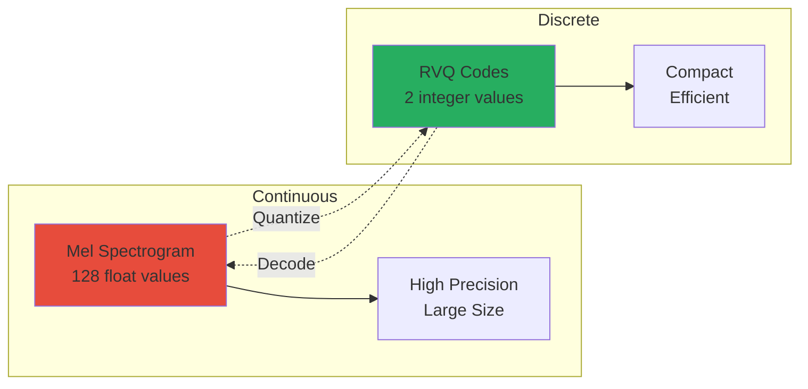

# Talker & Codec: Generating Speech

## 🎯 Key Takeaways (TL;DR)

- **What**: Talker generates speech codes, RVQ converts codes ↔ audio
- **Why**: Discrete codes enable autoregressive generation (like text tokens)
- **How**: Text → Thinker → Talker → RVQ Codes → Decode → Mel → Vocoder → Audio
- **Key Insight**: RVQ uses residual quantization (2 codebooks) for quality + efficiency
- **Common Mistake**: Wrong codebook size or forgetting residual quantization
- **Shape Flow**: `(B, T, 256)` → `(B, T, 2)` → `(B, T, 128)` → `(B, T, 16000)`

**📖 Reading Guide**:
- **Quick Read**: 15 minutes (overview + RVQ basics)
- **Standard Read**: 45 minutes (full document)
- **Deep Dive**: 90 minutes (read + code + experiments)

## Overview

**Talker** generates speech from text by predicting audio codes, which are then decoded into audio waveforms.

**RVQ Codec** converts between continuous audio (mel spectrograms) and discrete codes (like text tokens).

Together, they enable **Text-to-Speech (TTS)**.

## Why Discrete Codes?

Just like text uses tokens (words), speech uses codes:

```
Text:  "Hello" → [1234, 5678]
Speech: Audio → [45, 23, 67, 12, ...]
```

**Benefits**:
- Thinker can generate codes (like text tokens)
- Efficient representation
- Enables autoregressive generation

### Diagram 2: Discrete vs Continuous Representation



**Explanation**: Discrete codes (2 integers) are much more compact than continuous mel spectrograms (128 floats), enabling efficient storage and generation while maintaining quality through residual quantization.

## RVQ Codec

### What is RVQ?

**Residual Vector Quantization** - A multi-stage quantization method:

```
Stage 1: Quantize input
Stage 2: Quantize residual (error)
Stage 3: Quantize residual of residual
...
```

### Architecture

```
Mel Spectrogram (T×128)
    ↓
Project to Codebook Dimension (T×64)
    ↓
┌─────────────────────────┐
│ Codebook 0 (128 codes)  │ ← Quantize input
└───────────┬─────────────┘
            │
      Residual (error)
            ↓
┌─────────────────────────┐
│ Codebook 1 (128 codes)  │ ← Quantize residual
└───────────┬─────────────┘
            │
      Codes: [code0, code1]
```

### Diagram 1: RVQ Encoding Process

```mermaid
graph TD
    Mel[Mel Frame<br/>128 dim] --> Proj[Project<br/>128→64]
    Proj --> CB0[Codebook 0<br/>128 codes]
    CB0 --> Find0[Find Nearest<br/>Code 0]
    Find0 --> Code0[Code 0]
    Find0 --> Residual[Residual<br/>Error]
    Residual --> CB1[Codebook 1<br/>128 codes]
    CB1 --> Find1[Find Nearest<br/>Code 1]
    Find1 --> Code1[Code 1]
    Code0 --> Output[Codes<br/>(code0, code1)]
    Code1 --> Output
    
    style Mel fill:#e74c3c
    style CB0 fill:#3498db
    style CB1 fill:#3498db
    style Residual fill:#9b59b6
    style Output fill:#27ae60
```

**Explanation**: RVQ quantizes mel frames in two stages. First codebook quantizes the input, second codebook quantizes the residual error, producing two discrete codes per frame for efficient representation.

### Encoding Process

```python
# Simplified RVQ encoding
def encode(mel_frame):
    # Project to codebook dimension
    x = project(mel_frame)  # (64,)
    
    # Stage 1: Find closest code in codebook 0
    code0 = find_nearest(x, codebook0)  # Index: 0-127
    residual = x - codebook0[code0]
    
    # Stage 2: Find closest code in codebook 1 for residual
    code1 = find_nearest(residual, codebook1)  # Index: 0-127
    
    return [code0, code1]  # Two codes per frame
```

### Decoding Process

```python
# Simplified RVQ decoding
def decode(codes):
    code0, code1 = codes
    
    # Lookup embeddings
    emb0 = codebook0[code0]
    emb1 = codebook1[code1]
    
    # Sum embeddings
    quantized = emb0 + emb1
    
    # Project back to mel
    mel = project_back(quantized)  # (128,)
    return mel
```

### Why Residual?

**Residual quantization** captures fine details:

```
Input:  [1.0, 2.0, 3.0, 4.0]
Code0:  [1.0, 2.0, 3.0, 3.9]  ← Approximate
Residual: [0.0, 0.0, 0.0, 0.1] ← Fine detail
Code1:  [0.0, 0.0, 0.0, 0.1]  ← Captures detail
```

## Talker Model

### Architecture

**Talker** is similar to Thinker but predicts audio codes instead of text tokens:

```
Previous Codes (B, T, 2)
    ↓
Code Embeddings
    ↓
Transformer Blocks (same as Thinker)
    ↓
Output Heads (Base + Residual)
    ↓
Code Predictions (B, T, 2)
```

### Code Embeddings

```python
# Embed each codebook separately
base_emb = base_embedding(codes[:, :, 0])    # (B, T, d_model)
res_emb = res_embedding(codes[:, :, 1])      # (B, T, d_model)

# Sum embeddings
x = base_emb + res_emb
```

### Autoregressive Generation

Generate codes one frame at a time:

```python
def generate_audio(max_frames=200):
    codes = torch.zeros(1, 1, 2)  # Start with zeros
    
    for _ in range(max_frames):
        # Predict next codes
        base_logits, res_logits = talker(codes)
        
        # Get most likely codes
        base_code = argmax(base_logits[:, -1, :])
        res_code = argmax(res_logits[:, -1, :])
        
        # Append to sequence
        next_codes = [[[base_code, res_code]]]
        codes = torch.cat([codes, next_codes], dim=1)
    
    return codes
```

### Training

**Teacher Forcing**: Use ground truth previous codes:

```python
# Training: use actual codes
mel = load_audio("example.wav")
codes = rvq.encode(mel)  # Ground truth codes

# Shift by one position (predict current from previous)
prev_codes = torch.roll(codes, 1, dims=1)
prev_codes[:, 0, :] = 0  # First frame is zero

# Predict
base_logits, res_logits = talker(prev_codes)

# Loss on both codebooks
loss = cross_entropy(base_logits, codes[:, :, 0]) + \
       cross_entropy(res_logits, codes[:, :, 1])
```

## Vocoder: Griffin-Lim

### What is a Vocoder?

Converts mel spectrogram to audio waveform.

**Griffin-Lim** is a classical (non-neural) vocoder:

```
Mel Spectrogram (T×128)
    ↓
Convert to Linear Spectrogram
    ↓
Initialize Random Phase
    ↓
Iterative Refinement (32 iterations)
    ↓
Inverse STFT
    ↓
Audio Waveform
```

### Why Griffin-Lim?

- **No training required** - works out of the box
- **Simple** - easy to understand
- **Fast** - quick generation
- **Trade-off**: Lower quality than neural vocoders

### Process

```python
def griffin_lim(mel, n_iter=32):
    # Convert mel to linear spectrogram
    mag_spec = mel_to_linear(mel)
    
    # Initialize random phase
    phase = random_phase(mag_spec.shape)
    
    # Iterative refinement
    for _ in range(n_iter):
        # Phase → Time domain
        audio = istft(mag_spec, phase)
        # Time domain → Phase
        _, phase = stft(audio)
    
    return audio
```

## Complete TTS Pipeline

```
Text: "Hello world"
    ↓
Tokenizer
    ↓
Token IDs: [1234, 5678]
    ↓
Thinker (optional - can condition on text)
    ↓
Talker (autoregressive)
    ↓
RVQ Codes: [[45, 23], [67, 12], ...]
    ↓
RVQ Decode
    ↓
Mel Spectrogram (T×128)
    ↓
Griffin-Lim Vocoder
    ↓
Audio Waveform
    ↓
Save as WAV file
```

## Code Structure

### RVQ Codec

```python
# From omni/codec.py

class RVQ(nn.Module):
    def __init__(self, num_codebooks, codebook_size, d):
        # Codebooks (embeddings)
        self.codebooks = nn.ModuleList([
            nn.Embedding(codebook_size, d)
            for _ in range(num_codebooks)
        ])
        
        # Projections
        self.proj_in = nn.Linear(128, d)
        self.proj_out = nn.Linear(d, 128)
    
    def encode(self, mel):
        # Project
        x = self.proj_in(mel)
        
        # Greedy quantization
        codes = []
        residual = x
        for codebook in self.codebooks:
            # Find nearest
            distances = (residual.unsqueeze(-2) - codebook.weight).norm(dim=-1)
            code = distances.argmin(dim=-1)
            codes.append(code)
            
            # Update residual
            residual = residual - codebook(code)
        
        return torch.stack(codes, dim=-1)  # (B, T, num_codebooks)
    
    def decode(self, codes):
        # Sum codebook embeddings
        quantized = sum(
            codebook(codes[:, :, i])
            for i, codebook in enumerate(self.codebooks)
        )
        
        # Project back
        mel = self.proj_out(quantized)
        return mel
```

### Talker

```python
# From omni/talker.py

class TalkerTiny(nn.Module):
    def __init__(self, d_model, n_layers, ...):
        # Code embeddings
        self.base_emb = nn.Embedding(codebook_size, d_model)
        self.res_emb = nn.Embedding(codebook_size, d_model)
        
        # Start token
        self.start_token = nn.Parameter(torch.randn(1, 1, d_model))
        
        # Transformer blocks (same as Thinker)
        self.blocks = nn.ModuleList([...])
        
        # Output heads
        self.base_head = nn.Linear(d_model, codebook_size)
        self.res_head = nn.Linear(d_model, codebook_size)
    
    def forward(self, codes):
        # Embed codes
        base_emb = self.base_emb(codes[:, :, 0])
        res_emb = self.res_emb(codes[:, :, 1])
        x = base_emb + res_emb
        
        # Add start token
        x = torch.cat([self.start_token.expand(B, -1, -1), x], dim=1)
        
        # Process
        for block in self.blocks:
            x = block(x)
        
        # Predict
        base_logits = self.base_head(x)
        res_logits = self.res_head(x)
        
        return base_logits, res_logits
```

## Configuration

From `configs/talker_tiny.json`:

```json
{
  "d_model": 192,
  "n_layers": 4,
  "n_heads": 3,
  "codebooks": 2,
  "codebook_size": 128,
  "frame_rate": 12.5
}
```

## Frame Rate

At 12.5 Hz frame rate:
- 1 second = 12.5 frames
- 10 seconds = 125 frames
- Each frame = 2 codes (base + residual)

**Code sequence length**:
- 10 seconds audio = 125 frames = 250 codes total

## Training Data

From `data/audio/tts.csv`:
```csv
text,wav
"Hello world",data/audio/wav/000000.wav
"How are you",data/audio/wav/000001.wav
```

**Process**:
1. Load audio → mel spectrogram
2. Encode mel → RVQ codes
3. Train Talker to predict codes autoregressively

## Common Issues

### 1. Repetitive Speech

**Problem**: Model generates same codes repeatedly

**Solution**: 
- Better training data
- Temperature sampling (add randomness)
- Longer training

### 2. Audio Quality

**Problem**: Griffin-Lim produces robotic speech

**Solution**: 
- Use neural vocoder (requires training)
- Better codebook training
- More codebooks

### 3. Generation Speed

**Problem**: Autoregressive generation is slow

**Solution**:
- KV caching
- Parallel decoding (for some models)
- Shorter sequences

## Performance Tips

1. **Batch Encoding**: Encode multiple frames at once
2. **KV Caching**: Cache attention during generation
3. **Codebook Size**: Balance quality vs. memory
4. **Frame Rate**: Lower = fewer codes but less detail

---

## Complete Layer-by-Layer Breakdown

> This section provides a detailed breakdown of every single layer in Talker and RVQ Codec, combining **deep theoretical understanding** with **practical implementation**. All explanations are **strictly based on our actual code** in `omni/talker.py`, `omni/codec.py`, and `train_talker.py`.

### Theoretical Foundation: The Speech Generation Challenge

#### The Fundamental Problem

Speech generation faces a unique challenge:
- **Continuous output**: Audio is continuous (infinite possible values)
- **High-dimensional**: 16,000 samples per second
- **Temporal dependencies**: Current sample depends on all previous samples
- **Variable length**: Different sentences have different durations

#### Why Discrete Codes?

**The quantization solution**:
- Convert continuous audio to discrete codes
- Enables autoregressive generation (like text)
- Reduces dimensionality
- Makes transformer processing possible

**Analogy to text**:
- Text: Words → Token IDs → Embeddings → Transformer
- Speech: Audio → Codes → Embeddings → Transformer

#### Why Residual Vector Quantization?

**Single codebook limitation**:
- One codebook: Limited capacity
- Coarse quantization: Loses fine details
- Poor reconstruction quality

**Residual quantization solution**:
- Multiple codebooks in sequence
- Each quantizes the residual (error) from previous
- Captures both coarse and fine details
- Better reconstruction quality

**Mathematical elegance**:
- Hierarchical decomposition
- Progressive refinement
- Each stage adds detail

### RVQ Codec Architecture

#### Complete Flow

```
Mel Spectrogram (T×128)
    ↓
[Input Projection] → (T×64)
    ↓
┌─────────────────────────────┐
│  Codebook 0 (128 codes)     │
│  Find nearest code          │
│  → Code 0                   │
└───────────┬─────────────────┘
            ↓
      Residual = input - codebook[Code 0]
            ↓
┌─────────────────────────────┐
│  Codebook 1 (128 codes)     │
│  Find nearest code          │
│  → Code 1                   │
└───────────┬─────────────────┘
            ↓
      Codes: [Code 0, Code 1]
```

### Layer 1: Input Projection

**Theory**: Mel spectrograms have 128 frequency bins, but codebooks use a different dimension (typically 64). The projection reduces dimensionality and aligns with codebook dimension.

**Implementation**:

```python
# From omni/codec.py
self.proj_in = nn.Linear(128, d)  # 128 → 64
```

**Purpose**: Project mel spectrogram frames to codebook dimension for efficient quantization.

### Layer 2: Codebook 0 (Base Quantization)

**Theory**: The first codebook captures **coarse features**:
- Overall spectral shape
- Major frequency components
- Broad patterns

**Implementation**:

```python
# Codebook: learnable embeddings
self.codebooks = nn.ModuleList([
    nn.Embedding(codebook_size, d)  # 128 codes, each 64-dim
    for _ in range(num_codebooks)
])

# Find nearest code
def encode_stage(self, x, codebook):
    # x: (B, T, d) - input frames
    # codebook: (codebook_size, d) - codebook embeddings
    
    # Compute distances
    distances = (x.unsqueeze(-2) - codebook.weight).norm(dim=-1)
    # (B, T, codebook_size) - distance to each code
    
    # Find nearest
    code = distances.argmin(dim=-1)  # (B, T) - code indices
    
    return code
```

**Deep Theoretical Analysis: Greedy Quantization**

**Why Greedy (Not Optimal)?**

**Greedy approach** (used):
- Quantize stage 1, then quantize residual
- Fast, simple
- Good enough in practice

**Optimal approach** (VQ-VAE-2):
- Jointly optimize all codebooks
- Better reconstruction
- Much slower, more complex

**Why greedy works**:
- Residual is typically small
- Greedy is close to optimal
- Speed matters for training
- Good quality/speed trade-off

**Distance Metric: Why Euclidean?**

**Euclidean distance**: `||x - code||²`
- Simple, fast
- Works well in practice
- Standard for vector quantization

**Codebook Size: Why 128?**

**128 codes**:
- Sweet spot: Good capacity, reasonable speed
- Standard size: Widely used
- Balance: Quality vs efficiency

**What Value Do We Get from Quantization?**

1. **Discrete Representation**: Enables autoregressive generation
2. **Dimensionality Reduction**: Continuous → Discrete codes
3. **Efficiency**: Fast lookup, compact representation
4. **Hierarchical**: Captures multiple levels of detail
5. **Learnable**: Codebooks adapt to data

### Layer 3: Residual Computation

**Theory**: The residual captures **what was lost** in quantization:
- Fine details not captured by first codebook
- High-frequency components
- Subtle variations

**Implementation**:

```python
# Get quantized value
quantized = codebook[code]  # (B, T, d)

# Compute residual
residual = x - quantized  # (B, T, d)
```

### Layer 4: Codebook 1 (Residual Quantization)

**Theory**: The second codebook quantizes the residual:
- Captures fine-grained details
- Complements the first codebook
- Together, they provide better reconstruction

**Complete Encoding**:

```python
def encode(self, mel):
    # Project
    x = self.proj_in(mel)  # (B, T, 128) → (B, T, 64)
    
    codes = []
    residual = x
    
    for codebook in self.codebooks:
        # Find nearest code
        code = encode_stage(residual, codebook)
        codes.append(code)
        
        # Update residual
        quantized = codebook(code)
        residual = residual - quantized
    
    return torch.stack(codes, dim=-1)  # (B, T, num_codebooks)
```

### Decoding Process

**Theory**: Decoding reverses the process:
1. Lookup codes in codebooks
2. Sum the embeddings
3. Project back to mel space

**Implementation**:

```python
def decode(self, codes):
    # codes: (B, T, num_codebooks) or (num_codebooks,)
    
    # Sum codebook embeddings
    quantized = sum(
        codebook(codes[:, :, i])
        for i, codebook in enumerate(self.codebooks)
    )
    
    # Project back
    mel = self.proj_out(quantized)  # (B, T, 64) → (B, T, 128)
    return mel
```

### Talker Architecture

#### Theoretical Foundation

**Why Autoregressive Generation?**

Speech has **temporal dependencies**:
- Current frame depends on previous frames
- Autoregressive generation models these dependencies
- Similar to language modeling for text

**Code Prediction**:

Instead of predicting text tokens, Talker predicts **audio codes**:
- Each frame → 2 codes (base + residual)
- Predict codes one frame at a time
- Use previous codes as context

#### Complete Architecture

```
Previous Codes (B, T, 2)
    ↓
[Code Embeddings]
    ↓
[Start Token]
    ↓
┌─────────────────────────────┐
│  Transformer Blocks         │
│  (Same as Thinker)          │
└───────────┬─────────────────┘
            ↓
[Output Heads]
    ↓
Base Logits (B, T, 128)  # Predictions for codebook 0
Residual Logits (B, T, 128)  # Predictions for codebook 1
```

### Layer 1: Code Embeddings

**Theory**: Codes are discrete (0-127), but transformers need continuous embeddings. Code embeddings convert discrete codes to dense vectors and learn semantic relationships between codes.

**Implementation**:

```python
# From omni/talker.py
self.base_emb = nn.Embedding(codebook_size, d_model)  # For codebook 0
self.res_emb = nn.Embedding(codebook_size, d_model)   # For codebook 1

# Embed codes
base_codes = codes[:, :, 0]  # (B, T)
res_codes = codes[:, :, 1]    # (B, T)

base_emb = self.base_emb(base_codes)  # (B, T, d_model)
res_emb = self.res_emb(res_codes)    # (B, T, d_model)

# Combine
x = base_emb + res_emb  # (B, T, d_model)
```

### Layer 2: Start Token

**Theory**: Like language models use BOS (beginning of sequence), Talker uses a start token:
- Provides initial context
- Signals start of generation
- Learnable parameter

**Implementation**:

```python
self.start_token = nn.Parameter(torch.randn(1, 1, d_model))

# Prepend to sequence
x = torch.cat([self.start_token.expand(B, -1, -1), x], dim=1)
# (B, 1, d_model) + (B, T, d_model) → (B, T+1, d_model)
```

### Layer 3: Transformer Blocks

**Theory**: Same architecture as Thinker:
- Self-attention learns relationships between frames
- MLP processes information
- Enables long-range dependencies in speech

**Implementation**:

```python
# Same as Thinker blocks
for block in self.blocks:
    x = block(x)  # (B, T+1, d_model)
```

### Layer 4: Output Heads

**Theory**: Talker predicts **two codebooks simultaneously**:
- Base head: Predicts codebook 0 codes
- Residual head: Predicts codebook 1 codes

This is more efficient than predicting sequentially.

**Implementation**:

```python
self.base_head = nn.Linear(d_model, codebook_size)  # → 128
self.res_head = nn.Linear(d_model, codebook_size)   # → 128

# Predict
base_logits = self.base_head(x)  # (B, T+1, 128)
res_logits = self.res_head(x)    # (B, T+1, 128)
```

### Training Process

**Theory**: **Teacher Forcing** - Use ground truth previous codes during training:
- Faster convergence
- More stable training
- Standard practice for autoregressive models

**Implementation** (from `train_talker.py`):

```python
# Training
mel = load_audio("example.wav")
codes = rvq.encode(mel)  # Ground truth codes

# Shift by one (predict current from previous)
prev_codes = torch.roll(codes, 1, dims=1)
prev_codes[:, 0, :] = 0  # First frame is zero

# Predict
base_logits, res_logits = talker(prev_codes)

# Loss
loss = cross_entropy(base_logits, codes[:, :, 0]) + \
       cross_entropy(res_logits, codes[:, :, 1])
```

### Generation Process

**Theory**: **Autoregressive Generation**:
1. Start with zero codes
2. Predict first frame codes
3. Use predicted codes to predict next frame
4. Repeat until desired length

**Deep Dive: Why Autoregressive?**

**The Temporal Dependency Problem**:

Speech has **strong temporal dependencies**:
- Current frame depends on previous frames
- Phonemes flow into each other
- Prosody (rhythm, stress) spans multiple frames

**Why autoregressive?**
- Models temporal dependencies naturally
- Each frame conditions on all previous frames
- Captures long-range dependencies
- Similar to language modeling (proven approach)

**Comparison to Non-Autoregressive**:

**Non-autoregressive** (parallel generation):
- Generate all frames simultaneously
- Faster generation
- But: Harder to model dependencies
- Lower quality

**Autoregressive** (sequential generation):
- Generate one frame at a time
- Slower generation
- But: Better dependency modeling
- Higher quality

**Why autoregressive for speech?**
- Quality matters more than speed
- Temporal dependencies are critical
- Proven approach (works well)

**Teacher Forcing vs Autoregressive**:

**Teacher forcing** (training):
- Use ground truth previous codes
- Faster training
- More stable gradients
- Standard practice

**Autoregressive** (inference):
- Use predicted previous codes
- Matches real usage
- Can accumulate errors
- Requires careful generation

**What Value Do We Get from Autoregressive Generation?**

1. **Temporal Modeling**: Captures frame dependencies
2. **High Quality**: Better than non-autoregressive
3. **Flexible Length**: Can generate any duration
4. **Proven**: Standard approach for sequence generation
5. **Interpretable**: Can analyze generation step-by-step

**Implementation**:

```python
def generate_audio_codes(max_frames=200):
    codes = torch.zeros(1, 1, 2)  # Start
    
    for _ in range(max_frames):
        # Predict
        base_logits, res_logits = talker(codes)
        
        # Get most likely codes
        base_code = argmax(base_logits[:, -1, :])
        res_code = argmax(res_logits[:, -1, :])
        
        # Append
        next_codes = [[[base_code, res_code]]]
        codes = torch.cat([codes, next_codes], dim=1)
    
    return codes
```

### Complete Pipeline

**Theory**: The complete TTS pipeline:
1. **Text → Thinker**: Generate text (optional conditioning)
2. **Thinker → Talker**: Generate audio codes
3. **RVQ Decode**: Codes → Mel spectrogram
4. **Vocoder**: Mel → Audio waveform

**Implementation**:

```python
# 1. Generate codes
codes = generate_audio_codes(talker, max_frames=200)

# 2. Decode to mel
mel = rvq.decode(codes)  # (T, 128)

# 3. Vocoder (Griffin-Lim)
audio = vocoder.mel_to_audio(mel)  # (T_samples,)
```

### Memory and Computation

**RVQ Codec**:
- **Parameters**: ~5M (codebooks + projections)
- **Encoding**: O(T × codebook_size × d) per stage
- **Decoding**: O(T × num_codebooks × d)

**Talker**:
- **Parameters**: ~30M (similar to Thinker)
- **Generation**: O(T² × d_model) per frame (autoregressive)

---

**Next:**
- [07_Training_Workflow.md](07_Training_Workflow.md) - How to train Talker
- [08_Inference_Guide.md](08_Inference_Guide.md) - Using TTS in inference
- [09_Hands_On_Exercises.md](09_Hands_On_Exercises.md) - Practice exercises

**See Also:**
- [Architecture Overview](02_Architecture_Overview.md)
- [Audio Encoder](04_Audio_Encoder.md)
- [Thinker Deep Dive](03_Thinker_Deep_Dive.md) - Thinker details

