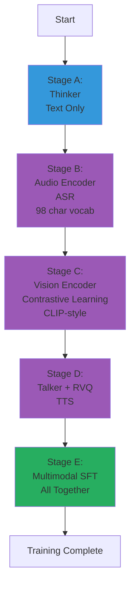

# Training Workflow

## 🎯 Key Takeaways (TL;DR)

- **What**: Staged training - train components separately, then combine
- **Why**: Fits in 12GB VRAM, easier to debug, better specialization
- **How**: 5 stages: Thinker → Audio → Vision → Talker → Multimodal SFT
- **Key Insight**: Each stage builds on previous knowledge (curriculum learning)
- **Common Mistake**: Skipping stages or training end-to-end (runs out of memory)
- **Time Estimate**: Stage A: 2-4 hours, Full pipeline: 8-12 hours (with AMP: 1-2 hours)

**📖 Reading Guide**:
- **Quick Read**: 15 minutes (overview + stages)
- **Standard Read**: 45 minutes (full document)
- **Deep Dive**: 2 hours (read + run training scripts)

## Overview

μOmni uses a **staged training approach** - train components separately, then combine them. This document explains the **theoretical foundations** behind our specific training implementation, based on the actual code in `train_*.py` files.

## Theoretical Foundation: Why Staged Training?

### The Memory Constraint Problem

**End-to-end training challenge**:
- All components active simultaneously
- Gradients flow through all components
- Memory: O(batch_size × sequence_length × model_size)
- For μOmni: Would exceed 12GB VRAM

**Our staged solution**:
- Train one component at a time
- Memory: O(batch_size × sequence_length × single_component_size)
- Fits comfortably in 12GB VRAM

### The Learning Efficiency Theory

**Why staged works better**:

1. **Specialization**: Each component focuses on one task
   - Thinker: Language modeling only
   - Audio Encoder: Speech recognition only
   - Vision Encoder: Image understanding only
   - Each becomes expert in its domain

2. **Stability**: Easier to train and debug
   - Can monitor each component separately
   - Identify issues early
   - Adjust hyperparameters per component

3. **Reusability**: Pretrained components are valuable
   - Can reuse in other projects
   - Can improve individually
   - Can swap with better pretrained models

4. **Modularity**: Clear separation of concerns
   - Each stage has clear objective
   - Can understand what each component learns
   - Easier to modify and improve

### The Curriculum Learning Perspective

Staged training is a form of **curriculum learning**:
1. **Stage A**: Learn basic language (Thinker)
2. **Stage B**: Learn speech understanding (Audio)
3. **Stage C**: Learn vision understanding (Vision)
4. **Stage D**: Learn speech generation (Talker)
5. **Stage E**: Learn multimodal integration (SFT)

Each stage builds on previous knowledge, creating a **learning curriculum**.

**Why this works**:
- Foundation first (language)
- Then specialized skills (modalities)
- Finally integration (multimodal)
- Natural progression of complexity

## Training Stages

```
Stage A: Thinker (Text)
    ↓
Stage B: Audio Encoder (ASR)
    ↓
Stage C: Vision Encoder
    ↓
Stage D: Talker + RVQ
    ↓
Stage E: Multimodal SFT (All Together)
```

### Diagram 1: Staged Training Pipeline



**Explanation**: Training proceeds in stages - first foundation (Thinker), then specialized encoders (Audio with full character vocabulary, Vision with contrastive learning), then generation (Talker), finally multimodal integration (SFT). Each stage builds on previous knowledge with proper algorithms.

## Stage A: Thinker Pretraining

### Goal
Train the core language model on text data.

### Process

```bash
python train_text.py --config configs/thinker_tiny.json
```

### What Happens

1. **Load Data**: Text corpus (`data/text/tiny_corpus.txt`)
2. **Tokenize**: Convert text to token IDs
3. **Create Batches**: Group sequences together
4. **Train**: Predict next token
5. **Save**: Checkpoint to `checkpoints/thinker_tiny/`

### Training Loop (From `train_text.py`)

```python
# Actual code from train_text.py (with AMP and gradient accumulation)
for x, y in tqdm(train_dl, desc=f"epoch{epoch}"):
    x, y = x.to(device), y.to(device)
    
    # Forward pass with mixed precision (AMP)
    if use_amp:
        with autocast():
            logits = model(x)  # (B, T, V)
            loss = loss_fn(logits.view(-1, logits.size(-1)), y.view(-1))
    else:
        logits = model(x)  # (B, T, V)
        loss = loss_fn(logits.view(-1, logits.size(-1)), y.view(-1))
    
    # Scale loss for gradient accumulation
    loss = loss / accumulation_steps
    
    # Backward pass with gradient scaling (AMP)
    if use_amp:
        scaler.scale(loss).backward()
    else:
        loss.backward()
    
    # Gradient accumulation: only step every N steps
    if (step + 1) % accumulation_steps == 0:
        if use_amp:
            scaler.unscale_(opt)
        torch.nn.utils.clip_grad_norm_(model.parameters(), max_grad_norm)
        if use_amp:
            scaler.step(opt)
            scaler.update()
        else:
            opt.step()
        scheduler.step()
        opt.zero_grad()
    
    step += 1
    
    # Log perplexity periodically
    if step % print_freq == 0:
        perplexity = torch.exp(loss * accumulation_steps).item() if (loss * accumulation_steps).item() < 10 else float('inf')
        logger.info(f"Perplexity: {perplexity:.2f}")
```

### Deep Theoretical Analysis: Next-Token Prediction

#### Why This Objective Works

**The language modeling objective**:
- **Input**: `[BOS] + tokens[:-1]` - context up to position t-1
- **Target**: `tokens[1:]` - token at position t
- **Goal**: Predict next token given all previous tokens

**Why this is powerful**:
- **Self-supervised**: No labels needed (text is its own label)
- **Scalable**: Can use massive text corpora
- **General**: Learns general language understanding
- **Proven**: Foundation of GPT, LLaMA, etc.

#### The Shifted Sequence Trick

**Key insight**: Use the same sequence for input and target, just shifted:

```
Input:  [BOS, "The", "cat", "sat"]
Target: ["The", "cat", "sat", "on"]
```

**Why this works**:
- Efficient: No need to create separate input/target pairs
- Natural: Each position learns to predict from its context
- Parallel: Can process all positions simultaneously

#### Loss Computation (Our Implementation)

**From `train_text.py`**:
```python
loss = loss_fn(logits.view(-1, logits.size(-1)), y.view(-1))
```

**What happens**:
- `logits`: (B, T, vocab_size) → (B×T, vocab_size)
- `y`: (B, T) → (B×T,)
- Loss computed for all positions simultaneously

**Why flatten?**
- Cross-entropy expects 2D logits and 1D targets
- Efficient batch processing
- Standard PyTorch pattern

#### Padding and Ignore Index

**Our implementation**:
```python
loss_fn = nn.CrossEntropyLoss(ignore_index=0)
```

**Why ignore padding (0)?**
- Sequences have different lengths
- Must pad to same length for batching
- Don't want to learn from padding tokens
- `ignore_index=0` excludes padding from loss

**What value do we get?**
- Efficient batching (variable lengths)
- No learning from padding
- Cleaner training signal

### Key Metrics

- **Loss**: Should decrease over time
- **Perplexity**: Lower is better (measure of uncertainty)
- **Validation Loss**: Check generalization

### Configuration

```json
{
  "max_steps": 1000,
  "batch_size": 8,
  "lr": 0.0003,
  "warmup_steps": 10,
  "use_amp": true
}
```

**Note**: `use_amp: true` is now the default in all configs. AMP provides 1.5-2x speedup and ~50% memory reduction.

**Gradient Accumulation**: All training scripts support `gradient_accumulation_steps` (default: 1). This allows simulating larger effective batch sizes by accumulating gradients over multiple forward passes before updating weights. How it works: (1) Forward pass and backward pass run normally, but loss is divided by accumulation_steps, (2) Gradients accumulate in model parameters, (3) Only every N steps (where N = accumulation_steps), optimizer steps and gradients are cleared. This is useful when memory is limited but you want larger effective batch sizes for more stable training.

### Output

- `thinker.pt` - Model weights
- `tokenizer.model` - Trained tokenizer
- `thinker_best.pt` - Best validation model

## Stage B: Audio Encoder (ASR)

### Goal
Train audio encoder to transcribe speech.

### Process

```bash
python train_audio_enc.py --config configs/audio_enc_tiny.json
```

### What Happens

1. **Load Data**: Audio files + transcriptions (`data/audio/asr.csv`)
2. **Convert to Mel**: Audio → mel spectrogram
3. **Encode**: Audio encoder processes mel
4. **CTC Head**: Predicts text characters
5. **CTC Loss**: Handles alignment

### Training Loop

```python
for audio, text in dataloader:
    # Convert to mel
    mel = mel_spec(audio)
    mel = mel.to(device)
    
    # Encode text to character IDs (proper tokenization)
    tgt = []
    for t in text:
        ids = []
        for c in t[:max_text_len]:  # max_text_len = 64
            if c in char_to_idx:
                ids.append(char_to_idx[c])
            else:
                ids.append(char_to_idx['<UNK>'])
        if len(ids) == 0:
            ids = [char_to_idx['<UNK>']]
        tgt.append(torch.tensor(ids, dtype=torch.long, device=device))
    tgt_lens = torch.tensor([len(t) for t in tgt], dtype=torch.long)
    tgt = torch.cat(tgt)
    
    # Forward pass with AMP
    if use_amp:
        with autocast():
            embeddings = audio_encoder(mel)  # (B, T', d_model)
            logits = ctc_head(embeddings)  # (B, T', vocab_size)
            log_prob = logits.log_softmax(-1).transpose(0, 1)  # (T', B, vocab_size)
            inp_lens = torch.full((log_prob.size(1),), log_prob.size(0), dtype=torch.long)
            loss = ctc_loss(log_prob, tgt, inp_lens, tgt_lens)
    else:
        embeddings = audio_encoder(mel)
        logits = ctc_head(embeddings)
        log_prob = logits.log_softmax(-1).transpose(0, 1)
        inp_lens = torch.full((log_prob.size(1),), log_prob.size(0), dtype=torch.long)
        loss = ctc_loss(log_prob, tgt, inp_lens, tgt_lens)
    
    # Scale loss for gradient accumulation
    loss = loss / accumulation_steps
    
    # Backward with gradient scaling
    if use_amp:
        scaler.scale(loss).backward()
    else:
        loss.backward()
    
    # Gradient accumulation: only step every N steps
    if (step + 1) % accumulation_steps == 0:
        if use_amp:
            scaler.unscale_(opt)
        clip_gradients(model, max_grad_norm)
        clip_gradients(ctc_head, max_grad_norm)
        if use_amp:
            scaler.step(opt)
            scaler.update()
        else:
            opt.step()
        opt.zero_grad()
    step += 1
```

### CTC (Connectionist Temporal Classification)

**Problem**: Audio has many frames, text has few tokens

**Solution**: CTC allows:
- Multiple frames per character
- Blank tokens
- Automatic alignment

**Character Tokenization**: Uses full printable ASCII vocabulary (32-126) + special tokens. Vocabulary size: 98 (includes blank token). Max text length: 64 characters.

### Output

- `audio_enc.pt` - Encoder weights + CTC head

## Stage C: Vision Encoder

### Goal
Train vision encoder using contrastive learning (CLIP-style) for image-caption alignment.

### Process

```bash
python train_vision.py --config configs/vision_tiny.json
```

### What Happens

1. **Load Data**: Images + captions (`data/images/annotations.json`)
2. **Encode**: Vision encoder processes image → CLS token
3. **Project**: Image and text embeddings projected to shared space
4. **Contrastive Loss**: InfoNCE loss for image-caption alignment

### Training Loop

```python
for image, caption in dataloader:
    B = image.shape[0]
    
    # Encode images and captions
    if use_amp:
        with autocast():
            cls_token, _ = vision_encoder(image)  # (B, 1, d_model)
            img_emb = img_proj(cls_token.squeeze(1))  # (B, embed_dim)
            img_emb = img_emb / img_emb.norm(dim=-1, keepdim=True)  # L2 normalize
            
            # Encode captions (bag-of-words)
            text_embs = torch.stack([encode_caption(c) for c in caption]).to(device)
            text_emb = text_proj(text_embs)  # (B, embed_dim)
            text_emb = text_emb / text_emb.norm(dim=-1, keepdim=True)  # L2 normalize
            
            # Contrastive loss (InfoNCE)
            logits = torch.matmul(img_emb, text_emb.t()) / temperature  # (B, B)
            labels = torch.arange(B, device=device)  # Positive pairs on diagonal
            loss = cross_entropy(logits, labels)
    else:
        cls_token, _ = vision_encoder(image)
        img_emb = img_proj(cls_token.squeeze(1))
        img_emb = img_emb / img_emb.norm(dim=-1, keepdim=True)
        text_embs = torch.stack([encode_caption(c) for c in caption]).to(device)
        text_emb = text_proj(text_embs)
        text_emb = text_emb / text_emb.norm(dim=-1, keepdim=True)
        logits = torch.matmul(img_emb, text_emb.t()) / temperature
        labels = torch.arange(B, device=device)
        loss = cross_entropy(logits, labels)
    
    # Scale loss for gradient accumulation
    loss = loss / accumulation_steps
    
    # Backward with gradient scaling
    if use_amp:
        scaler.scale(loss).backward()
    else:
        loss.backward()
    
    # Gradient accumulation: only step every N steps
    if (step + 1) % accumulation_steps == 0:
        if use_amp:
            scaler.unscale_(opt)
        clip_gradients(vit, max_grad_norm)
        clip_gradients(img_proj, max_grad_norm)
        clip_gradients(text_proj, max_grad_norm)
        if use_amp:
            scaler.step(opt)
            scaler.update()
        else:
            opt.step()
        opt.zero_grad()
    step += 1
```

### Note

**Current Implementation**: Uses contrastive learning (CLIP-style) with InfoNCE loss for proper image-caption alignment. Projects image and text embeddings to shared space and learns alignment through contrastive learning.

**Simplified Alternative**: Some implementations use simple classification tasks (e.g., "red" in caption?), but contrastive learning provides better representations for multimodal fusion.

### Output

- `vision.pt` - Encoder weights + classifier head

## Stage D: Talker + RVQ Codec

### Goal
Train Talker to generate speech codes, and RVQ to quantize audio.

### Process

```bash
python train_talker.py --config configs/talker_tiny.json
```

### What Happens

1. **Load Data**: Audio files (`data/audio/tts.csv`)
2. **Convert to Mel**: Audio → mel spectrogram
3. **Encode**: RVQ encodes mel to codes
4. **Train Talker**: Predict codes autoregressively
5. **Train RVQ**: Codebooks learn to represent audio

### Training Loop (From `train_talker.py`)

```python
# Actual code from train_talker.py (with AMP and safety checks)
for mel in tqdm(train_dl, desc=f"epoch{epoch}"):
    mel = mel.to(device)  # (B, T, 128)
    
    # Forward pass with AMP
    opt.zero_grad()
    if use_amp:
        with autocast():
            # Batch encode all frames at once (optimized)
            idxs = rvq.encode(mel)  # (B, T, 2) - encodes all frames in batch
            
            # AR training: predict current codes from previous codes
            prev = torch.roll(idxs, 1, dims=1)  # Shift by one
            prev[:, 0, :] = 0  # First frame is zero
            
            base_logit, res_logit = talker(prev)
            # Note: Talker automatically checks for NaN/Inf in logits
            
            # Loss on both codebooks
            loss = loss_fn(base_logit.reshape(-1, base_logit.size(-1)), idxs[:, :, 0].reshape(-1)) + \
                   loss_fn(res_logit.reshape(-1, res_logit.size(-1)), idxs[:, :, 1].reshape(-1))
    else:
        idxs = rvq.encode(mel)
        prev = torch.roll(idxs, 1, dims=1)
        prev[:, 0, :] = 0
        base_logit, res_logit = talker(prev)
        loss = loss_fn(base_logit.reshape(-1, base_logit.size(-1)), idxs[:, :, 0].reshape(-1)) + \
               loss_fn(res_logit.reshape(-1, res_logit.size(-1)), idxs[:, :, 1].reshape(-1))
    
    # 🔒 Loss Validation (NEW)
    try:
        validate_loss(loss, min_loss=-1e6, max_loss=1e6)
    except RuntimeError as e:
        logger.error(f"Step {step}: {e}")
        logger.error("Skipping this batch due to invalid loss")
        continue  # Skip this batch - no backward() called, so no scaler.update() needed
    
    # Backward pass with gradient scaling
    if use_amp:
        scaler.scale(loss).backward()
        # Unscale before checking gradients (gradients are in scaled space until unscaled)
        scaler.unscale_(opt)
    else:
        loss.backward()
    
    # 🔒 Gradient Explosion Detection (NEW)
    # Note: Must unscale BEFORE checking when using AMP (gradients are in scaled space)
    try:
        grad_norm_rvq, is_exploded_rvq = check_gradient_explosion(rvq, max_grad_norm=100.0, raise_on_error=False)
        grad_norm_talker, is_exploded_talker = check_gradient_explosion(talker, max_grad_norm=100.0, raise_on_error=False)
        if is_exploded_rvq or is_exploded_talker:
            logger.error(f"Gradient explosion detected. Skipping batch.")
            opt.zero_grad()  # Clear gradients
            if use_amp:
                scaler.update()  # Update scaler even though we skipped (unscale was called)
            continue
    except RuntimeError as e:
        logger.error(f"Step {step}: {e}")
        opt.zero_grad()  # Clear gradients
        if use_amp:
            scaler.update()  # Update scaler even though we skipped (unscale was called)
        continue
    
    # Gradient clipping (already unscaled if using AMP)
    if use_amp:
        clip_gradients(rvq, max_grad_norm)
        clip_gradients(talker, max_grad_norm)
        scaler.step(opt)
        scaler.update()
    else:
        clip_gradients(rvq, max_grad_norm)
        clip_gradients(talker, max_grad_norm)
        opt.step()
    scheduler.step()
```

### Deep Theoretical Analysis: Teacher Forcing

#### Why `torch.roll` for Teacher Forcing?

**The teacher forcing trick**:
```python
prev = torch.roll(idxs, 1, dims=1)  # Shift right by one
prev[:, 0, :] = 0  # First position is zero
```

**What this does**:
- **Before shift**: `[code0, code1, code2, code3]`
- **After shift**: `[0, code0, code1, code2]`
- **Target**: `[code0, code1, code2, code3]`

**Result**: Model learns to predict `code_t` from `code_{t-1}`

#### Why Teacher Forcing Works

**Training with teacher forcing**:
- Use **ground truth** previous codes
- Fast convergence
- Stable gradients
- Standard practice

**Inference without teacher forcing**:
- Use **predicted** previous codes
- Realistic generation
- Can accumulate errors
- Requires careful generation

**Why both?**
- **Training**: Efficiency and stability (teacher forcing)
- **Inference**: Realism (autoregressive)

#### The Two-Codebook Loss

**Our implementation**:
```python
loss = loss_base + loss_residual
```

**Why sum both losses?**
- **Base codebook**: Captures coarse features
- **Residual codebook**: Captures fine details
- **Both matter**: Need both for good reconstruction
- **Equal weight**: Both losses contribute equally

**Alternative**: Weighted sum (e.g., 0.7 base + 0.3 residual)
- Could emphasize one codebook
- But equal weights work well in practice

#### RVQ and Talker Joint Training

**Why train together?**
- **End-to-end**: Codebooks learn optimal representations
- **Adaptive**: Codebooks adapt to Talker's needs
- **Better quality**: Joint optimization improves reconstruction

**What gets learned**:
- **RVQ codebooks**: Learn to represent audio efficiently
- **Talker**: Learns to predict codes autoregressively
- **Together**: Optimal codebook-Talker pairing

#### What Value Do We Get?

1. **Efficient Training**: Teacher forcing speeds up training
2. **Joint Optimization**: RVQ and Talker learn together
3. **Quality**: Better than training separately
4. **Stability**: Stable training with gradient clipping
5. **Flexibility**: Can generate variable-length audio

### Key Points

- **RVQ and Talker trained together** - end-to-end
- **Teacher forcing** - use ground truth previous codes
- **Two codebooks** - base and residual

### Output

- `talker.pt` - Talker weights + RVQ codebooks

## Stage E: Multimodal SFT

### Goal
Fine-tune Thinker with multimodal data, train projectors.

### Process

```bash
python sft_omni.py --config configs/omni_sft_tiny.json
```

### What Happens

1. **Load Components**: Thinker, Audio Encoder, Vision Encoder (frozen)
2. **Load Data**: Mixed text, images, audio
3. **Encode Modalities**: Each encoder processes its modality
4. **Project**: Align to Thinker dimension
5. **Fuse**: Concatenate embeddings
6. **Train**: Thinker + projectors (encoders frozen)

### Training Loop (From `sft_omni.py`)

```python
# Actual code from sft_omni.py (with AMP)
for batch_idx, data in enumerate(train_dl):
    # Process batch (handles variable modalities, with AMP support)
    batch_emb, batch_targets, batch_mask = process_batch(data, is_training=True, use_amp_flag=use_amp)
    
    # Forward pass with AMP
    opt.zero_grad()
    if use_amp:
        with autocast():
            logits = think(embeddings=batch_emb)  # (B, T, vocab)
            loss = loss_fn(logits.view(-1, logits.size(-1)), batch_targets.view(-1))
    else:
        logits = think(embeddings=batch_emb)  # (B, T, vocab)
        loss = loss_fn(logits.view(-1, logits.size(-1)), batch_targets.view(-1))
    
    # Backward with gradient scaling (AMP)
    if use_amp:
        scaler.scale(loss).backward()
        scaler.unscale_(opt)
        clip_gradients(think, max_grad_norm)
        clip_gradients(proj_a, max_grad_norm)
        clip_gradients(proj_v, max_grad_norm)
        scaler.step(opt)
        scaler.update()
    else:
        loss.backward()
        clip_gradients(think, max_grad_norm)
        clip_gradients(proj_a, max_grad_norm)
        clip_gradients(proj_v, max_grad_norm)
        opt.step()
    
    scheduler.step()
```

### Deep Theoretical Analysis: Multimodal SFT

#### Why Freeze Encoders?

**Our implementation** (from `sft_omni.py`):
```python
# Encoders are loaded but NOT in optimizer
# Only Thinker and projectors are trainable
opt = torch.optim.AdamW(
    list(think.parameters()) + 
    list(proj_a.parameters()) + 
    list(proj_v.parameters()),
    lr=cfg["lr"]
)
# Note: vis and aud are NOT in optimizer (frozen)
```

**Why freeze?**
- **Already trained**: Encoders learned good representations
- **Focus SFT**: Focus on alignment, not encoding
- **Stability**: Frozen encoders = stable training
- **Efficiency**: Fewer parameters to update

**What gets learned in SFT**:
- **Projectors**: How to align modalities to Thinker space
- **Thinker**: How to process multimodal sequences
- **Cross-modal relationships**: Connections between modalities

#### The Batch Processing Strategy

**Our `process_batch` function** (from `sft_omni.py`):
1. **Batch images**: Process all images together
2. **Batch audio**: Process all audio together (with padding)
3. **Process text**: Per sample (then combine)
4. **Fuse**: Concatenate embeddings per sample
5. **Pad**: Pad to same length for final batch

**Why this strategy?**
- **Efficiency**: Batch processing is faster
- **Flexibility**: Handles variable modalities per sample
- **Memory**: Efficient use of GPU memory

#### Context Allocation Theory

**Our implementation**:
```python
# Limit audio length
max_audio_tokens = cfg["ctx_len"] // 4  # 512 // 4 = 128 tokens

# Calculate remaining context for text
multimodal_len = sum(emb.shape[1] for emb in multimodal_emb_list)
max_text_len = cfg["ctx_len"] - multimodal_len - 1
```

**Why ctx_len // 4 for audio?**
- **Balance**: Leaves room for text
- **Practical**: Audio can be long, need to limit
- **Empirical**: Works well in practice

**Why dynamic text allocation?**
- **Flexible**: More multimodal → less text (and vice versa)
- **Efficient**: Uses full context
- **Adaptive**: Adjusts to input

#### Loss Only on Text Tokens

**Our implementation**:
```python
# Loss computed on all tokens, but...
# Multimodal tokens have padding in targets (ignored by loss)
multimodal_padding = torch.zeros(multimodal_len, dtype=y_ids.dtype, device=device)
y_ids = torch.cat([multimodal_padding, y_ids], dim=0)
```

**Why ignore multimodal tokens in loss?**
- **Objective**: Learn to generate text from multimodal input
- **Not generating**: Not generating images/audio, only text
- **Focus**: Focus learning on text generation

**What value do we get?**
- **Clear objective**: Generate text, not modalities
- **Efficient**: Don't waste loss on non-text tokens
- **Standard**: Matches multimodal LLM training

#### What Value Do We Get from SFT?

1. **Multimodal Understanding**: Learns cross-modal relationships
2. **Alignment**: Projectors align modalities to Thinker space
3. **Integration**: Thinker learns to process multimodal sequences
4. **Efficiency**: Frozen encoders = faster training
5. **Flexibility**: Handles any combination of modalities

### Key Points

- **Encoders frozen** - already trained
- **Projectors trainable** - learn to align modalities
- **Thinker fine-tuned** - learns multimodal understanding
- **Loss only on text** - multimodal tokens ignored

### Output

- `omni.pt` - Thinker + projectors

## Training Best Practices (Our Implementation)

All training scripts include specific techniques from our codebase:

### Learning Rate Scheduling (From `omni/training_utils.py`)

**Our implementation**:
```python
def get_lr_scheduler(optimizer, warmup_steps, max_steps, min_lr_ratio=0.1):
    def lr_lambda(step):
        if step < warmup_steps:
            return step / max(warmup_steps, 1)  # Linear warmup
        else:
            # Cosine decay
            progress = (step - warmup_steps) / max((max_steps - warmup_steps), 1)
            return min_lr_ratio + (1 - min_lr_ratio) * 0.5 * (1 + torch.cos(torch.tensor(progress * math.pi)))
    return torch.optim.lr_scheduler.LambdaLR(optimizer, lr_lambda)
```

#### Why Warmup?

**The problem**: Large learning rates at start can cause:
- Gradient explosion
- Training instability
- Poor convergence

**Our solution**: Linear warmup
- Start: `lr = 0`
- End of warmup: `lr = base_lr`
- Gradual increase prevents instability

**Why this works**:
- **Stable start**: Small gradients initially
- **Gradual increase**: Model adapts gradually
- **Proven**: Standard in transformer training

#### Why Cosine Decay?

**Our implementation**: Cosine decay after warmup
- **Start**: `lr = base_lr` (after warmup)
- **End**: `lr ≈ min_lr_ratio * base_lr` (at max_steps)
- **Shape**: Cosine curve (smooth decrease)

**Why cosine?**
- **Smooth**: Gradual decrease (no sudden drops)
- **Exploration**: High LR early (explore)
- **Refinement**: Low LR late (refine)
- **Proven**: Used in many successful models

### Mixed Precision Training (AMP) - Our Implementation

**Automatic Mixed Precision (AMP)** is now enabled by default in all training scripts for faster training and reduced memory usage.

**Our implementation** (from all `train_*.py` files):
```python
from torch.cuda.amp import autocast, GradScaler

# Initialize AMP
use_amp = cfg.get("use_amp", True) and device == "cuda"
scaler = GradScaler() if use_amp else None

# In training loop:
if use_amp:
    with autocast():  # Forward pass in FP16
        logits = model(x)
        loss = loss_fn(logits, targets)
    
    scaler.scale(loss).backward()  # Scaled backward
    scaler.unscale_(opt)  # CRITICAL: Unscale BEFORE checking gradients/clipping
    
    # Check for gradient explosion (after unscaling)
    grad_norm, is_exploded = check_gradient_explosion(model, max_grad_norm=100.0)
    if is_exploded:
        opt.zero_grad()
        scaler.update()  # Update scaler (unscale was called)
        continue  # Skip batch
    
    torch.nn.utils.clip_grad_norm_(model.parameters(), max_grad_norm)
    scaler.step(opt)  # Scaled optimizer step
    scaler.update()  # Update scaler
```

**Why AMP?**
- **Speed**: 1.5-2x faster training
- **Memory**: ~50% less VRAM usage
- **Quality**: Minimal impact on model quality
- **Automatic**: PyTorch handles precision automatically

**How it works**:
- **Forward pass**: Uses FP16 (half precision) for speed
- **Loss scaling**: Scales loss to prevent underflow
- **Backward pass**: Computes gradients in FP16 (scaled space)
- **Unscaling**: Converts gradients back to FP32 (real space) - **must do before checking/clipping**
- **Optimizer step**: Updates weights in FP32

**Critical AMP Gotcha**: 
- Gradients are in **scaled space** after `scaler.scale(loss).backward()`
- **Must unscale BEFORE** checking gradient norms or clipping
- Checking before unscaling causes **false positives** (gradients appear 1000x larger)

**Configuration**:
- **Default**: `use_amp: true` in all configs
- **Disable**: Set `use_amp: false` in config if needed
- **Automatic**: Only enabled on CUDA devices

**What value do we get?**
- **Faster training**: 1.5-2x speedup on modern GPUs
- **More VRAM**: Can use larger batch sizes
- **Same quality**: Minimal impact on final model performance
- **Production-ready**: Standard practice in modern training

### Gradient Clipping (Our Implementation)

**From `omni/training_utils.py`**:
```python
def clip_gradients(model, max_norm=1.0):
    return torch.nn.utils.clip_grad_norm_(model.parameters(), max_norm)
```

**Why gradient clipping?**
- **Prevents explosion**: Large gradients → weight explosion
- **Stability**: Keeps training stable
- **Convergence**: Helps model converge

**Why max_norm=1.0?**
- **Empirical**: Works well in practice
- **Conservative**: Prevents extreme gradients
- **Standard**: Common value in transformer training

**Note**: With AMP, gradients must be unscaled before clipping:
```python
if use_amp:
    scaler.unscale_(opt)  # Unscale first!
    clip_gradients(model, max_grad_norm)  # Then clip
```

**What value do we get?**
- **Stable training**: No gradient explosions
- **Better convergence**: Smoother optimization
- **Robustness**: Handles difficult batches

### Validation Strategy (Our Implementation)

**From `train_text.py`**:
```python
# Validation every N steps
if step % val_freq == 0 and step > 0:
    model.eval()
    val_loss_sum = 0.0
    val_count = 0
    with torch.no_grad():
        for val_x, val_y in val_dl:
            # ... compute loss ...
            if val_count >= 20:  # Limit validation batches
                break
    
    avg_val_loss = val_loss_sum / val_count
    
    # Save best model
    if avg_val_loss < best_val_loss:
        best_val_loss = avg_val_loss
        torch.save(model.state_dict(), "thinker_best.pt")
```

#### Why Periodic Validation?

**The problem**: Training loss can be misleading
- May overfit to training data
- Need to check generalization

**Our solution**: Validate every N steps
- **Frequency**: `val_freq` (e.g., 200 steps)
- **Limited batches**: Only 20 batches (efficiency)
- **Best model**: Save when validation improves

**Why limit to 20 batches?**
- **Efficiency**: Full validation is slow
- **Representative**: 20 batches is enough
- **Practical**: Balance between accuracy and speed

#### What Value Do We Get?

1. **Generalization Check**: Monitors overfitting
2. **Best Model**: Saves best validation model
3. **Early Stopping**: Can stop if validation plateaus
4. **Efficiency**: Limited batches = fast validation
5. **Practical**: Works well in practice

## Monitoring Training

### Key Metrics

1. **Loss**: Should decrease smoothly
2. **Learning Rate**: Check scheduler
3. **Gradient Norm**: Should be stable
4. **Validation Loss**: Should track training loss

## ⚠️ Common Pitfalls

1. **Skipping Training Stages**: Don't skip stages - each builds on previous
   ```python
   # WRONG: Training everything at once
   train_all_components()  # Runs out of memory!
   
   # CORRECT: Stage by stage
   train_thinker()  # Stage A
   train_audio_encoder()  # Stage B
   # ... etc
   ```

2. **Wrong Learning Rate**: Too high = NaN, too low = no learning
   ```python
   # Check your learning rate
   print(f"LR: {optimizer.param_groups[0]['lr']}")
   # Typical: 1e-4 to 1e-3 for transformers
   ```

3. **Forgetting Validation**: Always validate to check overfitting
   ```python
   # Don't skip validation!
   if step % val_freq == 0:
       validate(model, val_loader)
   ```

4. **Device Mismatch**: Ensure model and data on same device
   ```python
   # Check device
   assert next(model.parameters()).device == batch.device
   ```

5. **Gradient Issues**: Use gradient clipping for stability
   ```python
   # Backward pass
   if use_amp:
       scaler.scale(loss).backward()
       scaler.unscale_(opt)  # CRITICAL: Unscale BEFORE checking gradients
   else:
       loss.backward()
   
   # Check for gradient explosion (after unscaling if AMP)
   grad_norm, is_exploded = check_gradient_explosion(model, max_grad_norm=100.0)
   if is_exploded:
       logger.error(f"Gradient explosion: {grad_norm:.2f}")
       opt.zero_grad()
       if use_amp:
           scaler.update()  # Update scaler (unscale was called)
       continue
   
   # Then clip gradients (already unscaled if using AMP)
   if use_amp:
       torch.nn.utils.clip_grad_norm_(model.parameters(), max_norm=1.0)
       scaler.step(opt)
       scaler.update()
   else:
       torch.nn.utils.clip_grad_norm_(model.parameters(), max_norm=1.0)
       opt.step()
   ```

6. **Numerical Stability**: All models now check for NaN/Inf automatically
   ```python
   # Automatic in model forward passes:
   logits = model(x)  # Raises RuntimeError if NaN/Inf detected
   
   # Manual loss validation:
   validate_loss(loss, min_loss=-1e6, max_loss=1e6)
   ```

## 🔍 Debugging Checklist: Training Issues

When training fails, check these:

- [ ] **Stage Order**: Are you training stages in correct order?
- [ ] **Checkpoint Loading**: Are you loading previous stage's checkpoint?
- [ ] **Data Loading**: Are batches correct shape? `print(batch.shape)`
- [ ] **Loss Values**: Is loss reasonable? `print(loss.item())`
- [ ] **Learning Rate**: Is LR appropriate? Check scheduler
- [ ] **Gradients**: Are gradients flowing? `print(param.grad is not None)`
- [ ] **Memory**: Are you running out of VRAM? Reduce batch size
- [ ] **Validation**: Is validation loss decreasing?
- [ ] **Device**: CPU vs GPU? `print(next(model.parameters()).device)`
- [ ] **Numerical Stability**: Check logs for NaN/Inf errors (automatic detection)
- [ ] **Gradient Explosion**: Check logs for gradient explosion warnings (automatic detection)

### Common Issues

1. **Loss not decreasing**:
   - Check learning rate
   - Check for NaN/Inf in loss (automatic validation will catch this)
   - Verify loss validation is passing
   - Verify data loading
   - Check model initialization

2. **Loss exploding**:
   - Reduce learning rate
   - Add gradient clipping
   - Check for NaN values

3. **Overfitting**:
   - More data augmentation
   - Increase dropout
   - Early stopping

## ✅ Understanding Checkpoint

Before moving on, can you answer:

1. **Why staged training instead of end-to-end?**
   - Answer: Fits in 12GB VRAM, easier to debug, better specialization

2. **What's the order of training stages?**
   - Answer: Thinker → Audio → Vision → Talker → Multimodal SFT

3. **Why validate periodically?**
   - Answer: Check overfitting, save best model, monitor generalization

4. **What happens if you skip a stage?**
   - Answer: Later stages may fail or perform poorly (missing prerequisites)

5. **How are numerical issues handled during training?**
   - Answer: Automatic NaN/Inf detection in forward passes, loss validation, and gradient explosion detection - invalid batches are automatically skipped

6. **What is AMP and how does it help?**
   - Answer: Automatic Mixed Precision uses FP16 for forward passes, providing 1.5-2x speedup and ~50% memory reduction. Enabled by default in all training scripts.

7. **How do you know when a stage is done?**
   - Answer: Loss plateaus, validation loss stops improving, or max steps reached

8. **When are checkpoints saved and how does resuming work?**
   - Answer: Checkpoints are saved in three scenarios: (1) Periodically every `checkpoint_freq` steps (default: 500) - saves as `{model}_step_{step}.pt`, (2) When validation loss improves - saves as `{model}_best.pt`, (3) At end of training - saves as `{model}.pt`. Each checkpoint includes: model weights, optimizer state, scheduler state, step counter, best validation loss, and scaler state (if using AMP). Training automatically detects the latest checkpoint on startup and resumes from that exact point, skipping already-processed batches. Example: If training stops at step 1999 with checkpoint_freq=500, the latest checkpoint is `thinker_step_1500.pt`, so training resumes from step 1500, skips batches until step 1999, then continues from step 2000.

## Training Time Estimates

For tiny models on 12GB GPU (with AMP enabled):

| Stage | Steps | Time (FP32) | Time (AMP) | Speedup |
|-------|-------|-------------|------------|---------|
| Thinker | 1000 | 10-20 min | 6-12 min | 1.5-2x |
| Audio Encoder | 500 | 5-10 min | 3-6 min | 1.5-2x |
| Vision Encoder | 5000 | 50-100 min | 30-60 min | 1.5-2x |
| Talker | 500 | 5-10 min | 3-6 min | 1.5-2x |
| Omni SFT | 2000 | 20-40 min | 12-24 min | 1.5-2x |

**Total (FP32)**: ~1.5-3 hours for full training
**Total (AMP)**: ~1-2 hours for full training ⚡

**Note**: AMP provides 1.5-2x speedup and ~50% memory reduction with minimal quality impact.

## Next Steps

After training:

1. **Evaluate**: Test on validation set
2. **Inference**: Try generating outputs
3. **Fine-tune**: Adjust hyperparameters
4. **Deploy**: Use in applications

---

**Next:**
- [08_Inference_Guide.md](08_Inference_Guide.md) - Using trained models
- [09_Hands_On_Exercises.md](09_Hands_On_Exercises.md) - Practice exercises

**See Also:**
- [Architecture Overview](02_Architecture_Overview.md)
- [Thinker Deep Dive](03_Thinker_Deep_Dive.md)

