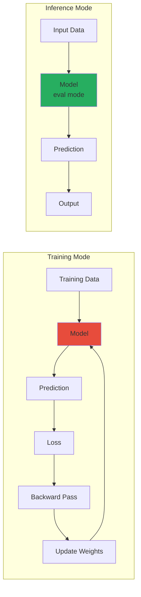
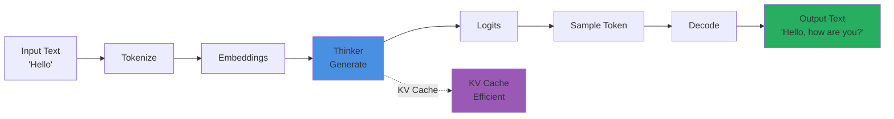

# Inference Guide: Using Trained Models

## What is Inference?

**Inference** is using a trained model to make predictions on new data.

Training = Learning from examples
Inference = Using what was learned

### Diagram 1: Training vs Inference



**Explanation**: Training involves forward pass, loss calculation, and weight updates. Inference only performs forward pass with model in eval mode (no gradients, no dropout), producing predictions.

## Theoretical Foundation: Inference vs Training

### Key Differences

**Training mode**:
- **Gradient computation**: Tracks gradients for backprop
- **Dropout active**: Randomly drops neurons
- **Batch norm updates**: Updates running statistics
- **Memory intensive**: Stores activations for gradients

**Inference mode**:
- **No gradients**: `torch.no_grad()` or `model.eval()`
- **Dropout inactive**: Uses all neurons
- **Batch norm frozen**: Uses learned statistics
- **Memory efficient**: No gradient storage

### Why `model.eval()` Matters

**Our implementation** (from `infer_chat.py`):
```python
think.eval()  # Set to evaluation mode
vis.eval()
aud.eval()
```

**What `eval()` does**:
- Disables dropout (deterministic)
- Freezes batch norm (uses learned stats)
- Ensures consistent behavior

**Why critical**:
- **Reproducibility**: Same input → same output
- **Determinism**: No randomness in inference
- **Performance**: Slightly faster (no dropout computation)

### Memory Efficiency in Inference

**Training**: Stores activations for gradients
- Memory: O(batch_size × sequence_length × model_size × 2)
- Factor of 2: activations + gradients

**Inference**: No gradient storage
- Memory: O(batch_size × sequence_length × model_size)
- Half the memory of training

**What value do we get?**
- Can use larger batches
- Can process longer sequences
- More efficient GPU usage

## Basic Usage

### Text-Only Chat

```bash
python infer_chat.py --ckpt_dir checkpoints/thinker_tiny --text "Hello, how are you?"
```

**What happens:**
1. Load Thinker model
2. Tokenize input text
3. Generate response
4. Decode tokens to text
5. Print output

### Diagram 2: Text Inference Flow



**Explanation**: Text is tokenized, processed through Thinker to generate logits, tokens are sampled and decoded back to text. KV caching stores previous computations for efficient autoregressive generation.

### Image + Text

```bash
python infer_chat.py --ckpt_dir checkpoints/omni_sft_tiny \
  --image examples/sample_image.png \
  --text "What do you see?"
```

**What happens:**
1. Load all models (Thinker, Vision, projectors)
2. Encode image → embeddings
3. Tokenize text → embeddings
4. Fuse embeddings
5. Thinker processes
6. Generate text response

### Audio Input

```bash
python infer_chat.py --ckpt_dir checkpoints/omni_sft_tiny \
  --audio_in examples/sample_audio.wav \
  --text "What did you hear?"
```

### Text-to-Speech

```bash
python infer_chat.py --ckpt_dir checkpoints/omni_sft_tiny \
  --text "Hello world" \
  --audio_out output.wav
```

## Code Walkthrough

### Loading Models

```python
# From infer_chat.py

# Load Thinker
thinker = ThinkerLM(...)
thinker.load_state_dict(torch.load("thinker.pt"))
thinker.eval()  # Set to evaluation mode

# Load encoders
vision_encoder = ViTTiny(...)
audio_encoder = AudioEncoderTiny(...)

# Load projectors (from omni checkpoint)
projectors = torch.load("omni.pt")
vision_projector.load_state_dict(projectors["proj_v"])
audio_projector.load_state_dict(projectors["proj_a"])
```

### Processing Inputs

```python
# Image
if image_path:
    image = Image.open(image_path)
    image_tensor = transform(image)  # (3, 224, 224)
    cls_token, _ = vision_encoder(image_tensor)
    img_emb = vision_projector(cls_token)  # (1, 256)

# Audio
if audio_path:
    audio, sr = torchaudio.load(audio_path)
    mel = mel_spec(audio)
    audio_emb = audio_encoder(mel)
    audio_emb = audio_projector(audio_emb)  # (T, 256)

# Text
text_ids = tokenizer.encode(text)
text_emb = thinker.tok_emb(text_ids)  # (T, 256)
```

### Generation (From `infer_chat.py`)

```python
# Actual code from infer_chat.py
# Combine multimodal embeddings
multimodal_emb = torch.cat(multimodal_embeddings, dim=1)  # (1, T_mm, d_thinker)

# Generate with multimodal context
out = generate(think, tok, prompt, ctx=ctx_len, multimodal_emb=multimodal_emb)
```

### Deep Theoretical Analysis: Our Generation Function

#### The Generation Process (From `infer_chat.py`)

**Our implementation**:
```python
def generate(model, tok, prompt, max_new=64, ctx=512, multimodal_emb=None, use_cache=True):
    # Tokenize prompt
    ids = [1] + tok.encode(prompt)
    
    # Handle multimodal embeddings
    if multimodal_emb is not None:
        mm_len = multimodal_emb.shape[1]
        max_text_len = ctx - mm_len - max_new - 1
        ids = ids[:max_text_len]
        text_emb = model.tok_emb(torch.tensor(ids, ...))
        combined_emb = torch.cat([multimodal_emb, text_emb], dim=1)
        
        # First forward pass
        logits = model(embeddings=combined_emb)
        next_id = int(torch.argmax(logits[0, -1]))
        generated_ids = ids + [next_id]
        
        # Incremental generation
        for _ in range(max_new - 1):
            next_emb = model.tok_emb(torch.tensor([[next_id]], ...))
            logits = model(embeddings=next_emb)
            next_id = int(torch.argmax(logits[0, -1]))
            generated_ids.append(next_id)
            if next_id == 2: break  # EOS
```

#### Why Greedy Decoding?

**Our implementation**: `torch.argmax(logits[0, -1])`
- Always picks highest probability token
- Deterministic
- Fast

**Alternatives**:
- **Sampling**: Random selection based on probabilities
- **Top-k**: Sample from top k tokens
- **Top-p (nucleus)**: Sample from tokens with cumulative probability p

**Why greedy for μOmni?**
- **Simplicity**: Easy to implement
- **Deterministic**: Reproducible results
- **Fast**: No sampling overhead
- **Sufficient**: Works well for small models

#### Context Management Theory

**Our implementation**:
```python
if multimodal_emb is not None:
    mm_len = multimodal_emb.shape[1]
    max_text_len = ctx - mm_len - max_new - 1
    ids = ids[:max_text_len]
```

**Why this allocation?**
- **Total context**: `ctx_len` (512 tokens)
- **Multimodal tokens**: `mm_len` (e.g., 22 for image+audio)
- **Generation budget**: `max_new` (64 tokens)
- **Available for prompt**: `ctx - mm_len - max_new - 1`

**The -1**: Safety margin to prevent overflow

**What value do we get?**
- **Efficient**: Uses full context
- **Flexible**: Adapts to multimodal input size
- **Safe**: Prevents context overflow

#### KV Caching in Our Implementation

**Our code** (from `infer_chat.py`):
```python
# Enable KV caching if supported
if use_cache and hasattr(model, 'enable_kv_cache'):
    model.enable_kv_cache(True)
    model.reset_kv_cache()
```

**What KV caching does**:
- **First pass**: Process full prompt, cache K/V
- **Subsequent passes**: Only process new token, reuse cache
- **Speedup**: O(n²) → O(n) for incremental generation

**Why critical for inference?**
- **Efficiency**: Much faster generation
- **Scalability**: Enables long sequences
- **Standard**: Used in all modern LLMs

#### What Value Do We Get from Our Generation?

1. **Efficiency**: KV caching speeds up generation
2. **Flexibility**: Handles multimodal inputs
3. **Context Management**: Efficient context allocation
4. **Deterministic**: Greedy decoding = reproducible
5. **Practical**: Works well for our model size

## Generation Process

### Autoregressive Generation

```python
def generate(model, tokenizer, prompt, max_new=64):
    # Tokenize prompt
    ids = tokenizer.encode(prompt)
    
    # First forward pass
    logits = model(ids)
    next_id = argmax(logits[:, -1, :])
    generated = ids + [next_id]
    
    # Continue generating
    for _ in range(max_new - 1):
        # Only process new token (KV cache handles rest)
        logits = model([[next_id]])
        next_id = argmax(logits[:, -1, :])
        generated.append(next_id)
        
        if next_id == EOS:
            break
    
    return tokenizer.decode(generated)
```

### KV Caching

Speed up generation by caching attention states:

```python
# Enable caching
model.enable_kv_cache(True)
model.reset_kv_cache()

# First pass: process full sequence
logits, kv_cache = model(prompt, use_cache=True)

# Subsequent passes: only new token
logits, kv_cache = model(new_token, kv_cache=kv_cache)
```

## TTS Generation

### Complete Pipeline

```python
# 1. Generate text
text = "Hello world"

# 2. Generate audio codes
codes = generate_audio_codes(talker, text, max_frames=200)

# 3. Decode codes to mel
mel = rvq.decode(codes)

# 4. Convert mel to audio
audio = vocoder.mel_to_audio(mel)

# 5. Save
soundfile.write("output.wav", audio, 16000)
```

### Audio Code Generation (From `infer_chat.py`)

```python
# Actual code from infer_chat.py
def generate_audio(talker, rvq, voc, text_tokens, device, max_frames=None):
    # Determine frames based on text length
    if max_frames is None:
        if text_tokens is not None and len(text_tokens) > 0:
            max_frames = max(50, min(1000, int(len(text_tokens) * 30)))
        else:
            max_frames = 200
    
    # Enable KV caching
    if hasattr(talker, 'enable_kv_cache'):
        talker.enable_kv_cache(True)
        talker.reset_kv_cache()
    
    with torch.no_grad():
        codes = torch.zeros(1, 1, 2, dtype=torch.long, device=device)
        
        # First forward pass
        base_logit, res_logit = talker(codes, use_cache=True)
        base_code = torch.argmax(base_logit[0, -1, :])
        res_code = torch.argmax(res_logit[0, -1, :])
        next_codes = torch.tensor([[[base_code, res_code]]], device=device)
        codes = torch.cat([codes, next_codes], dim=1)
        
        # Incremental generation
        for _ in range(max_frames - 1):
            base_logit, res_logit = talker(next_codes, use_cache=True)
            base_code = torch.argmax(base_logit[0, -1, :])
            res_code = torch.argmax(res_logit[0, -1, :])
            next_codes = torch.tensor([[[base_code, res_code]]], device=device)
            codes = torch.cat([codes, next_codes], dim=1)
```

### Deep Theoretical Analysis: Frame Estimation

#### Why 30 Frames Per Token?

**Our heuristic** (from `infer_chat.py`):
```python
max_frames = max(50, min(1000, int(len(text_tokens) * 30)))
```

**The reasoning**:
- **At 12.5 Hz**: 1 frame = 80ms
- **Speech rate**: ~2-3 tokens per second
- **30 frames/token**: ~2.4 seconds per token (generous)
- **Why generous?**: Better to have too much than too little

**Why min/max bounds?**
- **Min 50**: Ensures minimum audio length (~0.8s)
- **Max 1000**: Prevents excessive generation (~16s)
- **Practical**: Handles edge cases

#### Why Start with Zero Codes?

**Our implementation**:
```python
codes = torch.zeros(1, 1, 2, dtype=torch.long, device=device)
```

**Why zeros?**
- **Start token**: Similar to BOS in language models
- **Learnable**: Model learns what "start" means
- **Standard**: Common practice in autoregressive models

**What gets learned?**
- Model learns to generate first frame from "nothing"
- Start token provides initial context
- Enables generation from scratch

#### The Decoding Process

**Our implementation**:
```python
# Decode codes to mel spectrogram
mel_frames = []
for t in range(codes.shape[1]):
    frame_codes = codes[:, t:t+1, :]  # (1, 1, 2)
    frame_codes_flat = frame_codes.squeeze(0).squeeze(0)  # (2,)
    mel_frame = rvq.decode(frame_codes_flat.unsqueeze(0))  # (1, 128)
    mel_frames.append(mel_frame.squeeze(0))  # (128,)

mel = torch.stack(mel_frames, dim=0)  # (T, 128)
```

**Why frame-by-frame decoding?**
- **RVQ decode**: Expects (B, num_codebooks) per frame
- **Sequential**: Must decode each frame separately
- **Memory**: Can't decode all frames at once (different shapes)

**What value do we get?**
- **Correct decoding**: Proper RVQ reconstruction
- **Memory efficient**: Processes one frame at a time
- **Flexible**: Handles variable-length generation

#### What Value Do We Get from TTS Inference?

1. **Flexible Duration**: Adapts to text length
2. **Efficient Generation**: KV caching speeds up
3. **Quality**: Autoregressive captures dependencies
4. **Practical**: Works with our model
5. **Complete Pipeline**: End-to-end text-to-speech

## Interactive Mode

```bash
python infer_chat.py --ckpt_dir checkpoints/thinker_tiny
```

Enters interactive chat:

```
Entering interactive chat mode. Type 'exit' to quit.
You: Hello
μOmni: Hello! How can I help you?
You: What is AI?
μOmni: AI is artificial intelligence...
You: exit
```

### Deep Theoretical Analysis: Interactive Mode

#### Why Interactive Mode?

**Our implementation** (from `infer_chat.py`):
```python
# Interactive text chat mode
print("Entering interactive chat mode. Type 'exit' to quit.")
while True:
    q = input("You: ")
    if q.lower() in ['exit', 'quit', 'q']:
        break
    out = generate(think, tok, q)
    print("μOmni:", out)
```

**Why this design?**
- **User-friendly**: Natural conversation interface
- **Iterative**: Can have multi-turn conversations
- **Practical**: Easy to test and use

#### KV Cache Persistence

**Important**: Our implementation resets cache each turn
- Each query is independent
- No conversation history maintained
- **Limitation**: Can't remember previous turns

**Why this limitation?**
- **Simplicity**: Easier implementation
- **Memory**: No need to store history
- **Sufficient**: Works for single-turn queries

**Future improvement**: Could maintain conversation history
- Store previous tokens in cache
- Enable multi-turn conversations
- More complex but more powerful

#### What Value Do We Get from Interactive Mode?

1. **User-Friendly**: Natural interface
2. **Testing**: Easy to test model
3. **Iterative**: Can refine queries
4. **Practical**: Useful for experimentation
5. **Simple**: Straightforward implementation

## Common Parameters

- `--ckpt_dir`: Checkpoint directory
- `--text`: Text prompt
- `--image`: Image file path
- `--audio_in`: Input audio file
- `--audio_out`: Output audio file (TTS)
- `--video`: Video file path
- `--prompt`: Override default prompt

## Performance Tips

1. **Use GPU**: Much faster than CPU
2. **KV Caching**: Enabled by default
3. **Batch Processing**: Process multiple inputs together
4. **Context Length**: Truncate if too long

## Troubleshooting

### Model Not Found

```
Error: Checkpoint not found
```

**Solution**: Check checkpoint path, ensure training completed

### Out of Memory

```
Error: CUDA out of memory
```

**Solution**: 
- Reduce batch size
- Use CPU (slower)
- Reduce context length

### Poor Quality Output

**Causes**:
- Insufficient training
- Wrong checkpoint
- Poor data quality

**Solutions**:
- Train longer
- Use best checkpoint
- Check data quality

---

**Next:** [09_Hands_On_Exercises.md](09_Hands_On_Exercises.md) - Practice exercises

**See Also:**
- [Training Workflow](07_Training_Workflow.md)
- [Architecture Overview](02_Architecture_Overview.md)

