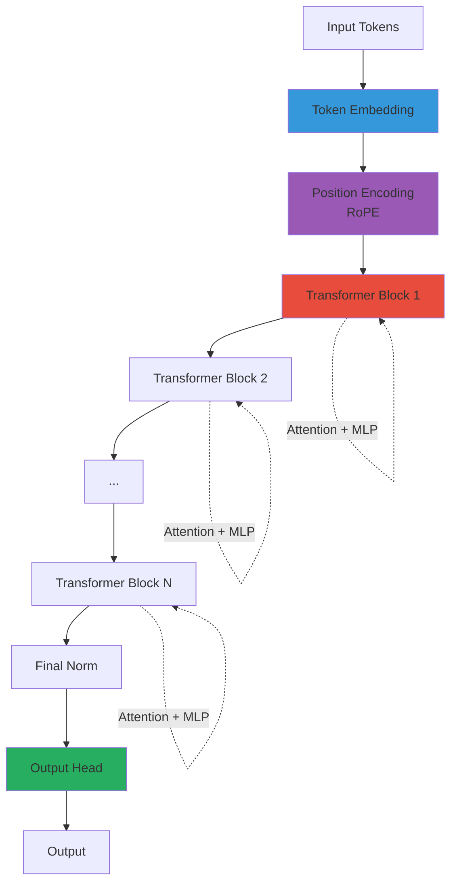

# Transformer Deep Dive: Every Layer Explained

## Overview

This guide explains **every single layer** in a transformer, combining **theoretical understanding** with **practical implementation**. We'll cover both the "why" (theory) and "how" (code) for each component.

### Diagram 1: Complete Transformer Architecture



**Explanation**: Complete transformer architecture showing token embedding, position encoding, stacked transformer blocks (each with attention and MLP), final normalization, and output head for predictions.

## Why Transformers?

### The Problem They Solve

Before transformers, sequence models (like RNNs) had fundamental limitations:

1. **Sequential Processing**: Had to process tokens one-by-one, making parallelization difficult
2. **Long-Range Dependencies**: Struggled to connect distant tokens in a sequence
3. **Vanishing Gradients**: Information got lost over long sequences during training

### The Transformer Solution

Transformers introduced **attention mechanisms** that:
- Process all tokens in parallel
- Directly model relationships between any two tokens (regardless of distance)
- Enable efficient training on modern GPUs

### Core Innovation: Attention

The key insight is that instead of processing sequences sequentially, we can let each position "attend" to all other positions simultaneously. This creates a rich representation where each token understands its relationship to every other token in the context.

## Theoretical Foundation

### Information Theory Perspective

From an information theory standpoint, transformers maximize the mutual information between tokens. Each attention head learns to extract different types of relationships:
- Syntactic (grammatical structure)
- Semantic (meaning relationships)
- Pragmatic (context-dependent usage)

### Mathematical Foundation

Transformers are based on the concept of **set-to-set functions**. Given a set of input tokens, they produce a set of output representations where each output can depend on all inputs. This is fundamentally different from sequence-to-sequence models where outputs depend only on previous inputs.

**Note**: All theory in this document applies to **μOmni's specific implementation** in `omni/thinker.py`, `omni/audio_encoder.py`, `omni/vision_encoder.py`, and `omni/talker.py`. We reference actual code from our codebase throughout.

#### Set-to-Set Transformation

The mathematical elegance of transformers lies in treating sequences as **sets with positional information**:
- **Set property**: All tokens are processed simultaneously (parallelism)
- **Positional property**: Position encoding maintains order information
- **Result**: Best of both worlds - efficiency of sets, structure of sequences

#### Information Flow

In traditional RNNs, information flows **sequentially**: `h_t = f(h_{t-1}, x_t)`
- Information must pass through all previous states
- Bottleneck at each step
- O(n) sequential operations

In transformers, information flows **directly**: `y_i = Attention(x_i, {x_1, ..., x_n})`
- Each position can directly access all other positions
- No sequential bottleneck
- O(1) parallel operations (though attention is O(n²))

#### Computational Complexity

**RNN**: O(n) sequential steps, each O(d²) → Total: O(n × d²)
**Transformer**: O(n²) attention, but fully parallel → Total: O(n² × d) parallel

For long sequences, transformers are faster despite quadratic attention because:
- Modern GPUs excel at parallel computation
- Batch matrix operations are highly optimized
- No sequential dependencies

### Historical Context

#### Before Transformers

**RNNs (1980s-2010s)**:
- Processed sequences step-by-step
- Suffered from vanishing gradients
- Limited parallelization

**LSTMs/GRUs (1990s-2010s)**:
- Added gating mechanisms
- Better gradient flow
- Still sequential, limited parallelization

**CNNs for Sequences (2010s)**:
- Parallel processing possible
- Limited receptive field
- Required many layers for long-range dependencies

#### The Transformer Breakthrough (2017)

The "Attention Is All You Need" paper introduced:
- Pure attention mechanism (no recurrence, no convolution)
- Parallel processing of entire sequences
- Direct modeling of long-range dependencies
- Foundation for modern LLMs

#### Evolution to Modern LLMs

Transformers enabled:
- **BERT (2018)**: Bidirectional understanding
- **GPT (2018-2023)**: Autoregressive generation
- **T5 (2019)**: Text-to-text framework
- **GPT-3/4 (2020-2023)**: Scale and emergent abilities
- **Modern Multimodal**: Vision, audio, text in one model

## Table of Contents

1. [Complete Architecture](#complete-architecture)
2. [Embedding Layer](#embedding-layer)
3. [Position Encoding](#position-encoding)
4. [Transformer Block](#transformer-block)
   - [RMSNorm](#rmsnorm)
   - [Self-Attention](#self-attention)
   - [Multi-Head Attention](#multi-head-attention)
   - [Feedforward Network](#feedforward-network)
   - [Residual Connections](#residual-connections)
5. [Output Head](#output-head)
6. [Complete Forward Pass](#complete-forward-pass)

## Complete Architecture

```
Input Tokens: [1234, 5678, 9012]
    ↓
[Embedding Layer] → (B, T, d_model)
    ↓
[Position Encoding] → (B, T, d_model)
    ↓
┌─────────────────────────────────┐
│   Transformer Block 1           │
│   ┌───────────────────────────┐ │
│   │ RMSNorm                   │ │
│   └───────────┬───────────────┘ │
│               ↓                  │
│   ┌───────────────────────────┐ │
│   │ Multi-Head Self-Attention  │ │
│   └───────────┬───────────────┘ │
│               ↓                  │
│   [Residual Connection]          │
│               ↓                  │
│   ┌───────────────────────────┐ │
│   │ RMSNorm                   │ │
│   └───────────┬───────────────┘ │
│               ↓                  │
│   ┌───────────────────────────┐ │
│   │ Feedforward Network (MLP) │ │
│   └───────────┬───────────────┘ │
│               ↓                  │
│   [Residual Connection]          │
└───────────────┬──────────────────┘
                ↓
    [Repeat for N blocks]
                ↓
[Final RMSNorm] → (B, T, d_model)
    ↓
[Output Head] → (B, T, vocab_size)
    ↓
Token Logits
```

## Embedding Layer

### Theoretical Foundation

#### The Embedding Problem

Natural language uses **discrete symbols** (words, subwords, characters). These are categorical data - there's no inherent numerical relationship between "cat" and "dog" in the way there is between 1 and 2.

However, neural networks operate on **continuous numerical vectors**. We need a way to convert discrete tokens into continuous space.

#### Why Dense Embeddings?

**One-hot encoding** (traditional approach):
- "cat" → [1, 0, 0, 0, ...] (sparse, high-dimensional)
- "dog" → [0, 1, 0, 0, ...] (sparse, high-dimensional)
- Problems: High dimensionality, no semantic relationships

**Dense embeddings** (modern approach):
- "cat" → [0.2, -0.5, 0.8, ...] (dense, low-dimensional)
- "dog" → [0.3, -0.4, 0.7, ...] (dense, low-dimensional)
- Benefits: Lower dimensionality, learns semantic relationships

#### Semantic Space

The key insight is that embeddings create a **semantic space** where:
- Similar words are close together
- Relationships can be captured (e.g., "king" - "man" + "woman" ≈ "queen")
- The model learns these relationships during training

#### Geometric Interpretation

Embeddings create a **high-dimensional geometric space** (typically 256-4096 dimensions):
- Each word is a **point** in this space
- Similar words form **clusters**
- Relationships form **vectors** (e.g., "king" → "queen" vector ≈ "man" → "woman" vector)

This geometric structure enables:
- **Analogy reasoning**: Vector arithmetic (king - man + woman ≈ queen)
- **Semantic similarity**: Cosine distance between embeddings
- **Transfer learning**: Pre-trained embeddings capture general language structure

#### Learning Dynamics

During training, embeddings evolve:
1. **Initialization**: Random vectors (no meaning)
2. **Early training**: Learn basic word frequencies
3. **Mid training**: Capture syntactic patterns
4. **Late training**: Learn semantic relationships
5. **Fine-tuning**: Adapt to specific tasks

The embedding space becomes a **learned representation** of the language's structure.

#### Dimensionality Trade-offs

**Low dimensions (64-128)**:
- Pros: Faster computation, less memory
- Cons: Limited capacity, may lose nuances

**High dimensions (512-4096)**:
- Pros: Rich representations, captures fine distinctions
- Cons: More computation, risk of overfitting

**Optimal range (256-512)**:
- Balance between capacity and efficiency
- Used in most modern models including μOmni

#### What Value Do We Get?

1. **Semantic Understanding**: Model understands word meanings
2. **Transfer Learning**: Pre-trained embeddings work across tasks
3. **Efficiency**: Dense vectors are computationally efficient
4. **Generalization**: Captures patterns not in training data
5. **Interpretability**: Embedding space can be visualized and analyzed

### Purpose
Convert discrete token IDs to continuous dense vectors that capture semantic meaning.

### Implementation

```python
import torch
import torch.nn as nn

class TokenEmbedding(nn.Module):
    def __init__(self, vocab_size, d_model):
        super().__init__()
        # Embedding table: (vocab_size, d_model)
        self.embedding = nn.Embedding(vocab_size, d_model)
        self.d_model = d_model
    
    def forward(self, token_ids):
        """
        Args:
            token_ids: (batch_size, seq_len) - token IDs
        Returns:
            embeddings: (batch_size, seq_len, d_model)
        """
        # Lookup embeddings
        emb = self.embedding(token_ids)
        
        # Scale by sqrt(d_model) - helps with training stability
        emb = emb * (self.d_model ** 0.5)
        
        return emb
```

### Step-by-Step

```python
# Example
vocab_size = 5000
d_model = 256
embedding = TokenEmbedding(vocab_size, d_model)

# Input: token IDs
token_ids = torch.tensor([[1, 1234, 5678]])  # (1, 3)

# Forward pass
embeddings = embedding(token_ids)
# Shape: (1, 3, 256)
# - 1 batch
# - 3 tokens
# - 256 dimensions per token
```

### What Happens Internally

```python
# Internally, nn.Embedding does:
def embedding_lookup(token_ids, embedding_table):
    # embedding_table shape: (vocab_size, d_model)
    # token_ids shape: (batch, seq_len)
    
    result = []
    for batch in token_ids:
        batch_emb = []
        for token_id in batch:
            # Simple lookup: emb = table[token_id]
            emb = embedding_table[token_id]
            batch_emb.append(emb)
        result.append(batch_emb)
    
    return torch.stack(result)  # (batch, seq_len, d_model)
```

### Why Embeddings?

1. **Dense Representation**: Convert sparse one-hot to dense vectors
2. **Semantic Similarity**: Similar words have similar embeddings
3. **Learnable**: Model learns meaningful representations

### Example Embeddings

```python
# After training, similar words have similar embeddings:
"cat" → [0.2, -0.5, 0.8, ...]
"dog" → [0.3, -0.4, 0.7, ...]  # Close to "cat"
"car" → [-0.1, 0.9, -0.2, ...]  # Far from "cat"
```

## Position Encoding

### Theoretical Foundation

#### The Position Problem

Attention mechanisms are **permutation-invariant** - they treat all positions equally. Without position information, "cat sat on mat" and "mat sat on cat" would be identical to the model.

#### Why Position Matters

Language is inherently **sequential**:
- Word order matters: "dog bites man" ≠ "man bites dog"
- Context depends on position: "it" refers to different things based on position
- Syntax requires positional awareness

#### Types of Position Encoding

**1. Absolute Position Encoding (Original Transformer)**
- Fixed sinusoidal functions
- Pros: Generalizes to longer sequences
- Cons: Fixed, not learnable

**2. Learned Position Embeddings (BERT-style)**
- Learnable parameters
- Pros: Can learn optimal positions
- Cons: Fixed maximum length

**3. Rotary Position Embedding (RoPE) - Used in μOmni**
- Rotates query/key vectors based on position
- Pros: Relative positions, better generalization
- Cons: More complex computation

### Mathematical Intuition

RoPE works by rotating vectors in a **complex plane**. The rotation angle depends on:
- Position in sequence
- Dimension index
- Base frequency (theta)

This creates a relative position encoding where the model learns relationships like "2 positions away" rather than "at position 5".

#### Complex Number Representation

RoPE treats each dimension pair as a complex number:
- Even dimensions: Real part
- Odd dimensions: Imaginary part
- Rotation preserves magnitude while encoding position

#### Rotation Mechanics

For position `m` and dimension `i`:
```
θ_i = 1 / (10000^(2i/d))
angle = m × θ_i
```

The rotation creates a **relative encoding**:
- Distance between positions is encoded in the angle difference
- Model learns relative relationships (e.g., "next word", "3 words away")
- Generalizes to longer sequences than seen in training

#### Why Relative Positions Matter

**Absolute positions** (learned embeddings):
- "Position 5" is always the same
- Doesn't generalize beyond training length
- Fixed maximum sequence length

**Relative positions** (RoPE):
- "2 positions away" works at any position
- Generalizes to longer sequences
- More flexible and powerful

#### Frequency Decomposition

Different dimensions encode different frequencies:
- **Low dimensions**: High frequency (fine-grained positions)
- **High dimensions**: Low frequency (coarse positions)

This creates a **multi-scale** position encoding that captures both:
- Local structure (adjacent words)
- Global structure (distant relationships)

#### What Value Do We Get?

1. **Generalization**: Works on sequences longer than training
2. **Efficiency**: No learnable parameters (computed on-the-fly)
3. **Relative Understanding**: Learns "distance" not "absolute position"
4. **Multi-scale**: Captures both local and global patterns
5. **Proven**: Used in LLaMA, PaLM, and other state-of-the-art models

### Purpose
Tell the model where each token is in the sequence, enabling it to understand word order and positional relationships.

### Types

#### 1. Learned Position Embeddings (Simple)

```python
class LearnedPositionalEmbedding(nn.Module):
    def __init__(self, max_len, d_model):
        super().__init__()
        # Learnable position embeddings
        self.pos_emb = nn.Parameter(torch.randn(1, max_len, d_model))
    
    def forward(self, x, position=None):
        """
        Args:
            x: (batch, seq_len, d_model) - token embeddings
        Returns:
            x + pos_emb: (batch, seq_len, d_model)
        """
        seq_len = x.size(1)
        return x + self.pos_emb[:, :seq_len, :]
```

#### 2. RoPE (Rotary Position Embedding) - Used in μOmni

More sophisticated - rotates query/key vectors based on position.

```python
def apply_rope(x, position, theta=10000.0):
    """
    Apply rotary position embedding.
    
    Args:
        x: (batch, seq_len, n_heads, head_dim)
        position: (seq_len,) - position indices
        theta: Base frequency for rotations
    """
    batch, seq_len, n_heads, head_dim = x.shape
    device = x.device
    
    # Create frequency matrix
    freqs = 1.0 / (theta ** (torch.arange(0, head_dim, 2, device=device) / head_dim))
    
    # Create angles: position * frequencies
    angles = position.unsqueeze(-1) * freqs.unsqueeze(0)  # (seq_len, head_dim/2)
    
    # Split x into pairs for rotation
    x_real = x[..., 0::2]  # Even indices
    x_imag = x[..., 1::2]  # Odd indices
    
    # Rotate: [cos, -sin; sin, cos] @ [x_real; x_imag]
    cos = torch.cos(angles).unsqueeze(0).unsqueeze(2)  # (1, seq_len, 1, head_dim/2)
    sin = torch.sin(angles).unsqueeze(0).unsqueeze(2)
    
    x_rotated_real = x_real * cos - x_imag * sin
    x_rotated_imag = x_real * sin + x_imag * cos
    
    # Interleave back
    x_rotated = torch.zeros_like(x)
    x_rotated[..., 0::2] = x_rotated_real
    x_rotated[..., 1::2] = x_rotated_imag
    
    return x_rotated
```

### Why RoPE?

1. **Relative Positions**: Better generalization to longer sequences
2. **No Extra Parameters**: Computed, not learned
3. **Efficient**: Can be applied during attention computation

## Transformer Block

The core building block - processes information through attention and feedforward.

### Complete Block Structure

```python
class TransformerBlock(nn.Module):
    def __init__(self, d_model, n_heads, d_ff, dropout=0.1, use_swiglu=True):
        super().__init__()
        # Pre-norm architecture
        self.norm1 = RMSNorm(d_model)
        self.norm2 = RMSNorm(d_model)
        
        # Attention
        self.attention = MultiHeadAttention(d_model, n_heads, dropout)
        
        # Feedforward
        self.mlp = FeedForward(d_model, d_ff, dropout, use_swiglu)
        
        self.dropout = nn.Dropout(dropout)
    
    def forward(self, x, use_cache=False, kv_cache=None):
        """
        Args:
            x: (batch, seq_len, d_model)
            use_cache: Enable KV caching
            kv_cache: Previous key/value cache
        """
        # Pre-norm + Attention + Residual
        residual = x
        x = self.norm1(x)
        x, kv_cache = self.attention(x, use_cache=use_cache, kv_cache=kv_cache)
        x = self.dropout(x)
        x = x + residual  # Residual connection
        
        # Pre-norm + MLP + Residual
        residual = x
        x = self.norm2(x)
        x = self.mlp(x)
        x = self.dropout(x)
        x = x + residual  # Residual connection
        
        return x, kv_cache
```

## RMSNorm

### Theoretical Foundation

#### Why Normalization?

Neural networks suffer from **internal covariate shift**:
- As weights update, the distribution of activations changes
- This makes training unstable
- Normalization stabilizes these distributions

#### LayerNorm vs RMSNorm

**LayerNorm** (traditional):
- Subtracts mean, then normalizes by standard deviation
- Formula: `(x - mean) / std`

**RMSNorm** (used in μOmni):
- Only normalizes by root mean square
- Formula: `x / RMS(x)`
- Simpler, faster, similar performance

#### Why RMSNorm Works

RMSNorm works because:
- It normalizes the **scale** of activations
- The mean is less important than the scale
- Removing mean subtraction simplifies computation
- Empirically performs similarly to LayerNorm

#### Mathematical Properties

RMSNorm preserves:
- **Direction**: Relative relationships between dimensions
- **Scale**: Normalized to unit RMS
- **Information**: No information loss (unlike some normalizations)

#### Why Mean Subtraction Isn't Needed

**LayerNorm**: `(x - μ) / σ`
- Subtracts mean to center distribution
- Normalizes by standard deviation

**RMSNorm**: `x / RMS(x)`
- Only normalizes scale
- Doesn't center distribution

**Why this works**:
- The **scale** (magnitude) is what causes training instability
- The **mean** (center) is less critical
- Removing mean subtraction simplifies computation
- Empirically performs similarly to LayerNorm

#### Internal Covariate Shift

**The problem**:
- As weights update, activation distributions shift
- Later layers see constantly changing inputs
- Training becomes unstable

**The solution (normalization)**:
- Normalize activations to consistent distribution
- Later layers see stable inputs
- Training becomes more stable

**Why RMSNorm works**:
- Controls scale (prevents extreme values)
- Stabilizes distributions
- Enables larger learning rates
- Faster convergence

#### Scale Parameter

The learnable `scale` parameter:
- Allows model to recover original scale if needed
- Provides flexibility
- Initialized to 1.0 (starts as pure normalization)

**Why learnable?**
- Sometimes original scale is important
- Model can learn optimal scale
- More expressive than fixed normalization

#### What Value Do We Get?

1. **Training Stability**: Prevents internal covariate shift
2. **Faster Convergence**: Enables larger learning rates
3. **Simplicity**: Simpler than LayerNorm (no mean)
4. **Efficiency**: Faster computation
5. **Flexibility**: Learnable scale provides expressiveness

### Purpose
Normalize activations to stabilize training by controlling the scale of activations without requiring mean subtraction.

### Formula

```
RMS(x) = sqrt(mean(x²) + eps)
y = x / RMS(x) * scale
```

### Implementation

```python
class RMSNorm(nn.Module):
    def __init__(self, d_model, eps=1e-6):
        super().__init__()
        self.eps = eps
        # Learnable scale parameter
        self.scale = nn.Parameter(torch.ones(d_model))
    
    def forward(self, x):
        """
        Args:
            x: (batch, seq_len, d_model)
        Returns:
            normalized: (batch, seq_len, d_model)
        """
        # Compute RMS
        rms = torch.sqrt(torch.mean(x ** 2, dim=-1, keepdim=True) + self.eps)
        
        # Normalize and scale
        normalized = x / rms * self.scale
        
        return normalized
```

### Step-by-Step Example

```python
# Input
x = torch.tensor([[1.0, 2.0, 3.0, 4.0]])  # (1, 4)

# Compute RMS
x_squared = x ** 2  # [[1, 4, 9, 16]]
mean_squared = x_squared.mean()  # 7.5
rms = sqrt(7.5 + 1e-6)  # ~2.74

# Normalize
normalized = x / rms  # [[0.365, 0.730, 1.095, 1.460]]

# Scale (if scale = [1, 1, 1, 1])
output = normalized * scale  # Same as normalized
```

### Why RMSNorm vs LayerNorm?

- **RMSNorm**: Simpler, faster (no mean subtraction)
- **LayerNorm**: More standard, subtracts mean first
- **Result**: Similar performance, RMSNorm is slightly faster

## Self-Attention

### Theoretical Foundation

#### What is Attention?

Attention is inspired by **human cognition**. When reading a sentence, you don't process every word equally - you focus on important words. For example, in "The cat sat on the mat," you pay more attention to "cat," "sat," and "mat" than to "the."

#### The Attention Mechanism

Attention computes a **weighted combination** of values, where weights indicate importance:

```
Output = Σ(attention_weight_i × value_i)
```

The attention weights are computed from **query-key similarity**:
- Query (Q): "What am I looking for?"
- Key (K): "What do I represent?"
- Value (V): "What information do I contain?"

#### Why Query-Key-Value?

This three-way split allows the model to:
- **Query**: Express what information is needed
- **Key**: Express what information is available
- **Value**: Provide the actual information

This separation enables rich, context-dependent information retrieval.

#### Self-Attention vs Cross-Attention

**Self-Attention**: Q, K, V all come from the same sequence
- Used in encoders and decoders
- Learns relationships within a sequence

**Cross-Attention**: Q from one sequence, K and V from another
- Used in encoder-decoder architectures
- Connects different sequences (e.g., translation)

### Mathematical Formulation

The attention mechanism can be written as:

```
Attention(Q, K, V) = softmax(QK^T / √d_k) × V
```

Where:
- `QK^T` computes similarity scores
- `√d_k` scales to prevent extreme values
- `softmax` converts scores to probabilities
- Multiplication with V creates weighted combination

#### Deep Dive: Dot Product Similarity

**Why dot product?**
- Measures **cosine similarity** when vectors are normalized
- Computationally efficient (single matrix multiplication)
- Captures both magnitude and direction

**Mathematical relationship**:
```
Q · K = ||Q|| × ||K|| × cos(θ)
```

When normalized: `Q · K = cos(θ)` (pure angle relationship)

#### Why Scale by √d_k?

**The Problem**: Without scaling, dot products grow with dimension:
- High dimensions → large dot products
- Large values → extreme softmax (nearly one-hot)
- Extreme softmax → vanishing gradients

**The Solution**: Scale by `√d_k`:
- Keeps dot products in reasonable range
- Maintains gradient flow
- Prevents attention collapse

**Mathematical justification**:
- Variance of dot product scales with `d_k`
- Scaling by `√d_k` normalizes variance
- Keeps softmax in "soft" region (not too peaked)

#### Softmax: From Scores to Probabilities

**Why softmax?**
- Converts arbitrary scores to valid probability distribution
- Differentiable (unlike argmax)
- Smooth approximation to "hard" attention

**Properties**:
- All values sum to 1.0
- All values are positive
- Larger scores get exponentially more probability

**Temperature effect** (if used):
- Low temperature: Sharper distribution (more focused)
- High temperature: Softer distribution (more uniform)

#### Information-Theoretic View

Attention can be seen as **information retrieval**:
- Query: "What information do I need?"
- Keys: "What information is available?"
- Values: "The actual information"
- Attention weights: "How much to retrieve from each source"

This creates a **content-addressable memory** where:
- Information is retrieved based on content (similarity)
- Not based on location (like traditional memory)
- Enables flexible, context-dependent information access

#### What Value Do We Get?

1. **Contextual Understanding**: Each token sees full context
2. **Flexible Relationships**: Learns any relationship type
3. **Parallel Processing**: All positions processed simultaneously
4. **Interpretability**: Attention weights show what model focuses on
5. **Efficiency**: Single matrix operation for all relationships

### Purpose
Allow each position to "attend" to all other positions, creating rich contextual representations.

### Single-Head Attention

```python
def single_head_attention(query, key, value, mask=None):
    """
    Args:
        query: (batch, seq_len, d_k)
        key: (batch, seq_len, d_k)
        value: (batch, seq_len, d_v)
        mask: (batch, seq_len, seq_len) - optional attention mask
    Returns:
        output: (batch, seq_len, d_v)
        attention_weights: (batch, seq_len, seq_len)
    """
    d_k = query.size(-1)
    
    # Step 1: Compute attention scores
    # Q @ K^T: (batch, seq_len, d_k) @ (batch, d_k, seq_len)
    scores = torch.matmul(query, key.transpose(-2, -1))
    # Result: (batch, seq_len, seq_len)
    # scores[i, j] = similarity between position i and j
    
    # Step 2: Scale by sqrt(d_k)
    scores = scores / (d_k ** 0.5)
    
    # Step 3: Apply mask (if provided)
    if mask is not None:
        scores = scores.masked_fill(mask == 0, float('-inf'))
    
    # Step 4: Softmax to get probabilities
    attention_weights = torch.softmax(scores, dim=-1)
    # attention_weights[i, j] = how much position i attends to position j
    # Each row sums to 1.0
    
    # Step 5: Weighted sum of values
    output = torch.matmul(attention_weights, value)
    # (batch, seq_len, seq_len) @ (batch, seq_len, d_v)
    # = (batch, seq_len, d_v)
    
    return output, attention_weights
```

### Visual Example

```
Query: "What is AI?"
         ↓
Attention Scores:
        What  is   AI   ?
What    0.1   0.2  0.6  0.1
is      0.3   0.1  0.5  0.1
AI      0.05  0.05 0.8  0.1
?       0.2   0.2  0.4  0.2

"AI" attends most to "AI" itself (0.8)
"What" attends most to "AI" (0.6)
```

### Causal Mask (for Decoders)

```python
def create_causal_mask(seq_len, device):
    """Mask future positions in decoder"""
    mask = torch.triu(torch.ones(seq_len, seq_len, device=device), diagonal=1)
    # Upper triangle = 1 (masked), lower = 0 (visible)
    return mask == 1  # Convert to boolean

# Example for seq_len=4:
# [[False, True,  True,  True ],  # Position 0 can't see 1,2,3
#  [False, False, True,  True ],  # Position 1 can't see 2,3
#  [False, False, False, True ],  # Position 2 can't see 3
#  [False, False, False, False]]  # Position 3 can see all previous
```

## Multi-Head Attention

### Theoretical Foundation

#### Why Multiple Heads?

A single attention head learns **one type** of relationship. But language has many types:
- Syntactic (grammatical structure)
- Semantic (meaning)
- Long-range dependencies
- Local patterns

**Multi-head attention** allows the model to learn **multiple relationship types simultaneously**.

#### Specialization Hypothesis

Different heads specialize in different patterns:
- **Head 1**: Subject-verb relationships
- **Head 2**: Adjective-noun relationships  
- **Head 3**: Long-range dependencies
- **Head 4**: Positional patterns

This is learned automatically during training - the model discovers useful specializations.

#### Empirical Evidence

Research shows heads do specialize:
- **Syntactic heads**: Focus on grammatical relationships
- **Semantic heads**: Focus on meaning relationships
- **Coreference heads**: Track entity references
- **Positional heads**: Encode relative positions

However, specialization is **emergent**, not enforced - the model discovers what's useful.

#### Why Multiple Subspaces?

**Single head limitation**:
- One attention pattern for all relationships
- Must compromise between different relationship types
- Limited capacity

**Multiple heads benefit**:
- Each head can specialize in one relationship type
- No compromise needed
- Total capacity increases (more parameters)

#### Dimensionality Analysis

With `d_model = 256` and `n_heads = 4`:
- Each head: 64 dimensions
- Total: 4 × 64 = 256 dimensions (same as input)
- But organized into 4 specialized subspaces

**Key insight**: It's not about more dimensions, it's about **better organization** of the same dimensions.

#### Attention Head Diversity

**Why diversity matters**:
- If all heads learn the same pattern → wasted capacity
- Diverse heads → richer representation
- Model learns to use different heads for different purposes

**How diversity emerges**:
- Random initialization creates different starting points
- Gradient descent finds different local minima
- Natural specialization without explicit regularization

#### What Value Do We Get?

1. **Richer Representations**: Multiple relationship types captured
2. **Specialization**: Each head becomes expert in one pattern
3. **Robustness**: If one head fails, others compensate
4. **Interpretability**: Can analyze what each head learns
5. **Scalability**: Can add more heads for more capacity

#### Dimensionality Split

With `d_model = 256` and `n_heads = 4`:
- Each head gets `256 / 4 = 64` dimensions
- This is a **dimensionality split**, not a reduction
- Total capacity remains the same, just organized differently

### Mathematical View

Multi-head attention can be seen as:
1. **Project** input to multiple subspaces (one per head)
2. **Compute attention** in each subspace independently
3. **Concatenate** results from all heads
4. **Project** back to original dimension

This creates a richer representation than single-head attention.

### Purpose
Run attention multiple times in parallel with different learned projections, enabling the model to capture diverse types of relationships simultaneously.

### Implementation

```python
class MultiHeadAttention(nn.Module):
    def __init__(self, d_model, n_heads, dropout=0.1):
        super().__init__()
        assert d_model % n_heads == 0
        
        self.d_model = d_model
        self.n_heads = n_heads
        self.d_k = d_model // n_heads  # Dimension per head
        
        # Projections
        self.W_q = nn.Linear(d_model, d_model)  # Query projection
        self.W_k = nn.Linear(d_model, d_model)  # Key projection
        self.W_v = nn.Linear(d_model, d_model)  # Value projection
        self.W_o = nn.Linear(d_model, d_model)  # Output projection
        
        self.dropout = nn.Dropout(dropout)
    
    def forward(self, x, use_cache=False, kv_cache=None):
        """
        Args:
            x: (batch, seq_len, d_model)
        Returns:
            output: (batch, seq_len, d_model)
        """
        batch, seq_len, _ = x.shape
        
        # Step 1: Project to Q, K, V
        Q = self.W_q(x)  # (batch, seq_len, d_model)
        K = self.W_k(x)  # (batch, seq_len, d_model)
        V = self.W_v(x)  # (batch, seq_len, d_model)
        
        # Step 2: Reshape for multi-head
        # Split d_model into n_heads
        Q = Q.view(batch, seq_len, self.n_heads, self.d_k).transpose(1, 2)
        # (batch, n_heads, seq_len, d_k)
        K = K.view(batch, seq_len, self.n_heads, self.d_k).transpose(1, 2)
        V = V.view(batch, seq_len, self.n_heads, self.d_k).transpose(1, 2)
        
        # Step 3: Apply RoPE (if using)
        # Q, K = apply_rope(Q, K, positions)
        
        # Step 4: Compute attention for each head
        # Q @ K^T: (batch, n_heads, seq_len, d_k) @ (batch, n_heads, d_k, seq_len)
        scores = torch.matmul(Q, K.transpose(-2, -1)) / (self.d_k ** 0.5)
        # (batch, n_heads, seq_len, seq_len)
        
        # Step 5: Softmax
        attn_weights = torch.softmax(scores, dim=-1)
        attn_weights = self.dropout(attn_weights)
        
        # Step 6: Apply to values
        # attn_weights @ V: (batch, n_heads, seq_len, seq_len) @ (batch, n_heads, seq_len, d_k)
        attn_output = torch.matmul(attn_weights, V)
        # (batch, n_heads, seq_len, d_k)
        
        # Step 7: Concatenate heads
        attn_output = attn_output.transpose(1, 2).contiguous()
        # (batch, seq_len, n_heads, d_k)
        attn_output = attn_output.view(batch, seq_len, self.d_model)
        # (batch, seq_len, d_model)
        
        # Step 8: Output projection
        output = self.W_o(attn_output)
        
        return output, kv_cache
```

### Why Multiple Heads?

Different heads learn different patterns:
- **Head 1**: Syntactic relationships (subject-verb)
- **Head 2**: Semantic relationships (word meanings)
- **Head 3**: Long-range dependencies
- **Head 4**: Positional patterns

### Example with 4 Heads

```python
# Input: "The cat sat on the mat"
# Head 1: "cat" → "sat" (subject-verb)
# Head 2: "on" → "mat" (preposition-object)
# Head 3: "The" → "cat" (article-noun)
# Head 4: "sat" → "on" (verb-preposition)
```

## Feedforward Network

### Theoretical Foundation

#### Why Feedforward After Attention?

Attention creates **linear combinations** of input tokens. While powerful, linear combinations alone cannot model complex, non-linear relationships.

The feedforward network adds **non-linearity**, enabling the model to:
- Combine information in complex ways
- Learn non-linear transformations
- Model higher-order interactions

#### The Two-Stage Process

Transformers use a **two-stage** information processing:
1. **Attention**: Gather relevant information (what to focus on)
2. **Feedforward**: Process and transform that information (what to do with it)

This mirrors human cognition: first gather information, then process it.

#### Why Expand Then Contract?

Feedforward networks typically:
- **Expand**: `d_model → d_ff` (e.g., 256 → 1024)
- **Activate**: Apply non-linear function
- **Contract**: `d_ff → d_model` (e.g., 1024 → 256)

This expansion creates a **bottleneck architecture** that:
- Forces the model to learn efficient representations
- Provides more capacity for complex transformations
- Prevents overfitting through the bottleneck

#### Bottleneck Architecture Theory

**The bottleneck principle**:
- Wide middle layer (d_ff) provides **capacity** for complex transformations
- Narrow input/output (d_model) provides **constraint** for efficiency
- Forces information through a compressed representation

**Why this works**:
- Information must be **compressed** (input → middle)
- Then **processed** in high-dimensional space
- Then **decompressed** (middle → output)

This compression forces the model to:
- Extract essential information
- Discard irrelevant details
- Learn efficient representations

#### Capacity Analysis

**Expansion ratio**: `d_ff / d_model` (typically 4:1)
- μOmni: 1024 / 256 = 4× expansion
- Larger models: 4096 / 1024 = 4× expansion

**Why 4×?**
- Empirical sweet spot
- Enough capacity without excessive parameters
- Balance between expressiveness and efficiency

**What if different ratios?**
- **2×**: Less capacity, faster, may underfit
- **8×**: More capacity, slower, may overfit
- **4×**: Good balance (widely used)

#### Information Processing Theory

The two-stage process (attention + feedforward) mirrors **human information processing**:

1. **Attention (Gathering)**: "What information is relevant?"
   - Selective focus
   - Context integration
   - Relationship identification

2. **Feedforward (Processing)**: "What should I do with this information?"
   - Non-linear combination
   - Feature transformation
   - Decision making

This separation of concerns enables:
- **Modularity**: Each stage has clear purpose
- **Efficiency**: Can optimize each stage independently
- **Interpretability**: Can analyze each stage separately

#### What Value Do We Get?

1. **Non-linearity**: Enables complex transformations
2. **Capacity**: Wide middle layer provides processing power
3. **Efficiency**: Bottleneck forces efficient representations
4. **Modularity**: Clear separation from attention
5. **Flexibility**: Can adjust d_ff for different capacity needs

### SwiGLU Activation

#### Why SwiGLU?

**SwiGLU** (Swish-Gated Linear Unit) is a modern activation function that:
- Is **smooth** (unlike ReLU's hard cutoff)
- Has **non-zero gradients** everywhere (unlike ReLU's dead neurons)
- Uses **gating** to selectively pass information

#### Gating Mechanism

The "gate" in SwiGLU acts like a **filter**:
- When gate is high: information flows through
- When gate is low: information is blocked

This allows the model to learn **selective information processing**.

#### Why Gating Works

**Traditional activations** (ReLU, GELU):
- Apply same transformation to all inputs
- No selectivity
- All information processed equally

**Gated activations** (SwiGLU, GLU):
- Learn which information to process
- Selective filtering
- More expressive power

**Mathematical advantage**:
- Two projections (gate + up) provide more parameters
- Gate learns "what to process"
- Up learns "how to process"
- Multiplication creates interaction between them

#### Swish vs ReLU vs GELU

**ReLU**: `max(0, x)`
- Pros: Simple, fast, sparse
- Cons: Dead neurons, not smooth, zero gradient for x < 0

**GELU**: `x × Φ(x)` (Gaussian Error Linear Unit)
- Pros: Smooth, non-zero gradients
- Cons: More expensive, less sparse

**Swish**: `x × sigmoid(x)`
- Pros: Smooth, self-gating, non-zero gradients
- Cons: More expensive than ReLU
- **Best of both worlds**: Smooth like GELU, gating like GLU

#### Self-Gating Property

Swish is **self-gating**:
- The input `x` gates itself through `sigmoid(x)`
- No separate gate projection needed
- More parameter-efficient than GLU variants

**Why this matters**:
- Fewer parameters than full GLU
- Still gets gating benefits
- Simpler architecture

#### What Value Do We Get?

1. **Smooth Gradients**: No dead neurons, better training
2. **Selective Processing**: Learns what information to use
3. **Expressiveness**: More powerful than ReLU/GELU
4. **Efficiency**: Self-gating is parameter-efficient
5. **Proven**: Used in state-of-the-art models (PaLM, LLaMA)

### Purpose
Process information non-linearly after attention, enabling complex transformations and higher-order interactions.

### Standard MLP

```python
class FeedForward(nn.Module):
    def __init__(self, d_model, d_ff, dropout=0.1):
        super().__init__()
        self.linear1 = nn.Linear(d_model, d_ff)
        self.linear2 = nn.Linear(d_ff, d_model)
        self.activation = nn.GELU()
        self.dropout = nn.Dropout(dropout)
    
    def forward(self, x):
        """
        Args:
            x: (batch, seq_len, d_model)
        Returns:
            output: (batch, seq_len, d_model)
        """
        x = self.linear1(x)  # (batch, seq_len, d_ff)
        x = self.activation(x)  # GELU activation
        x = self.dropout(x)
        x = self.linear2(x)  # (batch, seq_len, d_model)
        return x
```

### SwiGLU (Used in μOmni)

More powerful activation function:

```python
class SwiGLUFeedForward(nn.Module):
    def __init__(self, d_model, d_ff, dropout=0.1):
        super().__init__()
        # SwiGLU uses two gates
        self.gate = nn.Linear(d_model, d_ff)
        self.up = nn.Linear(d_model, d_ff)
        self.down = nn.Linear(d_ff, d_model)
        self.dropout = nn.Dropout(dropout)
    
    def forward(self, x):
        """
        SwiGLU: Swish-gated linear unit
        Formula: (Swish(xW_g) ⊙ (xW_u))W_d
        where Swish(x) = x * sigmoid(x)
        """
        gate = self.gate(x)  # (batch, seq_len, d_ff)
        up = self.up(x)      # (batch, seq_len, d_ff)
        
        # Swish activation
        swish = gate * torch.sigmoid(gate)
        
        # Element-wise multiplication
        x = swish * up  # (batch, seq_len, d_ff)
        
        x = self.dropout(x)
        x = self.down(x)  # (batch, seq_len, d_model)
        
        return x
```

### Why SwiGLU?

- **Better than ReLU**: Smoother, non-zero gradients
- **Gated**: Allows selective information flow
- **Proven**: Used in modern models (PaLM, LLaMA)

## Residual Connections

### Theoretical Foundation

#### The Vanishing Gradient Problem

In deep networks, gradients can become **exponentially small** as they propagate backward. This makes it difficult to train very deep networks because:
- Early layers receive tiny gradients
- Weights barely update
- Learning stagnates

#### The Residual Solution

Residual connections create **direct paths** for gradients:
- Gradients can flow directly through the residual connection
- Even if the layer learns nothing, the gradient path remains open
- Enables training of very deep networks (100+ layers)

#### Identity Mapping

Residual connections enable **identity mapping**:
- If a layer learns nothing useful, output ≈ input
- The network can "skip" unnecessary layers
- This makes optimization easier

#### Mathematical Intuition

Without residual: `y = f(x)`
- If `f(x) ≈ 0`, then `y ≈ 0` (information lost)

With residual: `y = f(x) + x`
- If `f(x) ≈ 0`, then `y ≈ x` (information preserved)
- The network can learn to add small corrections to the input

#### Gradient Flow Analysis

**Without residuals**:
- Gradients must flow through all layers
- Each layer multiplies gradients (can shrink or explode)
- Deep networks: gradients vanish or explode

**With residuals**:
- Direct path: `∂L/∂x = ∂L/∂y` (gradient flows directly)
- Layer path: `∂L/∂x = ∂L/∂y × ∂f/∂x` (gradient flows through layer)
- **Total**: `∂L/∂x = ∂L/∂y + ∂L/∂y × ∂f/∂x`

Even if `∂f/∂x ≈ 0` (layer learns nothing), gradient still flows through direct path!

#### Identity Mapping Theory

Residual connections enable **identity mapping**:
- Network can learn `f(x) = 0` (do nothing)
- Output = input (identity function)
- This is the **easiest function to learn**

**Why this helps**:
- Optimization starts from identity (easy)
- Can gradually learn corrections
- Better than starting from random transformation

#### Information Preservation

**Without residual**: Information can be lost
- Each layer transforms information
- Some information may be discarded
- Deep networks: information degrades

**With residual**: Information is preserved
- Original information always available
- Layer adds new information
- Information accumulates, not replaces

#### What Value Do We Get?

1. **Trainable Deep Networks**: Enables 100+ layer networks
2. **Stable Gradients**: Direct gradient paths prevent vanishing
3. **Identity Initialization**: Easier optimization
4. **Information Preservation**: No information loss
5. **Modular Learning**: Each layer learns incremental improvements

### Pre-Norm vs Post-Norm

**Pre-norm** (used in μOmni): `x = x + f(norm(x))`
- Normalize before transformation
- More stable gradients
- Better for deep networks

**Post-norm** (original Transformer): `x = norm(x + f(x))`
- Normalize after transformation
- Can have gradient issues in deep networks

### Purpose
Help gradients flow through deep networks, enabling training of very deep architectures and preventing vanishing gradients.

### Implementation

```python
# In TransformerBlock
def forward(self, x):
    # Attention block
    residual = x
    x = self.norm1(x)
    x = self.attention(x)
    x = x + residual  # Residual connection
    
    # MLP block
    residual = x
    x = self.norm2(x)
    x = self.mlp(x)
    x = x + residual  # Residual connection
    
    return x
```

### Why Residual?

1. **Gradient Flow**: Gradients can flow directly through residual
2. **Identity Mapping**: If layer learns nothing, output = input
3. **Deep Networks**: Enables training very deep models

### Mathematical View

```
Without residual:
y = f(x)

With residual:
y = f(x) + x

If f(x) ≈ 0, then y ≈ x (identity)
```

## Output Head

### Purpose
Convert hidden states to token predictions.

### Implementation

```python
class OutputHead(nn.Module):
    def __init__(self, d_model, vocab_size):
        super().__init__()
        self.linear = nn.Linear(d_model, vocab_size)
    
    def forward(self, x):
        """
        Args:
            x: (batch, seq_len, d_model) - hidden states
        Returns:
            logits: (batch, seq_len, vocab_size) - token predictions
        """
        logits = self.linear(x)
        return logits
```

### What are Logits?

Raw scores before softmax:
```python
logits = output_head(hidden_states)  # (batch, seq_len, vocab_size)
# logits[0, 0, :] = scores for first token, first position
# Higher score = more likely token

# Convert to probabilities
probs = torch.softmax(logits, dim=-1)
# probs[0, 0, token_id] = probability of that token
```

## Complete Forward Pass

### Full Example

```python
def complete_forward_pass(model, token_ids):
    """
    Complete forward pass through transformer.
    
    Args:
        token_ids: (batch, seq_len) - input token IDs
    Returns:
        logits: (batch, seq_len, vocab_size)
    """
    batch, seq_len = token_ids.shape
    
    # Step 1: Embedding
    x = model.embedding(token_ids)  # (batch, seq_len, d_model)
    
    # Step 2: Position encoding (if using learned)
    # x = x + model.pos_emb[:, :seq_len, :]
    
    # Step 3: Through each transformer block
    kv_cache = None
    for block in model.blocks:
        x, kv_cache = block(x, use_cache=False, kv_cache=kv_cache)
        # x shape: (batch, seq_len, d_model)
    
    # Step 4: Final normalization
    x = model.norm(x)  # (batch, seq_len, d_model)
    
    # Step 5: Output head
    logits = model.head(x)  # (batch, seq_len, vocab_size)
    
    return logits
```

### Step-by-Step with Shapes

```python
# Input
token_ids = torch.tensor([[1, 1234, 5678]])  # (1, 3)

# After embedding
x = embedding(token_ids)  # (1, 3, 256)

# After block 1
x, _ = block1(x)  # (1, 3, 256)

# After block 2
x, _ = block2(x)  # (1, 3, 256)

# After block 3
x, _ = block3(x)  # (1, 3, 256)

# After block 4
x, _ = block4(x)  # (1, 3, 256)

# After final norm
x = norm(x)  # (1, 3, 256)

# After output head
logits = head(x)  # (1, 3, 5000)
# logits[0, 0, :] = scores for next token at position 0
```

## Memory and Computation

### Attention Complexity

- **Time**: O(n²) where n = sequence length
- **Space**: O(n²) for attention matrix

### Optimizations

1. **KV Caching**: Cache previous computations
2. **Flash Attention**: More efficient attention computation
3. **GQA**: Share key/value heads (reduce memory)

## Summary

Every transformer layer:

1. **Embedding**: Token IDs → Dense vectors
2. **Position**: Add position information
3. **Attention**: Look at all positions
4. **MLP**: Process information
5. **Residual**: Help gradients flow
6. **Norm**: Stabilize training
7. **Output**: Predict next tokens

Each layer transforms: `(batch, seq_len, d_model) → (batch, seq_len, d_model)`

---

**Next:**
- [03_Thinker_Deep_Dive.md](03_Thinker_Deep_Dive.md) - See how Thinker uses transformers
- [04_Audio_Encoder.md](04_Audio_Encoder.md) - Encoder architecture
- [05_Vision_Encoder.md](05_Vision_Encoder.md) - Vision transformer

