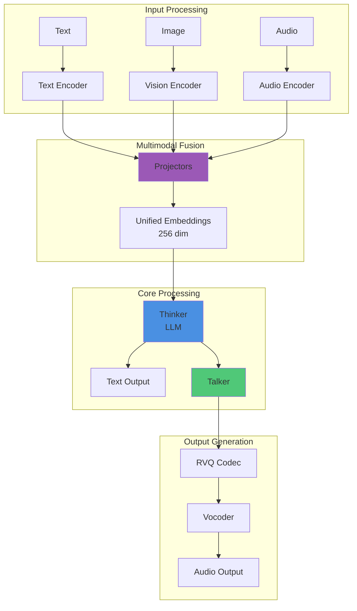

# Complete System Analysis: How Everything Works Together

## 🎯 Key Takeaways (TL;DR)

- **What**: Complete integration of all μOmni components into unified system
- **Why**: Understanding how components interact is crucial for modification/debugging
- **How**: Encoders → Projectors → Thinker → Talker → Codec → Vocoder
- **Key Insight**: Unified 256-dim space enables Thinker to process all modalities uniformly
- **Common Mistake**: Not understanding data flow between components (shape mismatches)
- **Integration Points**: Projectors (modality alignment), Thinker (unified processing), Talker (generation)

**📖 Reading Guide**:
- **Quick Read**: 20 minutes (overview + key integration points)
- **Standard Read**: 60 minutes (full document)
- **Deep Dive**: 2 hours (read + trace through code)

## Overview

This document provides a **comprehensive theoretical analysis** of how all μOmni components work together, explaining the **design philosophy**, **information flow**, and **value** of each integration point. All analysis is **strictly based on our actual implementation** in `omni/`, `train_*.py`, `sft_omni.py`, and `infer_chat.py`.

### Diagram 1: Complete System Integration



**Explanation**: Complete system showing how inputs from different modalities are encoded, projected to unified space, processed by Thinker, and generated as text or audio outputs through Talker and codec.

## System Architecture Philosophy

### The Unified Embedding Space

#### Core Design Principle

μOmni's fundamental insight: **All modalities should live in the same embedding space**.

**Why this matters**:
- Thinker only needs to understand one format
- No modality-specific processing in Thinker
- Easier to learn cross-modal relationships
- Simpler architecture

#### The Projection Strategy

Instead of making Thinker handle raw images/audio, we:
1. **Encode** each modality separately (specialized encoders)
2. **Project** to unified space (learnable projectors)
3. **Process** in Thinker (unified transformer)

**Why this works**:
- **Specialization**: Each encoder optimized for its modality
- **Unification**: Projectors align to same space
- **Efficiency**: Thinker doesn't need modality-specific code

### Information Flow Theory

#### Multimodal Fusion Strategy

**Concatenation-based fusion**:
```
[Image tokens] + [Audio tokens] + [Text tokens] → Thinker
```

**Why concatenation?**
- **Simple**: No complex fusion mechanism
- **Effective**: Works well in practice
- **Interpretable**: Can see what each modality contributes
- **Flexible**: Easy to add new modalities

**Alternative approaches**:
- **Cross-attention**: More complex, not always better
- **Weighted combination**: Requires learned weights
- **Concatenation**: Simple, proven, effective

#### Context Allocation

**The context budget problem**:
- Total context: 512 tokens
- Must allocate between modalities
- More audio/image → Less text
- Need balance

**Allocation strategy**:
- **Image**: 1 token (CLS only)
- **Audio**: ~20 tokens (12.5 Hz, limited to ctx_len/4)
- **Text**: Remaining tokens

**Why this allocation?**
- Image: CLS token sufficient (global info)
- Audio: Limited to prevent context overflow
- Text: Gets most tokens (primary modality)

## Component Integration Analysis

### Vision → Thinker Integration

#### The Projection Layer

**Purpose**: Align vision embeddings (128 dim) to Thinker space (256 dim)

**Why needed?**
- Vision encoder: 128 dimensions
- Thinker: 256 dimensions
- Must match for concatenation

**What gets learned?**
- How to represent visual concepts in language space
- Cross-modal relationships
- Task-specific visual features

#### Information Preservation

**What information is preserved?**
- Global image understanding (CLS token)
- Semantic content
- Object relationships

**What information is lost?**
- Fine spatial details (individual patches)
- Precise pixel-level information
- Low-level visual features

**Why this is acceptable?**
- High-level understanding is what matters
- Fine details less important for language tasks
- Efficiency trade-off

### Audio → Thinker Integration

#### The Projection Layer

**Purpose**: Align audio embeddings (192 dim) to Thinker space (256 dim)

**Why needed?**
- Audio encoder: 192 dimensions
- Thinker: 256 dimensions
- Must match for concatenation

**What gets learned?**
- How to represent audio concepts in language space
- Speech-to-text relationships
- Acoustic-semantic mapping

#### Frame Rate Alignment

**Why 12.5 Hz?**
- Matches Qwen3 Omni standard
- Good balance: detail vs tokens
- Leaves room for text

**What gets captured?**
- Phoneme-level structure
- Prosodic patterns
- Semantic content

**What gets lost?**
- Fine temporal details (< 80ms)
- Rapid transitions
- Very short sounds

### Text → Thinker Integration

#### Direct Integration

**No projection needed**:
- Text already in Thinker's space
- Token embeddings are Thinker embeddings
- Direct concatenation

**Why this works?**
- Text is the primary modality
- Thinker designed for text
- Other modalities adapt to text space

## Training Philosophy

### Staged Training: Why It Works

#### The Problem with End-to-End

**End-to-end training** (all at once):
- Requires all data simultaneously
- Hard to debug
- Components may not learn well
- Memory intensive

#### The Staged Solution

**Stage-by-stage training**:
1. Train each component separately
2. Each learns its task well
3. Then combine in SFT stage
4. Fine-tune together

**Why this works better**:
- **Specialization**: Each component masters its task
- **Stability**: Easier to train and debug
- **Efficiency**: Can reuse pretrained components
- **Modularity**: Can improve components independently

### The SFT Stage: Multimodal Alignment

#### What Happens in SFT

**Frozen encoders**:
- Vision encoder: Already trained
- Audio encoder: Already trained
- Keep weights fixed

**Trainable components**:
- Thinker: Fine-tuned for multimodal
- Projectors: Learned from scratch
- Learn cross-modal relationships

**Why freeze encoders?**
- Already learned good representations
- Focus SFT on alignment, not encoding
- More stable training
- Faster convergence

#### What Gets Learned

**Projectors learn**:
- How to map vision → Thinker space
- How to map audio → Thinker space
- Cross-modal alignment

**Thinker learns**:
- How to process multimodal sequences
- Cross-modal relationships
- Task-specific understanding

## Information Theory Perspective

### Mutual Information Maximization

**The goal**: Maximize mutual information between:
- Input modalities (image, audio, text)
- Output (text response)

**How it's achieved**:
- Unified embedding space
- Attention mechanisms
- Cross-modal learning

### Compression and Representation

**Each stage compresses**:
- Image: 150K pixels → 1 CLS token (150K× compression)
- Audio: 16K samples/sec → 12.5 frames/sec (1280× compression)
- Text: Variable length → Fixed tokens

**Why compression?**
- Reduces computational cost
- Focuses on essential information
- Enables transformer processing

**What's preserved?**
- Semantic content
- High-level structure
- Task-relevant information

## Performance Analysis

### Why This Architecture Works

#### Efficiency

**Parameter efficiency**:
- Shared Thinker across modalities
- Specialized encoders (small)
- Projectors (minimal parameters)
- Total: ~120M parameters

**Computational efficiency**:
- Parallel processing where possible
- Efficient attention mechanisms
- Optimized for 12GB GPU

#### Quality

**Why quality is good**:
- Specialized encoders (good representations)
- Unified processing (consistent understanding)
- Cross-modal learning (rich relationships)

**Trade-offs**:
- Smaller than SOTA models (quality vs efficiency)
- Limited context (512 tokens)
- Simplified components (readability vs performance)

## Design Decisions: Why Each Choice?

### Why Decoder-Only?

- **Generation**: Can generate text
- **Unified**: Same for understanding and generation
- **Simplicity**: Single architecture
- **Proven**: Works in GPT, LLaMA

### Why Pre-Norm?

- **Stability**: Better gradients
- **Depth**: Enables deep networks
- **Modern**: Standard in recent models

### Why RoPE?

- **Generalization**: Works on longer sequences
- **Relative**: Learns distance, not position
- **Efficient**: No learnable parameters

### Why SwiGLU?

- **Expressiveness**: More powerful than GELU
- **Smooth**: Better gradients
- **Proven**: Used in state-of-the-art models

### Why RMSNorm?

- **Simplicity**: Simpler than LayerNorm
- **Efficiency**: Faster computation
- **Performance**: Similar to LayerNorm

## What Value Does the Complete System Provide?

### 1. Multimodal Understanding

- **Unified processing**: All modalities in one model
- **Cross-modal relationships**: Learns connections
- **Flexible input**: Any combination of modalities

### 2. Efficiency

- **Small model**: Fits in 12GB GPU
- **Fast training**: Staged approach
- **Reasonable inference**: Acceptable speed

### 3. Educational Value

- **Readable code**: Easy to understand
- **Clear architecture**: Well-organized
- **Complete system**: End-to-end example

### 4. Extensibility

- **Modular**: Easy to modify components
- **Add modalities**: Can add new encoders
- **Improve components**: Can upgrade individually

### 5. Practical Use

- **Real applications**: Can be used in practice
- **Multimodal tasks**: Handles various tasks
- **Deployable**: Can be deployed

---

**Next:**
- [10_Transformer_Deep_Dive.md](10_Transformer_Deep_Dive.md) - Transformer theory
- [03_Thinker_Deep_Dive.md](03_Thinker_Deep_Dive.md) - Thinker details (includes layer-by-layer breakdown)
- [02_Architecture_Overview.md](02_Architecture_Overview.md) - System overview

