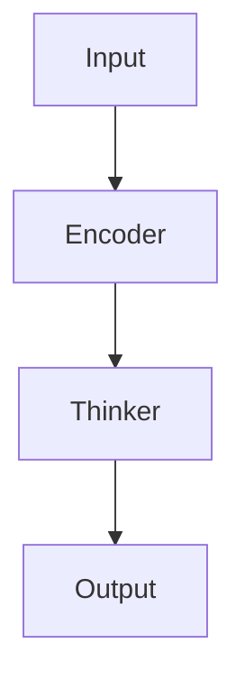

# Diagrams and Visualizations

This folder contains visual diagrams to help understand μOmni's architecture and workflow.

## Available Diagrams

### Architecture Diagrams
- `architecture.png` - High-level system architecture
- `thinker_architecture.png` - Thinker model details
- `multimodal_fusion.png` - How modalities are combined

### Training Diagrams
- `training_flow.png` - Training stages flowchart
- `data_flow.png` - Data processing pipeline

### Component Diagrams
- `attention_mechanism.png` - How attention works
- `rvq_codec.png` - RVQ encoding/decoding process
- `vision_patches.png` - Image patch extraction

## Creating Diagrams

You can create these diagrams using:
- **Mermaid** (text-based, works in markdown)
- **Graphviz** (DOT format)
- **Draw.io** (visual editor)
- **Python** (matplotlib, graphviz)

## Example Mermaid Diagram

## Placeholder Note

The actual diagram files are not included in this repository, but you can:
1. Create them using the tools above
2. Reference them in the markdown files
3. Add them to this folder

## Quick Reference

- Architecture overview: See [02_Architecture_Overview.md](../02_Architecture_Overview.md)
- Training stages: See [07_Training_Workflow.md](../07_Training_Workflow.md)
- Component details: See individual component guides

